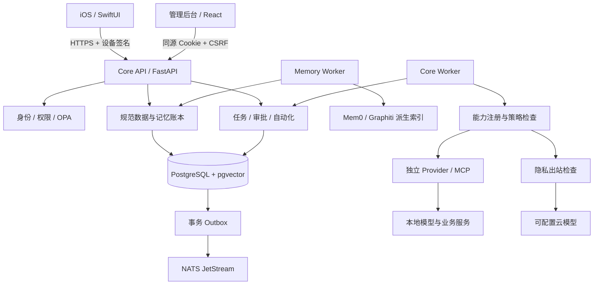
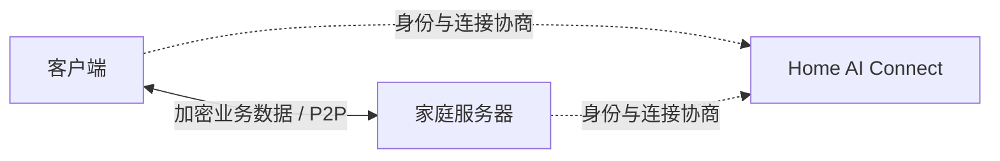

# Home AI OS

运行在家庭服务器上的私人 AI 系统。通过原生 iOS 客户端和网页管理后台，管理个人资料、长期记忆、AI 任务、自动化及家庭设备。数据由家庭端保存，本地使用不需要平台注册或付费。

**项目处于开发阶段，尚未完成生产与 iPhone 真机验收。远程访问正在迁移为纯 P2P，当前不能通过官方平台建立完整远程连接。**

## 功能

- **AI 对话与任务**：本地模型、多步骤工具调用、审批、取消、预算限制和异常核对。
- **数据与记忆**：文件及 iOS 数据导入、加密存储、版本管理、共享撤权、记忆确认和语义检索。
- **可插拔能力**：模型、文档、语音、搜索、家居、邮件和受控 MCP 工具。
- **自动化**：定时任务、数据事件触发、条件判断及持久化执行。
- **管理后台**：成员与设备、模型配置、凭据、Provider、数据、任务、自动化、审计和备份列表。
- **iOS 客户端**：AI、Activity、Automations、Data、Settings 五个主页面；提供语音、附件及系统数据授权入口。

## 项目架构

服务端采用 Python 模块化单体，各业务模块通过服务接口协作。API、任务处理、记忆索引和家居观察者独立运行；模型与 Provider 使用独立进程或环境。



| 层级 | 职责 |
|---|---|
| Core | 身份、权限、规范数据、密钥、任务状态、审计及插件生命周期 |
| PostgreSQL | 规范账本、授权、任务、版本、删除状态与事件 Outbox |
| Memory Provider | 可重建的记忆索引；不拥有数据的唯一副本 |
| Capability / Provider | 统一能力契约及真实实现；不得持有 Core 数据库凭据 |
| Skill / MCP | 声明式流程编排、显式工具映射；所有调用经过权限检查 |
| iOS / 管理后台 | 用户交互、系统授权、数据同步与任务审批 |
| Home AI Connect | 独立闭源平台；目标仅负责账号、连接授权、发现与信令 |

### 远程连接

目标是客户端与家庭服务器直接传输业务数据，平台不转发对话、文件或音视频，不允许直连失败后回退到中继。



当前已删除旧 frp 中继入口和连接进程。新的 WebRTC 数据通道组件使用配对身份签名绑定连接描述与 DTLS 指纹，仅允许 UDP 直连候选，拒绝 TURN 和中继候选。本机真实数据传输验证已通过；平台信令、iOS 接入和跨 NAT 验收仍未完成，该组件尚未承载产品业务请求。

域名不能自行穿透 NAT。部分防火墙或 NAT 环境可能无法直连，届时应明确失败，不会自动中继。平台套餐中的旧业务带宽与流量计量需要在独立项目中迁移。

## 工作流程

### 初始化与连接

1. 在家庭服务器安装数据库、事件和策略服务，创建主密钥并初始化管理员。
2. 从本机终端领取短期后台初始化凭据，设置网页登录密码和 TOTP。
3. 配置本地模型及需要的 Provider；秘密加密保存，管理页面不回显。
4. iPhone 导入短期配对信息，信任稳定服务器公钥，注册设备并获取短期会话。
5. 当前通过局域网 HTTPS 使用；证书或地址变更时验证原服务器身份，不静默替换信任对象。

### 数据与记忆

1. 用户授权 iOS 数据来源或导入文件，客户端携带设备签名、来源版本及幂等信息上传。
2. Core 校验权限，将规范记录和 Outbox 事件在同一事务中提交。
3. 后台处理文档、生成向量并更新派生索引；候选记忆经确认后成为有效事实。
4. 检索先查授权范围，命中后回到规范账本核对权限与版本。
5. 撤权或删除立即阻止读取，再传播至索引、缓存和文件；删除记录用于恢复时防止数据复活。

### AI 与任务

1. 客户端创建任务，Core 保存任务及步骤状态。
2. Agent 在预算和工具次数限制内规划执行；能力调用经过策略检查。
3. 需要审批的操作暂停，用户确认具体参数后重新校验权限再执行。
4. 外部副作用结果不明时进入待核对状态，不盲目重试。
5. 客户端获取任务事件与结果；来源被删除或撤权后，不再显示对应受保护结果。

### 自动化与运维

定时或数据事件创建持久任务，复用同一套权限、审批与执行机制。Outbox 和消费者去重降低重复处理风险。备份加密保存，恢复到隔离环境并重放删除记录后再验收。主密钥需单独安全保管。

## 本机启动

需要 Python 3.12+、Docker 和 Node.js；iOS 开发另需 Xcode 与 XcodeGen。以下为开发环境流程，不是已验收的生产一键部署。

```sh
python3 -m venv .venv
.venv/bin/pip install -r requirements.lock
.venv/bin/pip install --no-deps -e .
.venv/bin/python scripts/dev_env.py
docker compose --env-file .env.local -f deploy/compose.dev.yml up -d
.venv/bin/python scripts/migrate.py --runtime
.venv/bin/homeai init-key
.venv/bin/python scripts/tls.py
npm --prefix admin-web ci
npm --prefix admin-web run build
```

`init-key` 仅在首次安装执行；不要覆盖现有主密钥。保管生成的 `.env.local` 和 `state/`，不要提交到 Git。

启动 API：

```sh
.venv/bin/uvicorn homeai.api:create_app --factory \
  --host 0.0.0.0 --port 58443 \
  --ssl-keyfile state/tls/server.key --ssl-certfile state/tls/server.crt
```

在分别的终端启动后台进程：

```sh
.venv/bin/python -m homeai.worker
.venv/bin/python -m homeai.memory_worker
# 配置家居事件订阅后再启动：
.venv/bin/python -m homeai.home_observer
```

首次创建管理员，记录返回的用户 ID；再领取后台初始化凭据：

```sh
.venv/bin/homeai bootstrap --name 家庭管理员
.venv/bin/homeai web-setup --user <用户ID>
```

访问 `https://<家庭服务器地址>:58443/admin/`，按提示完成设置。`scripts/tls.py` 默认仅生成适用于 `localhost` 和 `127.0.0.1` 的开发证书；本机访问可用 `https://localhost:58443/admin/`。局域网和 iPhone 使用前，需另行配置与实际服务器地址匹配的证书。不要关闭证书验证。

生成 iOS 配对文件：

```sh
.venv/bin/homeai pair --user <用户ID> \
  --url https://<家庭服务器地址>:58443 \
  --output state/iphone-pairing.json
```

配对文件含短期凭据，应通过可信方式交给自己的设备。打开 `ios/HomeAI.xcodeproj`，配置签名后运行；最低支持 iOS 18。

模型权重不随仓库分发。`scripts/run_*.py`、`register_*.py` 提供各 Provider 的启动与注册工具；根据选用能力安装对应依赖和权重，具体版本及验证记录见 [验收记录](docs/验收记录.md)。

## 目录

```text
server/homeai/   Core API、权限、数据、任务与后台进程
server/tests/   自动化与真实服务集成测试
admin-web/      React 管理后台
ios/            SwiftUI 客户端
providers/      独立能力实现及运行适配
contracts/      OpenAPI 与 JSON Schema
scripts/        初始化、运行、注册、验证、备份与恢复工具
deploy/         容器、策略及部署配置
docs/           开发规范与详细验收记录
```

## 当前限制

- 纯 P2P 尚未接入平台与 iOS，不能宣称官方远程服务已完成迁移。
- 私人内容上云仍被拒绝；完整隐私检测与脱敏链路未完成。
- 生产 Provider 沙箱、完整升级卸载、vLLM 硬件验证尚未完成。
- APNs、iPhone 真机后台行为、真实家庭设备和外部邮箱仍需验收。
- 最终家庭部署、定时备份及异机恢复目标尚未完成验证。

## 验证与贡献

```sh
.venv/bin/pytest -q
.venv/bin/python scripts/check_boundaries.py
.venv/bin/python scripts/export_contracts.py
npm --prefix admin-web run build
```

外部服务未配置的集成测试会跳过；测试通过不能替代真机和生产验收。直连组件使用独立环境验证：

```sh
python3.12 -m venv state/venvs/p2p
state/venvs/p2p/bin/pip install -r requirements-p2p.lock
state/venvs/p2p/bin/python scripts/verify_direct_transport.py
```

开发约定见 [贡献指南](CONTRIBUTING.md) 和 [架构规范](docs/架构与开发规范.md)。不要提交凭据、个人数据、模型权重或闭源平台代码。

## 许可证

使用 [Home AI OS Attribution 1.0](LICENSE)，允许使用、修改、商用和闭源再分发。对外发布的衍生产品或托管服务需保留“基于 Home AI OS”及 [项目地址](https://github.com/MR-MaoJiu/home-ai-os)。这是自定义许可，不是标准 MIT 或 OSI 认证许可。第三方依赖遵循各自许可证，见 [第三方说明](THIRD_PARTY_NOTICES.md)。
