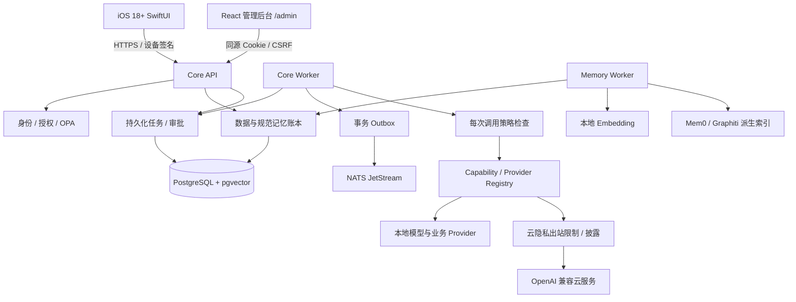
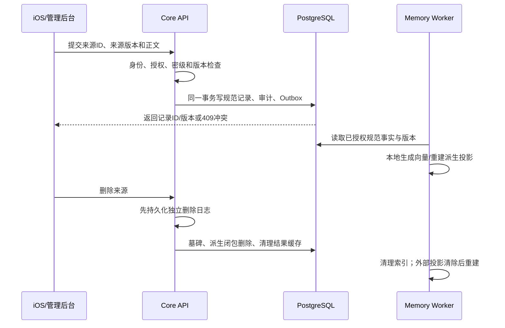
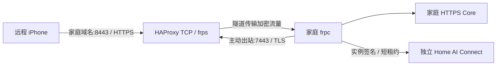

# Home AI OS

[项目主页](https://github.com/MR-MaoJiu/home-ai-os) · [参与开发](CONTRIBUTING.md) · [许可证](LICENSE)

以家庭服务器为中心的私人 AI 系统。项目已建立可运行开发实现，但**尚未达到完整 V1 或家庭生产可用的验收标准**。功能状态见 [验收记录](docs/验收记录.md)，不得将 Provider 配置文件视为真实接入成功。

## 当前可运行闭环

- 一次性配对 → P-256 设备签名 → 短期会话与刷新轮换。
- 用户数据同步 → 加密持久化 → 版本冲突 → 共享/撤回 → 删除墓碑。
- 记忆候选 → 用户确认 → 规范记录 → 授权范围内检索。
- 持久化任务 → OPA → 本地 llama.cpp → 受控工具提议 → 执行/审批/失败状态。
- Outbox → 真实 NATS JetStream 发布。
- SwiftUI 五页客户端及日历、提醒、联系人、睡眠、选定照片、文件导入入口。

## 项目边界与完成状态

本仓库提供家庭服务端、iOS 客户端、网页管理后台和独立 Provider 适配器。Home AI Connect 的账号、套餐、订单、运营后台和中继计量属于独立闭源项目，不在本仓库；家庭私人数据不上传到平台数据库。

“源码已实现”“真实服务集成通过”“iPhone 真机通过”“家庭部署通过”是四个不同阶段。下面列出的待办是实际缺口，不会通过返回固定成功值或示例数据掩盖。

| 模块 | 已实现 | 仍未完成或待验收 |
|---|---|---|
| 身份与管理后台 | 本机初始化、设备签名、短期令牌、撤销；网页密码/TOTP、CSRF、重新认证 | 完整安装向导体验、家庭多成员实用验收 |
| 数据 | 信封加密、版本冲突、共享/撤权、删除闭包、墓碑 | 分页快照一致性、后台增量同步、批次确认 |
| 记忆 | 候选确认、规范账本、pgvector、版本检查、自动与手动重建 | Mem0/Graphiti 已完成真实重建、检索与删除验收；冲突事实裁决、规模与更多故障演练待完成 |
| Agent | 本地模型自主多轮规划、持久化工具步骤、Token/轮次预算、结果引用、逐步审批、取消、恢复与核对 | 云端费用预算、更丰富工具、复杂条件及补偿 |
| 隐私 | 云能力限制、公开资料最小调用、披露记录 | 完整 NER、本地复核、占位符往返还原；私人内容上云保持拒绝 |
| 自动化 | 多步骤 Cron 工作流、幂等提交、Outbox/JetStream 发布 | 事件消费者、Skill 条件与补偿 |
| 插件 | 显式映射、凭据隔离、停用、配置回滚 | sandboxd、gVisor、网络沙箱、签名/SBOM、完整卸载验证 |
| 模型 | llama.cpp 本地生成；OpenAI 兼容协议 | MLX/vLLM 独立真实验证、云账户集成、Reranker |
| 文档/语音/家居/邮件 | Docling 七格式真实解析、加密附件与来源删除；其余适配器代码 | Docling Linux/生产沙箱验收；FunASR、whisper.cpp、CosyVoice、HA、邮件真实闭环 |
| iOS | 五个页面、配对、数据授权导入、录音入口、证书校验 | APNs、后台队列、App Intent、任务事件流、真机验收 |
| 远程 | 主动 frp 隧道、实例签名、租约、TLS 透传；已有真实连通/撤销记录 | 家庭域名 ACME 自动申请续期、长期断网与配额故障演练 |
| 运维 | 独立迁移账号、加密备份、隔离库恢复与删除日志重放 | 每日备份调度、异机/密钥恢复、RPO/RTO、生产隔离验收 |

## 系统架构

核心采用 Python 模块化单体。HTTP API、任务 worker、记忆 worker 是不同进程，共享核心契约和数据库；逻辑模块不是几十个独立微服务。推理服务和第三方 Provider 在独立进程/环境运行，不能获得 Core 数据库凭据。



### 工程目录与职责

| 路径 | 职责 |
|---|---|
| `server/homeai/api.py` | 应用装配、设备会话、数据/任务/Provider API |
| `server/homeai/browser_auth.py` | 浏览器密码、TOTP、Cookie、CSRF 与重新认证 |
| `server/homeai/db.py`、`server/alembic/` | 数据模型、主体作用域、数据库版本与 RLS |
| `server/homeai/data.py`、`deletion.py` | 数据版本、访问权限、来源删除闭包 |
| `server/homeai/memory.py`、`vector_index.py` | 候选确认、规范内容检索、向量对账与重建 |
| `server/homeai/derived_memory.py` | 外部记忆投影的清除、重建、检查点与失败状态 |
| `server/homeai/agent.py`、`runtime.py`、`task_control.py`、`worker.py` | 多步骤执行、审批恢复、人工核对、定时调度、事务事件发布 |
| `server/homeai/policy.py`、`privacy.py` | 核心风险等级、OPA、云出站限制 |
| `server/homeai/providers.py` | 端点/能力映射、凭据注入、实际 HTTP/MCP 调用 |
| `server/homeai/remote.py`、`remote_agent.py` | 独立服务器身份、绑定、短租约、frpc 生命周期 |
| `providers/homeai_providers/` | 第三方 SDK 桥；独立安装依赖 |
| `admin-web/` | 管理后台源码；构建结果由 Core 同源部署 |
| `ios/` | SwiftUI、Keychain、设备签名和系统数据连接器 |
| `contracts/` | 由服务端生成的 OpenAPI 和 JSON Schema |
| `deploy/` | 开发基础服务、OPA 策略和镜像构建配置 |
| `scripts/` | 初始化、迁移、模型登记、备份恢复、契约导出 |
| `server/tests/` | 单元与真实服务集成测试；不作为业务运行数据 |

### 数据归属与安全边界

- `Principal` 是成员身份；家庭管理者能管理基础设施，不能因此读取其他成年成员私有记录。
- `Record` 保存规范数据，`Revision` 记录版本，`Grant` 表达显式共享。应用层授权与 PostgreSQL `FORCE ROW LEVEL SECURITY` 同时生效。
- 私人正文、候选、任务参数/结果和 Secret 使用随机数据密钥加密，再由主密钥包裹；数据库记录通过主体及用途绑定 AAD。
- **pgvector 中用于计算距离的向量不是应用层密文**，向量也可能泄露语义。生产必须使用磁盘加密、数据库访问隔离与备份加密；不能宣称数据库所有列都是加密正文。
- 本地主密钥仍须由操作者安全保管、解锁；它不能随备份归档一起存放。当前不是自动 TPM 解锁方案。
- Provider 输出、MCP 描述、附件和模型回答均不具有授权能力。风险等级由 Core 决定，R4 操作不开放。

## 主要业务流程

### 1. 安装与首次身份建立

1. 启动 PostgreSQL、OPA、NATS，使用迁移账号执行迁移。
2. 本机创建主密钥和 HTTPS 证书，启动 Core；从终端创建家庭管理员并领取短期票据。
3. 网页账户通过 `web-setup` 票据绑定该管理员，再设置密码和 TOTP。没有票据不能匿名抢占管理员。
4. iPhone 使用独立配对票据和可信证书指纹配对，上传设备公钥，取得短期访问凭据。
5. 手机后续请求签名绑定时间、随机数、方法、路径、请求体摘要和令牌摘要；刷新凭据轮换，撤销设备后原凭据失效。

网页与 iPhone 使用两套会话机制，但业务授权复用同一个主体。平台账号不等于家庭管理员账号。

### 2. 数据导入、共享与删除



同一来源同一版本且内容相同是幂等写入；同版本不同内容、旧版本覆盖和已删除来源自动复活均拒绝。共享撤回立即影响 Core 查询。删除来源时递归撤下引用该来源的事实与候选，恢复旧备份时先重放独立删除日志，再允许访问。

### 3. 记忆确认与检索

候选并非有效事实：来源必须存在且属于调用者，确认时再次检查删除状态；用户确认后才写入 `memory.fact`。Mem0/Graphiti 不拥有规范事实的唯一副本。

向量 worker 检查 Provider 身份、版本、模型、端点、输入前缀与记录版本。配置变化或手动清除向量后自动补建，每次最多生成 50 条；事务锁防止同一主体被两个 worker 同时重建。模型输出必须是有限数值向量。查询向量生成后在 pgvector 计算距离，结果再次回到规范账本授权读取；过期版本不返回。

外部记忆消费者按主体与 Provider 建立检查点：发生记录变更时清除该主体投影，再从账本重建。中途失败保留 `FAILED` 和错误类型，后续循环重新清除再重试；未同步的投影拒绝查询。当前采用保守全量重建，适合验证一致性，尚不是大规模增量图同步实现。停用 Provider 后不再向其发送请求，外部残留数据须在恢复连接后清除，不能声称离线第三方存储已删除。

| 接口 | 用途 |
|---|---|
| `GET /api/v1/memory/index` | 当前调用者的可索引数、就绪数、待处理数及 Provider |
| `POST /api/v1/memory/index/rebuild` | 清除自己的向量投影，交给 worker 重建，不删除规范数据 |
| `GET /api/v1/memory/derived` | 外部记忆 Provider 的同步状态、尝试次数和错误类型 |
| `GET /api/v1/memory/search?q=…` | 返回 `pgvector_exact` 或明确的 `authorized_literal` 降级模式 |

### 4. 任务、审批与异常

当前任务按 `RECEIVED → EXECUTING → SUCCEEDED/FAILED` 执行；高风险工具进入 `AWAITING_APPROVAL → APPROVED`，参数摘要、主体和有效期必须与审批一致。取消标志、设备撤销和引用记录权限在调用返回时再次检查。

任务提交幂等键绑定请求摘要，相同键不同请求返回冲突。外部副作用在超时或进程中断后可能进入 `NEEDS_RECONCILIATION`，不会盲目重放。已支持显式声明的多步骤工作流，`max_steps` 在提交时限制步骤数。每次 worker 执行一个未完成步骤，成功后持久化结果；下一步骤可引用前序结果。任务连接级 PostgreSQL 锁跨事务保持，多个 worker 不会同时执行同一任务；进程退出后锁由数据库释放。启动时不再批量修改所有执行中任务。

恢复时跳过已成功步骤；内部事务操作使用 Invocation ID 作为来源幂等标识；只读网络操作在有限预算内重试；执行中断的外部副作用进入 `NEEDS_RECONCILIATION`，即使任务已过期也不能误报为确定失败。网络调用受单步超时与任务总截止时间限制。

自然语言本地任务现在使用多轮 Agent：模型提出工具调用 → 校验并持久化步骤 → 逐步执行 → 读取真实工具结果 → 再次规划或最终回答。模型一次可提出多个工具，但总数不能超过 `max_steps`；已完成步骤不会因为再次规划而重放。工具执行后、模型首次提出最终答复时，会在剩余预算内重新对照原始要求与真实工具结果核对；发现遗漏可以继续调用工具。重复提出相同的提醒创建会停止任务，不能循环制造副作用。

规划轮次最多为 `max_steps + 2`，工具预算耗尽后只允许一次无工具总结。`max_model_tokens` 默认 32768，发请求前按上下文 UTF-8 字节数、协议余量和输出上限保守预留，拿到有效 usage 后才返还差额；请求失败或进程退出时不擅自返还未知消耗。`GET /api/v1/tasks/{id}` 的 `execution` 展示轮次、已规划步骤与已计入的 Token 数。

当前自主工具清单为记忆检索、日程检索、家庭服务器提醒创建和家居状态读取。自主规划仅使用本地模型，不自动切换云端。工具返回的记录 ID 会回规范账本重新鉴权，已删除或撤权的结果不能继续送给模型；秘密密级仍拒绝进入模型。云端金额预算、更多工具、条件分支及补偿尚待完成。

```json
{
  "idempotency_key": "my-workflow-20260917-001",
  "max_steps": 2,
  "timeout_seconds": 600,
  "step_timeout_seconds": 120,
  "max_read_retries": 1,
  "steps": [
    {"capability": "reminder.create@v1", "arguments": {"title": "准备出行资料"}},
    {"capability": "reminder.create@v1", "arguments": {"title": "检查前一事项", "linked_record": {"$step": 0, "path": ["record_id"]}}}
  ]
}
```

将上述结构提交到已认证的 `POST /api/v1/tasks`。`$step` 从 0 起，只能指向本任务已完成步骤；`path` 只接受对象键和数组下标，不允许代码或表达式。`model.generate@v1` 的显式步骤可使用 `message` 和 `context` 参数，`context` 可引用前序结果，仍经秘密检测且多步骤工作流只开放本地模式。

通过 `GET /api/v1/tasks/{id}/steps` 或管理后台查看步骤。未知外部结果需先在外部系统核对，再调用 `POST /api/v1/tasks/{id}/reconcile`，提交 `COMPLETED`、`NOT_EXECUTED` 或 `ABORT` 及核对依据。人工确认结果明确标记为 `user_reconciliation`，不伪装成 Provider 自动确认。确认未执行后，R3 操作必须重新审批；过期和已取消任务不能重新执行。浏览器核对操作要求近期密码与 TOTP 验证。

Cron 自动化将整份 Skill 提交为一个工作流，也走相同任务入口和逐步审批策略。Outbox 与业务写入同事务，NATS 发布使用事件 ID 去重；这不意味着下游所有消费者或外部服务具有恰好一次执行保证。

### 5. 模型、插件与云调用

调用路径是 `Task → Policy → Registry → Provider`。Manifest 声明版本、适配器、能力、端点和允许主机；秘密由 Core 按主体与 Provider 对应关系注入，不返回管理页面，也不拼进模型上下文。

本地模型失败不会自动换成云模型。当前云端只允许指定公开资料总结/翻译路径，受限制指令、密级、显式云策略和披露审计共同约束。完整私人数据脱敏还没完成，不能为了“成功回答”放宽。

生产 Provider 启用目前主动拒绝，因为操作系统级沙箱未验收。开发环境的主机白名单属于应用层防护，不等同于 gVisor、网络命名空间或禁止插件访问宿主的完整隔离。

### 6. 可选远程访问



家庭路由器无需开放入站端口。注册、邮箱验证、人工收款、权益开通、子域名选择发生在平台；家庭后台确认绑定后才建立实例身份。已配对 iPhone 额外检查服务器身份，不仅看域名证书。

家庭 HTTPS 在家庭端终止，平台不保存家庭正文和模型密钥；但平台掌握域名和连接元数据，不能宣传为绝对无法访问任何信息。停用、到期、配额耗尽应断开远程连接，本地服务继续工作。平台提供的是子域名使用权，不是可独立转移的注册域名。

## 本机开发

要求 Python 3.12+、Docker、Xcode、XcodeGen。本机验证使用 Python 3.14；GitHub CI 使用 Python 3.12。iOS 已通过模拟器编译和证书校验测试，iOS 18 真机仍待验收。

```sh
python3 -m venv .venv
.venv/bin/pip install -r requirements.lock
.venv/bin/pip install --no-deps -e .
.venv/bin/python scripts/dev_env.py
docker compose --env-file .env.local -f deploy/compose.dev.yml up -d
.venv/bin/python scripts/migrate.py --runtime
.venv/bin/homeai init-key
.venv/bin/python scripts/tls.py
```

`.env.local` 的 `HOMEAI_DATABASE_URL` 应指向 `homeai_runtime`；迁移工具使用独立迁移账号，API 使用无 BYPASSRLS 权限的账号。主密钥只在首次初始化创建，禁止覆盖。首次初始化执行：

```sh
.venv/bin/homeai bootstrap --name 家庭管理员
```

配对码仅有效 5 分钟，不应复制到日志、Git 或聊天中。后续可以用 `homeai pair --user <用户ID>` 重新签发。开发证书指纹位于 `state/tls/fingerprint.txt`。

启动本地模型、API 和 worker（分别在三个终端运行）：

```sh
llama-server -m state/models/Qwen3-0.6B-Q8_0.gguf --host 127.0.0.1 --port 58080 -c 4096 --jinja --reasoning-budget 0
.venv/bin/python scripts/register_local_model.py
.venv/bin/uvicorn homeai.api:create_app --factory --host 127.0.0.1 --port 58443 --ssl-keyfile state/tls/server.key --ssl-certfile state/tls/server.crt
.venv/bin/python -m homeai.worker
```

API 地址为 `https://localhost:58443`，默认不开放局域网与公网。iOS 模拟器可以连接此地址；真机接入需要配置 LAN/VPN 地址及相应证书。

```sh
xcodegen generate --spec ios/project.yml
open ios/HomeAI.xcodeproj
```

首次进入“设置”填写地址、从本机可信渠道获取的证书指纹和配对码。Secure Enclave 真机私钥不导出；模拟器使用明确分支下的测试私钥。

## 测试

当前 0.6B 链路模型在重复多轮验收中仍会漏执行或重复提出操作；运行器会阻止重复副作用。请以最新 [验收记录](docs/验收记录.md) 的实际通过/失败结果为准，不能把一次模型测试成功视为稳定性保证。4B 模型已使用相同断言连续三次通过验收，开发默认优先使用它；这仍不构成任意任务的准确性保证。

```sh
.venv/bin/pytest -q
.venv/bin/python scripts/check_boundaries.py
.venv/bin/python scripts/migrate.py --test
HOMEAI_INTEGRATION=1 HOMEAI_MODEL_TEST=1 .venv/bin/pytest -q
```

集成测试固定使用 `homeai_test`，不写业务库。没有真实服务时集成测试明确跳过，不以模拟测试替代真实验收。

## Provider

`providers/manifests/` 为端点配置示例，注册后默认停用。模型名称和地址必须与实际服务一致。独立 SDK 适配器通过 `HOMEAI_ADAPTER` 选择，并强制校验 `PROVIDER_SERVICE_TOKEN`。各适配器使用独立环境，不把 Docling、语音或图数据库依赖安装到核心服务环境。

当前生产启用接口主动阻止未完成沙箱验收的 Provider。所有依赖尚未按生产 OCI Digest 和签名完成锁定，因此不能将开发 Compose 作为生产部署配置使用。

## 4B 本地 Agent 模型

0.6B 模型保留作低成本链路测试，已发现其多轮操作不稳定。当前开发实例优先登记真实 Qwen3-4B-Q4_K_M；模型来自 [Qwen 官方固定版本](https://huggingface.co/Qwen/Qwen3-4B-GGUF/tree/bc640142c66e1fdd12af0bd68f40445458f3869b)，权重约 2.5 GB，不进入 Git。

```sh
curl -fL --retry 3 -C - 'https://huggingface.co/Qwen/Qwen3-4B-GGUF/resolve/bc640142c66e1fdd12af0bd68f40445458f3869b/Qwen3-4B-Q4_K_M.gguf' -o state/models/Qwen3-4B-Q4_K_M.gguf
.venv/bin/python scripts/run_agent_model.py
```

另开终端运行 `.venv/bin/python scripts/register_agent_model.py`。启动脚本检查大小 `2497280256` 和 SHA256 `7485fe6f11af29433bc51cab58009521f205840f5b4ae3a32fa7f92e8534fdf5`；校验不符不会加载。服务位于 `127.0.0.1:58082`，使用单并发、8192 上下文，保留原 `58080` 链路测试服务。

Graphiti 使用 4B 服务进行真实抽取和重排。已验证版本的 llama.cpp 对含 `$ref` 的嵌套 Schema 存在约束兼容问题，适配层展开本地引用并保留必填字段；拒绝远程/循环引用，不修改模型返回内容，不事后补造字段。

Graphiti 服务启动、数据库和模型就绪后，为成员登记：

```sh
.venv/bin/python scripts/run_graphiti.py
.venv/bin/python scripts/register_local_graphiti.py --user <成员ID>
```

完整已接入服务回归使用：

```sh
HOMEAI_INTEGRATION=1 HOMEAI_MODEL_TEST=1 HOMEAI_EMBEDDING_TEST=1 HOMEAI_DOCLING_TEST=1 HOMEAI_MEM0_TEST=1 HOMEAI_GRAPHITI_TEST=1 HOMEAI_AGENT_TEST_URL=http://127.0.0.1:58082/v1 HOMEAI_AGENT_TEST_MODEL=Qwen3-4B-Q4_K_M.gguf .venv/bin/pytest -q
```

测试仍要求两条实际提醒、模型最终回答及重复调度无新增操作，另验证 Graphiti 实际关系检索与删除传播。没有启用对应标志的跳过结果不算验收通过。

## 可拆卸记忆投影（Mem0）

Mem0 1.0.11 是 Core 规范账本的派生索引，不负责决定事实真伪。实际运行使用本地 OpenAI 兼容接口、EmbeddingGemma 和本地 Qdrant；虽然 SDK 适配器名为 `lmstudio`，它调用的是本机 llama.cpp 的兼容接口，不要求安装 LM Studio。

```sh
python3.12 -m venv state/venvs/mem0
state/venvs/mem0/bin/pip install -r providers/requirements-mem0.txt
.venv/bin/python scripts/run_mem0.py
```

另开终端登记成员并启动索引 worker：

```sh
.venv/bin/python scripts/register_local_mem0.py --user <成员ID>
.venv/bin/python -m homeai.memory_worker
```

启动前必须已有 `58080` 本地生成服务和 `58081` Embedding 服务。配置显式指定两个本地模型，不保留 SDK 默认云端配置；规范事实以 `infer=False` 入库，Mem0 不能再次推断并覆盖账本。运行器只传递必要环境，服务监听 `127.0.0.1:8101`。服务秘密、SDK 状态与向量文件位于忽略的 `state/` 目录，完整已验证依赖见 `providers/locks/mem0-macos-py312.txt`。

`MEM0_TELEMETRY=false` 在导入 SDK 前设置；模型 HTTP 客户端禁用环境/系统代理，Python 出站门禁仅允许两个本地模型端口。真实验收确认本地连接计数增加，未授权连接尝试计数为零；单独测试确认外部域名和地址被拒绝。这不是操作系统沙箱，不能据此宣称任意恶意原生扩展已被隔离。

SDK 历史库只驻留内存，不额外落盘私人正文。主体清除循环处理 SDK 默认 100 条分页，确认无剩余向量后清空内存历史；适配层绕过固定 SDK `reset()` 的嵌套锁死锁路径，不修改第三方源码。Qdrant 文件仍是派生明文数据，部署时需要磁盘加密及备份保护。

Core 检查点未就绪时拒绝派生查询；检索只接收规范 ID，正文仍回到授权账本读取。停用时核心记忆保持可用，外部投影不再更新；恢复启用后处理积压删除并重建。管理后台“记忆索引”提供“重建我的投影”，对应 `POST /api/v1/memory/derived/{provider_id}/rebuild`；索引丢失或迁移后可以显式重新生成，不依赖碰巧出现新的数据事件。

```sh
HOMEAI_MEM0_TEST=1 .venv/bin/pytest -q server/tests/test_mem0_live.py
```

该测试实际调用 SDK、Embedding、Qdrant、PostgreSQL 和 OPA，覆盖重建、搜索回读、跨主体隔离、停用及删除传播。参考 [Mem0 本地 Embedding 配置](https://docs.mem0.ai/components/embedders/models/lmstudio)。

## Graphiti 独立图数据库

Graphiti 0.30.2 的依赖和本地客户端适配已准备，实际运行的 Neo4j 5.26.30 使用独立 Compose 项目、数据卷和凭据；仅发布本机 Bolt 端口 `57687`，不发布图数据库网页控制台。镜像已按官方 OCI 清单摘要锁定。真实模型抽取、图搜索、Core 规范记录回读、跨主体隔离和删除传播已通过开发验收；生产沙箱仍未完成。

```sh
.venv/bin/python scripts/init_graphiti.py
docker compose --env-file .env.graphiti -f deploy/compose.graphiti.yml up -d
python3.12 -m venv state/venvs/graphiti
state/venvs/graphiti/bin/pip install -r providers/requirements-graphiti.txt
state/venvs/graphiti/bin/python scripts/check_graphiti_database.py --initialize-indexes
```

`.env.graphiti` 为 0600 私有配置，不进入仓库；初始化不会覆盖已有凭据。SDK 直接导入但未声明的 `httpx` 已显式锁定。Mac/Python 3.12 完整依赖见 `providers/locks/graphiti-macos-py312.txt`。

`run_graphiti.py` 为独立启动入口，要求 `58082` 的本地生成模型、`58081` 的 Embedding 和已启动的 Neo4j。客户端显式关闭遥测和系统代理，Python 门禁只允许这三个本地端口，不使用默认云模型；原始 episode 正文不保留到图数据库。图仍是派生数据，搜索必须映射回规范记录 ID，再由 Core 重新鉴权。操作系统隔离尚未验收。

数据库认证连接、33 个索引在线和真实主体清理隔离已通过。启动 `run_graphiti.py` 后，可用独立测试节点运行 `state/venvs/graphiti/bin/python scripts/check_graphiti_isolation.py` 复验清理边界。随后已通过模型实体抽取、语义搜索及规范账本回读全链路测试。重建使用规范记录更新时间并按时间排序，不以重建时间冒充事实时间。

## 本地文档解析（Docling）

实际验证版本为 Docling 2.128.0、ONNX Runtime 1.30.0、Python 3.12；与 Core 使用独立环境。已验证 DOCX、Markdown、HTML、TXT、PPTX、PDF 和 PNG 的真实文件解析，PDF/图片使用本地布局、表格及 RapidOCR 模型。七个格式测试不代表任意扫描件或复杂版式都能准确识别；Linux 和生产隔离仍须独立验收。

```sh
python3.12 -m venv state/venvs/docling
state/venvs/docling/bin/pip install -r providers/requirements-docling.txt
state/venvs/docling/bin/docling-tools models download layout tableformer rapidocr --rapidocr-backend-lang onnxruntime:iso:zh --output-dir state/models/docling
.venv/bin/python scripts/verify_provider_models.py --manifest providers/models/docling-2.128.0.json --root state/models/docling
.venv/bin/python scripts/run_docling.py
```

另开终端登记当前成员：

```sh
.venv/bin/python scripts/register_local_docling.py --user <成员ID>
```

Mac/Python 3.12 的完整已验证依赖记录在 `providers/locks/docling-macos-py312.txt`；其他平台不能直接把此记录视为已验证。模型校验清单仅包含相对文件名、大小和 SHA256，不提交权重。上游权重若发生变化，校验脚本会拒绝，不能跳过校验后宣称使用相同模型。

启动脚本强制核对模型 SHA256，只传递必要环境，服务绑定 `127.0.0.1:8103`；随机服务凭据保存在 `state/provider-secrets/docling.token`（0600），登记时写入该成员的加密 Secret。不要将此文件、模型或环境目录提交到 Git。其他成员需分别登记；Registry 不会选择属于其他成员的服务凭据。

运行阶段关闭 Hugging Face/Transformers 自动下载，Docling 关闭远程服务和外部插件。预下载模型与实际文档处理分开。应用层选项不是操作系统网络沙箱；生产启用门禁仍保留。

### 上传到正文的流程

1. 管理后台“数据与记忆”选择文件，上传原始附件。设备上传签名覆盖完整 Multipart 正文摘要；正文被修改时返回 401。
2. Core 以信封加密保存附件。解析接口 `POST /api/v1/files/{record_id}/parse` 只允许当前成员自己的非秘密附件，重复提交返回原进行中或成功任务。
3. Worker 检查 OPA，经授权记录 ID 读取文件，解密后将字节交给独立 Provider；不下发宿主路径或数据库凭据。
4. Provider 串行解析，限制 20 MB 输入、100 页和 3 MB 输出。Office 外部关系、实体声明、过大的解压内容及大于 3000 万像素的图片会被拒绝。
5. Core 再次核对来源版本，将正文保存为 `document.parsed`，记录 `source_ids`、来源版本与解析器版本。解析期间来源变化时不保存旧结果。
6. 失败会保留明确失败任务，再次提交可重试；删除源附件时解析正文进入同一删除闭包，不保留孤立副本。删除和派生创建共用来源行锁。

在独立测试库运行真实验收：

```sh
HOMEAI_DOCLING_TEST=1 .venv/bin/pytest -q server/tests/test_docling_live.py
```

测试生成有效文档文件并调用真实 Docling HTTP 服务，不返回固定 Markdown。完整回归可以同时打开 `HOMEAI_INTEGRATION=1 HOMEAI_MODEL_TEST=1 HOMEAI_EMBEDDING_TEST=1 HOMEAI_DOCLING_TEST=1`。

参考：[Docling 离线与模型预下载](https://docling-project.github.io/docling/usage/advanced_options/)、[Pipeline 配置](https://docling-project.github.io/docling/reference/pipeline_options/)。

## 备份

`scripts/backup.py` 生成认证加密归档，并支持密文完整性验证。备份密钥应是独立的 32 字节随机文件，权限 0600，不随备份一起存储。`scripts/restore.py` 只允许恢复到全新隔离库，并强制重放独立删除日志。本机小样本演练已通过；异机恢复、备份期间附件一致性和 RPO/RTO 仍需验收。

## 网页管理与远程访问

登录式本地管理后台已实现，包含密码＋TOTP、敏感操作重新验证、模型配置、成员设备、数据、审批、自动化、备份列表、远程绑定与审计。备份恢复和服务器主密钥仍由本机管理。官方 Home AI Connect 是独立的闭源托管连接服务，可选用于远程访问；本地 AI、资料与家庭服务不依赖其账号或付费状态，也允许使用自建远程连接。

### 启用管理后台

```sh
cd admin-web
npm ci
npm run build
cd ..
.venv/bin/python scripts/migrate.py --runtime
.venv/bin/homeai web-setup --user <家庭管理员用户ID>
```

重启 API 后打开 `/admin/`。在“首次部署”入口输入本机短期凭据，设置用户名、密码并绑定验证器。初始化凭据沿用 CLI 输出中的 `pairing_token` 字段，5 分钟有效；它不是长期密码。忘记密码或丢失验证器时，在本机执行 `homeai web-recover --user <用户ID>`，再通过相同初始化页面重置；旧网页会话失效，手机设备身份保持独立。

浏览器会话使用 Secure/HttpOnly/host-only Cookie 与 CSRF 校验。敏感设置需要最近 5 分钟的密码与 TOTP 验证。生产须使用 HTTPS；仅本机开发 Origin 允许通过开发代理访问。

### 可选远程连接

在家庭后台生成连接申请码，在所选平台选择子域名，再将短期绑定码粘贴回家庭后台。家庭端持有独立实例私钥，不持有平台 Cloudflare 凭据。

安装并验证官方 frpc 二进制后，启动：

```sh
HOMEAI_FRPC_PATH=/absolute/path/to/frpc .venv/bin/python -m homeai.remote_agent
```

平台不可用或停用远程服务时，本地 AI 继续运行。客户端状态分别标明绑定、租约和进程状态；它们不等于真实外网已连通。家庭域名的受信任证书自动申请/续期仍在完善，当前不能将固定证书的透传验收描述为完整证书交付。

### 启动真实本地 Embedding

本机验证使用 llama.cpp 与 `ggml-org/embeddinggemma-300M-GGUF` 的固定版本。它是独立的检索模型，不拿生成模型的随意输出充当向量。模型权重约 334 MB，不进入 Git；使用前遵守模型仓库的许可。

```sh
curl -fL 'https://huggingface.co/ggml-org/embeddinggemma-300M-GGUF/resolve/0f741b5a6585bd53aeb15cd1372c56f2a0f65e12/embeddinggemma-300M-Q8_0.gguf' -o state/models/embeddinggemma-300M-Q8_0.gguf
shasum -a 256 state/models/embeddinggemma-300M-Q8_0.gguf
```

校验值应为 `b5ce9d77a3fc4b3b39ccb5643c36777911cc4eb46a66962eadfa3f5f60490d63`，不匹配时停止。分别在终端运行：

```sh
llama-server -m state/models/embeddinggemma-300M-Q8_0.gguf --host 127.0.0.1 --port 58081 --embedding --pooling mean -c 2048
.venv/bin/python scripts/register_local_embedding.py
.venv/bin/python -m homeai.memory_worker
```

登记脚本先调用真实 `/embeddings` 验证输出，再写 Provider 配置。查询与文档使用模型所需的不同前缀；切换前缀也会使旧索引失效。管理后台“数据与记忆”可查看当前账户的就绪数，并提交重建。

独立测试库准备完成后执行：

```sh
HOMEAI_INTEGRATION=1 HOMEAI_MODEL_TEST=1 HOMEAI_EMBEDDING_TEST=1 .venv/bin/pytest -q
```

`test_real_embedding.py` 通过真实 HTTP 调用 Embedding 和 OPA，连接 PostgreSQL，覆盖向量维度、语义检索、跨成员隔离、事实更新、版本切换、手动重建与删除。其他单元测试可能使用测试替身，它们不算作 Provider 真实接入证据。没有对应服务时不设置这些开关，不得把跳过测试称为通过。

参考：[模型固定版本](https://huggingface.co/ggml-org/embeddinggemma-300M-GGUF/tree/0f741b5a6585bd53aeb15cd1372c56f2a0f65e12)、[llama.cpp Embedding 说明](https://github.com/ggml-org/llama.cpp/blob/master/examples/embedding/README.md)。

### 派生向量索引

配置本地 `model.embed@v1` Provider 后，单独运行 `python -m homeai.memory_worker`，避免索引阻塞任务执行。PostgreSQL 使用精确向量检索，结果回到规范账本读取；缺少 Embedding Provider 或索引不可用时明确降级为授权范围内文字检索。Mem0 已通过真实 SDK、本地 Embedding、Qdrant 与 Core 重建/检索/删除验收。Graphiti 已通过真实 Neo4j、4B 模型、Embedding 与 Core 集成；规模、生产隔离与更复杂事实冲突仍需验收。

## 许可与出处

自有代码采用 **Home AI OS Attribution License 1.0**（`LicenseRef-Home-AI-OS-Attribution-1.0`）。允许个人使用、商用、修改、闭源衍生与自行托管。对外发布的衍生产品或托管服务必须保留版权声明，并在关于页、文档或 CLI 关于信息中显示“基于 Home AI OS”及本项目链接。

这是自定义宽松许可，不是标准 MIT，也不宣称获得 OSI 认证。完整权利和条件以 [LICENSE](LICENSE) 为准；第三方组件适用各自许可。
