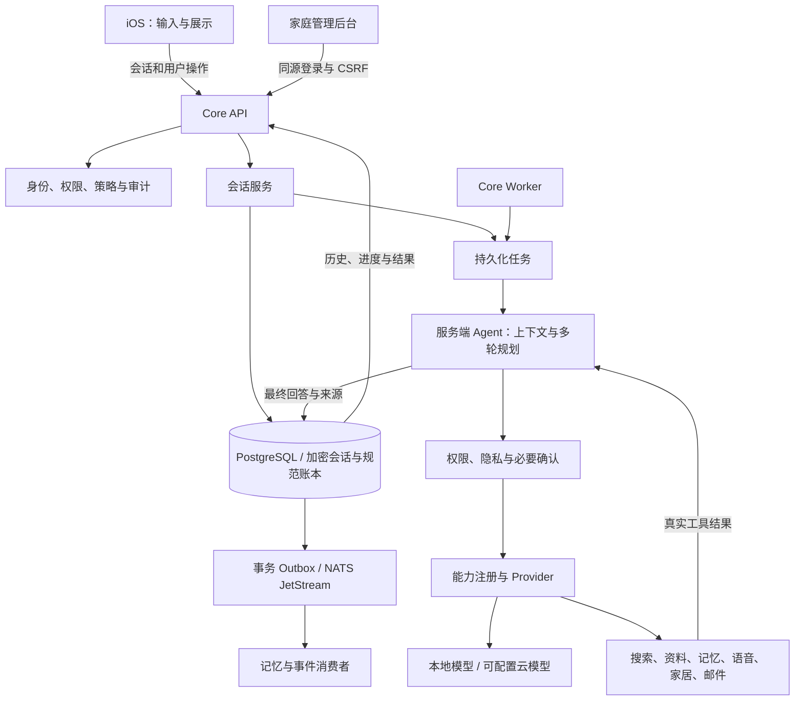
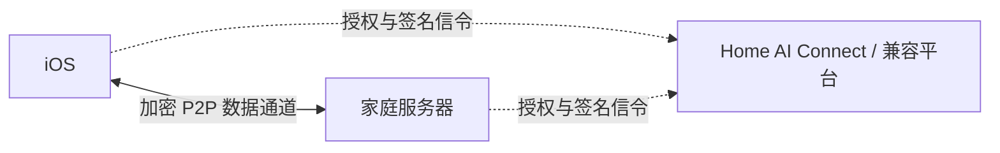

# Home AI OS

Home AI OS 是运行在家庭服务器上的私人 AI 系统，提供原生 iOS 客户端与网页管理后台。会话、资料、记忆、任务和自动化由家庭服务器持有；本地使用不需要平台注册或付费。

项目采用**服务端编排、客户端交互**的架构：iOS 发送用户消息并展示进度、回答和必要确认，服务端负责多轮上下文、模型选择、工具调用、隐私检查和结果保存。联网搜索由 AI 在对话中按需执行，客户端不选择搜索工具或拼装 Agent 工作流。

当前为持续开发版本；真实接入和验收范围见 [验收记录](docs/验收记录.md)，不将未具备环境的功能标记为完整生产交付。

## 产品组成

| 组成 | 职责 |
|---|---|
| iOS | 对话与历史、语音输入、自动化、个人数据与共享、系统权限和扫码配对 |
| 家庭管理后台 | 成员与设备、模型和 Provider、本人及已共享数据、记忆、任务、自动化、远程连接与运维 |
| Core API | 身份认证、会话接口、数据权限、同步、任务提交、审批与审计 |
| Core Worker / Agent | 持久化执行、多轮规划、工具调用、重试、预算、取消及自动化触发 |
| Memory Worker | 从规范记忆账本生成向量和可重建的派生索引 |
| Provider | 模型、搜索、文档、语音、家居、邮件与受控 MCP 的能力实现 |
| Home AI Connect | 独立闭源协调平台，提供远程开通、设备授权和连接协商，不转发家庭业务正文 |

iOS 最低支持 iOS 18，保留**对话、自动化、数据、设置**四个主页面。没有独立的“活动”Tab，也没有对话右上角的独立搜索入口。

## 系统架构



服务端是 Python 模块化单体，API、任务 Worker 和记忆 Worker 独立运行。PostgreSQL 保存规范数据，pgvector、Mem0 与 Graphiti 提供检索或派生索引，不能取代规范账本成为唯一数据副本。Provider 不持有 Core 数据库凭据。

## 对话与业务流程

### 1. 配对和打开应用

家庭管理员在“成员与设备”创建成员并生成五分钟有效的二维码。iOS 扫码后自动取得地址与稳定服务器身份：未启用远程时使用家庭 HTTPS 地址，已启用远程时可在外网首次配对。

打开应用后，客户端从服务端读取该成员的会话列表和历史，恢复上次选择的会话。聊天记录不依赖页面内存；关闭页面或重启应用不会删除服务端历史。不同成员的会话相互隔离。

### 2. 发送消息和多轮上下文

1. iOS 将消息和发送标识提交到会话接口，不提交模型角色、工具名称或执行计划。
2. Core 校验身份与会话所有权，把消息和任务在同一事务中保存。同一发送标识重复提交不会重复创建任务。
3. Agent 从服务端读取近期历史，重新校验旧回答引用资料的权限，再组织本轮上下文。
4. 服务端调用模型，由模型提出结构化工具建议；核心重新检查契约、权限、隐私和预算后执行。
5. 工具结果回到 Agent，必要时继续调用工具，最终将回答与真实来源保存到服务端。
6. iOS 读取进度和结果；断线期间服务端任务继续，重连后读取原任务，不重放有副作用的操作。

完整历史保存在服务器，但模型上下文有长度和轮次预算，并非无限上下文。已撤回授权或已删除来源的旧答案会被隐藏，不继续送入模型。旧版本没有会话标识的单轮任务，迁移为独立历史对话，不虚构它们之间的多轮关系。

### 3. 自动搜索与操作确认

公开联网搜索在对话中按需自动执行，通过自托管 SearXNG 获取结果，AI 整合后提供真实来源链接。搜索不再单独要求审批；查询仍经过隐私检查，不能借自动搜索将秘密或未获授权的私人来源发送出去。

邮件发送、受控设备操作等需要确认的行为，会在对话中显示具体参数。用户确认或拒绝后，由服务端继续处理。确认绑定执行身份、参数摘要和有效期，客户端不能把任意操作伪装成已批准。禁止的高风险能力不会因用户确认而自动开放。

语音录制和系统权限由 iOS 处理；音频交给服务器转写。快捷提醒通过语义输入接口交给服务器创建任务和会话记录，不在客户端编排工具。

### 4. 资料、成员共享与记忆

日历、提醒、联系人、睡眠、照片和位置等数据，由用户在 iOS 授权后按需上传。文件解析、索引和后续处理在服务端执行。

资料归属于手机配对的成员。管理后台只显示当前账号的数据和成员明确共享给它的数据；家庭管理员不会自动获得成年成员的私人内容。iOS 数据详情与管理后台均提供逐条共享和撤回，秘密资料不能共享。

原始资料不会自动成为已确认记忆。用户基于自己的来源资料提交候选，确认后写入记忆账本。成员可以查看自己的记忆和共享给自己的记忆；管理端可按成员筛选。向量、Mem0 和 Graphiti 索引可重建，停用 Provider 不删除规范记忆。

### 5. 任务与自动化

任务是一次执行的持久记录，例如回答消息、解析文件或创建提醒。对话内展示相关进度和必要确认；管理端“我的任务与审批”用于核查当前账号的执行情况，并非全家私人任务的总览。

自动化是“什么时候、做什么”的规则。定时或数据事件触发后，服务器创建任务，再经过同一套策略与执行流程。自动化页面管理当前成员的规则；停用规则不等于取消已经生成的任务。

Provider 显示服务可达，只说明健康检查通过。实际执行还取决于启用状态、能力契约、账户权限、模型或凭据配置，以及隐私策略。

## 远程连接



家庭端主动连接协调平台，不要求路由器映射家庭服务端口。客户端与家庭端通过 WebRTC 数据通道直接传输业务数据，稳定公钥签名绑定协商描述和 DTLS 身份；每个请求仍经过设备认证与数据权限检查。无法直连时明确失败，不回退 frp、TURN 或业务 HTTP 中继。

家庭后台默认使用 `https://homeai-connect.pintheworld.cn`，也可使用兼容协调协议的平台。读取套餐与客服信息后生成申请码，客服确认开通，家庭端自动领取并保存连接配置，无需来回复制绑定码。

开通后自动采用平台下发的 STUN，无需选择配置来源。家庭端可以选填自定义地址；平台可以追加备用节点。STUN 只用于发现网络地址，不承载家庭业务正文。内置服务正常与公网可达是不同状态，以实际探测结果为准。

有效直连不会因空闲或满五分钟而无条件关闭；单次请求仍有超时，设备撤销和授权失效继续生效。iOS 被系统挂起或网络变化时可能需要重新打洞，不承诺后台永久在线。

## 安全与数据边界

- 用户、设备、服务与 Provider 分开认证；应用权限与 PostgreSQL RLS 双重隔离。
- 浏览器使用 Secure、HttpOnly、SameSite Cookie 与 CSRF 校验；iOS 使用设备签名和 Keychain。
- 会话、资料、凭据与记忆内容在家庭端加密保存；密钥不进入模型上下文或普通日志。
- 外部网页、模型输出和工具结果均不可信，不能改变权限或批准操作。
- 云模型调用经过隐私网关，不能在本地模型失败后自动把私人内容转发到云端。
- 写入与 Outbox 同事务，消费者去重；外部副作用结果不明时保留待核对状态。
- 删除、撤权及恢复备份后的删除记录重放继续作用于旧答案和检索结果。

## 开发与部署

需要 Python 3.12+、Docker、Node.js；iOS 另需 Xcode 与签名配置。以下为开发环境启动方式。

```sh
python3 -m venv .venv
.venv/bin/pip install -r requirements.lock
.venv/bin/pip install --no-deps -e .
.venv/bin/python scripts/dev_env.py
docker compose --env-file .env.local -f deploy/compose.dev.yml up -d
.venv/bin/python scripts/migrate.py --runtime
.venv/bin/homeai init-key
.venv/bin/python scripts/tls.py
npm --prefix admin-web ci
npm --prefix admin-web run build
```

`init-key` 只在首次安装执行，保留已有主密钥与 `.env.local`。从旧版本升级时先备份，再运行数据库迁移及历史导入：

```sh
.venv/bin/python scripts/migrate.py --runtime
.venv/bin/python scripts/migrate_chat_history.py
```

分别启动 API 和后台服务：

```sh
.venv/bin/uvicorn homeai.api:create_app --factory \
  --host 0.0.0.0 --port 58443 \
  --ssl-keyfile state/tls/server.key --ssl-certfile state/tls/server.crt
.venv/bin/python -m homeai.worker
.venv/bin/python -m homeai.memory_worker
# 使用家居事件订阅时另行运行
.venv/bin/python -m homeai.home_observer
```

首次初始化管理员：

```sh
.venv/bin/homeai bootstrap --name 家庭管理员
.venv/bin/homeai web-setup --user <用户ID>
```

访问 `https://<家庭服务器地址>:58443/admin/`，配置家庭地址、模型和成员后生成二维码。开发证书默认仅适用于本机；部署时配置实际入口与证书，不关闭证书验证。打开 `ios/HomeAI.xcodeproj` 设置签名后运行。

模型权重不随仓库分发。Provider 启动与注册脚本位于 `scripts/`，固定版本配置位于 `providers/manifests/`。加密备份、主密钥和恢复演练需按实际部署环境配置。

## 工程目录

| 目录 | 内容 |
|---|---|
| `server/homeai/` | 会话、身份、账本、Agent、任务、工具与运维模块 |
| `server/alembic/` | 数据库迁移与 RLS 策略 |
| `ios/HomeAI/` | SwiftUI 交互、会话展示、设备权限和传输层 |
| `admin-web/` | React 家庭管理后台 |
| `providers/` | 独立 Provider 适配及固定版本清单 |
| `contracts/` | OpenAPI 与公共 JSON Schema |
| `deploy/`、`scripts/` | 部署、启动、迁移、备份与验证工具 |
| `server/tests/`、`ios/HomeAITests/` | 权限、协议、工作流与客户端测试 |

Home AI Connect 在独立闭源项目维护，不放入此仓库。

## 许可证

采用 `LicenseRef-Home-AI-OS-Attribution-1.0`，允许使用、修改、商用、闭源再分发和自行托管。对外发布的衍生产品或托管服务须保留“基于 Home AI OS”及指向本项目的可点击链接。详见 [LICENSE](LICENSE) 和 [第三方许可](THIRD_PARTY_NOTICES.md)；不宣称是标准 MIT 或已通过 OSI 认证。
