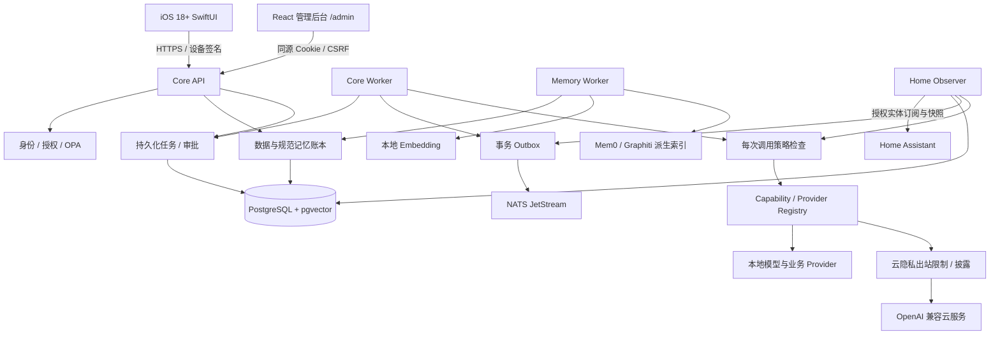
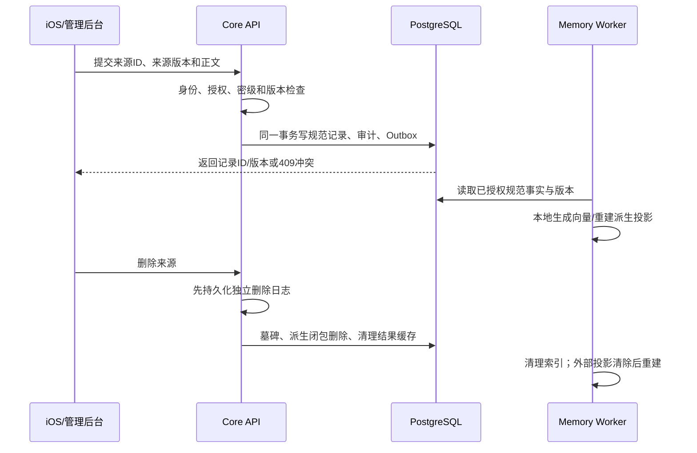
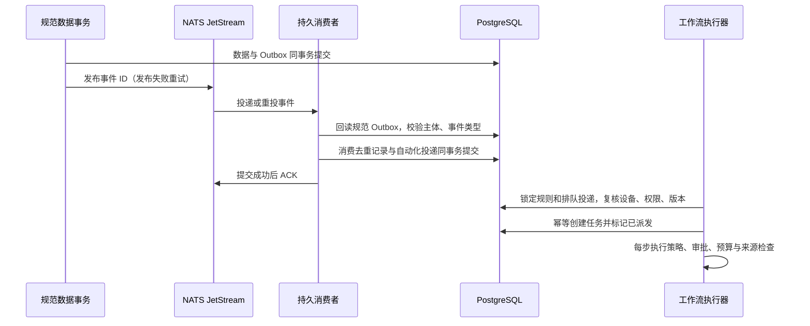
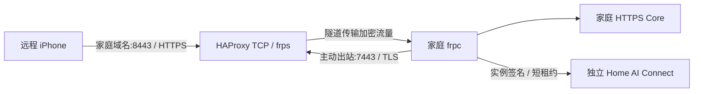
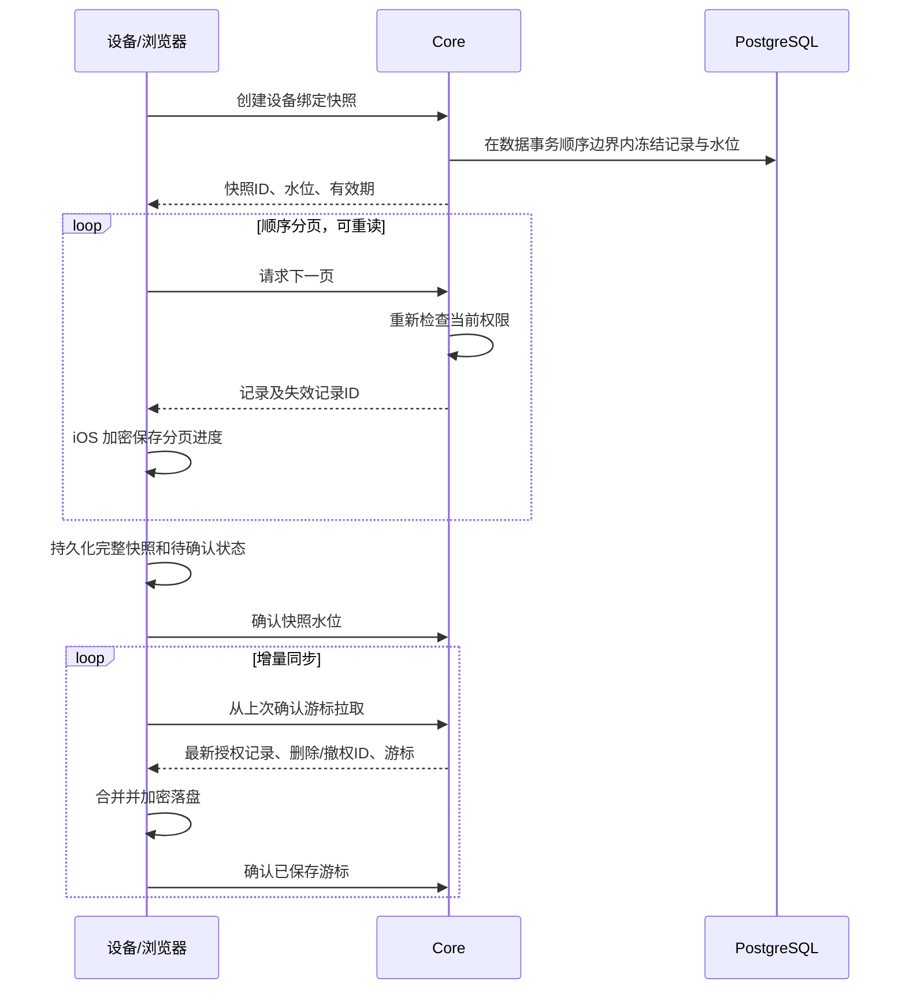
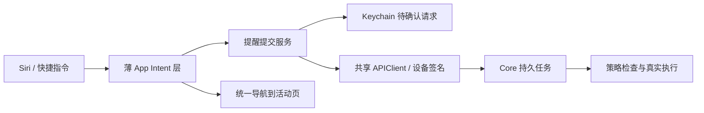
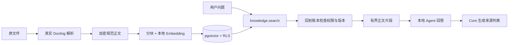
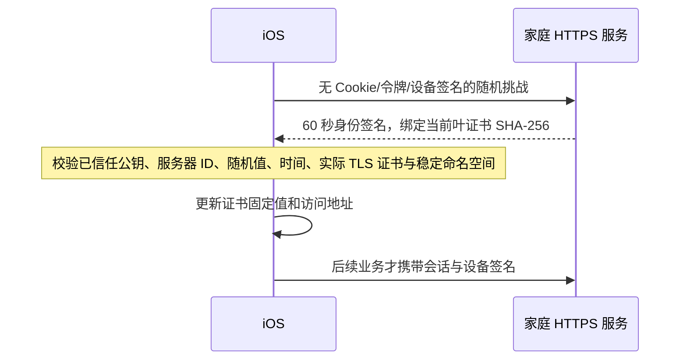

# Home AI OS

[项目主页](https://github.com/MR-MaoJiu/home-ai-os) · [参与开发](CONTRIBUTING.md) · [许可证](LICENSE)

以家庭服务器为中心的私人 AI 系统。项目已建立可运行开发实现，但**尚未达到完整 V1 或家庭生产可用的验收标准**。功能状态见 [验收记录](docs/验收记录.md)，不得将 Provider 配置文件视为真实接入成功。

## 当前可运行闭环

- 一次性配对 → P-256 设备签名 → 短期会话与刷新轮换。
- 用户数据同步 → 加密持久化 → 版本冲突 → 共享/撤回 → 删除墓碑。
- 记忆候选 → 用户确认 → 规范记录 → 授权范围内检索。
- 持久化任务 → OPA → 本地 llama.cpp → 受控工具提议 → 执行/审批/失败状态。
- Outbox → 真实 NATS JetStream 发布。
- SwiftUI 五页客户端及日历、提醒、联系人、睡眠、选定照片、文件导入入口。

## 项目边界与完成状态

本仓库提供家庭服务端、iOS 客户端、网页管理后台和独立 Provider 适配器。Home AI Connect 的账号、套餐、订单、运营后台和中继计量属于独立闭源项目，不在本仓库；家庭私人数据不上传到平台数据库。

“源码已实现”“真实服务集成通过”“iPhone 真机通过”“家庭部署通过”是四个不同阶段。下面列出的待办是实际缺口，不会通过返回固定成功值或示例数据掩盖。

| 模块 | 已实现 | 仍未完成或待验收 |
|---|---|---|
| 身份与管理后台 | 本机初始化、设备签名、短期令牌、撤销；网页密码/TOTP、CSRF、重新认证 | 完整安装向导体验、家庭多成员实用验收 |
| 数据 | 信封加密、版本冲突、共享撤权、删除墓碑、固定分页快照、按设备游标与批次确认 | 大规模性能、系统后台调度及更长离线故障演练 |
| 记忆 | 候选确认、规范账本、pgvector、版本检查、自动与手动重建 | Mem0/Graphiti 已完成真实重建、检索与删除验收；冲突事实裁决、规模与更多故障演练待完成 |
| Agent | 本地模型自主多轮规划、持久化工具步骤、Token/轮次预算、结果引用、逐步审批、取消、恢复与核对 | 云端费用预算、更丰富工具、复杂条件及补偿 |
| 隐私 | 云能力限制、公开资料最小调用、披露记录 | 完整 NER、本地复核、占位符往返还原；私人内容上云保持拒绝 |
| 自动化 | 多步骤 Cron、固定条件判断、数据事件工作流、持久 JetStream 消费、投递去重、冷却排队、因果循环限制 | Skill 补偿、更多事件类型、规模与故障演练 |
| 插件 | 显式映射、凭据隔离、停用、配置回滚 | sandboxd、gVisor、网络沙箱、签名/SBOM、完整卸载验证 |
| 模型 | llama.cpp、MLX 固定权重本地生成与真实工具调用；本地中英文 Reranker、Qwen2-VL 照片分析；OpenAI 兼容协议 | vLLM 硬件验收、云账户集成、视觉模型质量评估 |
| 文档/语音/搜索/家居/邮件 | Docling 七格式解析、whisper.cpp/FunASR 中英文转写、CosyVoice 内置音色合成、SearXNG 真实搜索及审批披露、Postfix/Dovecot 邮件协议闭环、Home Assistant 实体授权与软件辅助开关控制；其余适配器代码 | Linux/生产沙箱验收；真机语音播放、家居自动化因果关联/物理设备、真实外部邮箱账户 |
| iOS | 五页、配对、数据导入、语音入口、证书校验、加密同步缓存、分页与增量恢复、签名 WSS 任务状态流、App Intent 提醒提交、活动跳转、系统提醒受控写入 | APNs、后台调度及 Siri/快捷指令真机验收、逐 Token 文本流 |
| 远程 | 主动 frp 隧道、实例签名、租约、TLS 透传；稳定服务器身份、换证书/地址验证；已有真实连通/撤销记录 | 家庭域名 ACME 自动申请续期、长期断网与配额故障演练 |
| 运维 | 独立迁移账号、加密备份、隔离库恢复与删除日志重放 | 每日备份调度、异机/密钥恢复、RPO/RTO、生产隔离验收 |

## 系统架构

核心采用 Python 模块化单体。HTTP API、任务 worker、记忆 worker 和可选家居观察者是不同进程，共享核心契约和数据库；逻辑模块不是几十个独立微服务。推理服务和第三方 Provider 在独立进程/环境运行，不能获得 Core 数据库凭据。



### 工程目录与职责

| 路径 | 职责 |
|---|---|
| `server/homeai/api.py` | 应用装配、设备会话、数据/任务/Provider API |
| `server/homeai/browser_auth.py` | 浏览器密码、TOTP、Cookie、CSRF 与重新认证 |
| `server/homeai/db.py`、`server/alembic/` | 数据模型、主体作用域、数据库版本与 RLS |
| `server/homeai/data.py`、`deletion.py` | 数据版本、访问权限、来源删除闭包 |
| `server/homeai/memory.py`、`vector_index.py` | 候选确认、规范内容检索、向量对账与重建 |
| `server/homeai/derived_memory.py` | 外部记忆投影的清除、重建、检查点与失败状态 |
| `server/homeai/agent.py`、`runtime.py`、`task_control.py`、`worker.py` | 多步骤执行、审批恢复、人工核对、定时调度、事务事件发布 |
| `server/homeai/policy.py`、`privacy.py` | 核心风险等级、OPA、云出站限制 |
| `server/homeai/home_observer.py`、`home_events.py` | 家居订阅、租约、加密最新状态、断线恢复与观察 API |
| `server/homeai/providers.py` | 端点/能力映射、凭据注入、实际 HTTP/MCP 调用 |
| `server/homeai/remote.py`、`remote_agent.py` | 独立服务器身份、绑定、短租约、frpc 生命周期 |
| `providers/homeai_providers/` | 第三方 SDK 桥；独立安装依赖 |
| `admin-web/` | 管理后台源码；构建结果由 Core 同源部署 |
| `ios/` | SwiftUI、Keychain、设备签名和系统数据连接器 |
| `contracts/` | 由服务端生成的 OpenAPI 和 JSON Schema |
| `deploy/` | 开发基础服务、OPA 策略和镜像构建配置 |
| `scripts/` | 初始化、迁移、模型登记、备份恢复、契约导出 |
| `server/tests/` | 单元与真实服务集成测试；不作为业务运行数据 |

### 数据归属与安全边界

- `Principal` 是成员身份；家庭管理者能管理基础设施，不能因此读取其他成年成员私有记录。
- `Record` 保存规范数据，`Revision` 记录版本，`Grant` 表达显式共享。应用层授权与 PostgreSQL `FORCE ROW LEVEL SECURITY` 同时生效。
- 私人正文、候选、任务参数/结果和 Secret 使用随机数据密钥加密，再由主密钥包裹；数据库记录通过主体及用途绑定 AAD。
- **pgvector 中用于计算距离的向量不是应用层密文**，向量也可能泄露语义。生产必须使用磁盘加密、数据库访问隔离与备份加密；不能宣称数据库所有列都是加密正文。
- 本地主密钥仍须由操作者安全保管、解锁；它不能随备份归档一起存放。当前不是自动 TPM 解锁方案。
- Provider 输出、MCP 描述、附件和模型回答均不具有授权能力。风险等级由 Core 决定，R4 操作不开放。

## 主要业务流程

### 1. 安装与首次身份建立

1. 启动 PostgreSQL、OPA、NATS，使用迁移账号执行迁移。
2. 本机创建主密钥和 HTTPS 证书，启动 Core；从终端创建家庭管理员并领取短期票据。
3. 网页账户通过 `web-setup` 票据绑定该管理员，再设置密码和 TOTP。没有票据不能匿名抢占管理员。
4. iPhone 导入本机第二版配对信息，先验证稳定服务器身份与当前证书，再上传设备公钥并取得短期访问凭据。旧版指纹配对仍可使用，但需要显式升级才能跨 TLS 换钥恢复。
5. 手机后续请求签名绑定时间、随机数、方法、路径、请求体摘要和令牌摘要；刷新凭据轮换，撤销设备后原凭据失效。

网页与 iPhone 使用两套会话机制，但业务授权复用同一个主体。平台账号不等于家庭管理员账号。

### 2. 数据导入、共享与删除



同一来源同一版本且内容相同是幂等写入；同版本不同内容、旧版本覆盖和已删除来源自动复活均拒绝。共享撤回立即影响 Core 查询。删除来源时递归撤下引用该来源的事实与候选，恢复旧备份时先重放独立删除日志，再允许访问。

### 3. 记忆确认与检索

候选并非有效事实：来源必须存在且属于调用者，确认时再次检查删除状态；用户确认后才写入 `memory.fact`。Mem0/Graphiti 不拥有规范事实的唯一副本。

向量 worker 检查 Provider 身份、版本、模型、端点、输入前缀与记录版本。配置变化或手动清除向量后自动补建，每次最多生成 50 条；事务锁防止同一主体被两个 worker 同时重建。模型输出必须是有限数值向量。查询向量生成后在 pgvector 计算距离，结果再次回到规范账本授权读取；过期版本不返回。

外部记忆消费者按主体与 Provider 建立检查点：发生记录变更时清除该主体投影，再从账本重建。中途失败保留 `FAILED` 和错误类型，后续循环重新清除再重试；未同步的投影拒绝查询。当前采用保守全量重建，适合验证一致性，尚不是大规模增量图同步实现。停用 Provider 后不再向其发送请求，外部残留数据须在恢复连接后清除，不能声称离线第三方存储已删除。

| 接口 | 用途 |
|---|---|
| `GET /api/v1/memory/index` | 当前调用者的可索引数、就绪数、待处理数及 Provider |
| `POST /api/v1/memory/index/rebuild` | 清除自己的向量投影，交给 worker 重建，不删除规范数据 |
| `GET /api/v1/memory/derived` | 外部记忆 Provider 的同步状态、尝试次数和错误类型 |
| `GET /api/v1/memory/search?q=…` | 返回 `pgvector_exact` 或明确的 `authorized_literal` 降级模式 |

### 4. 任务、审批与异常

当前任务按 `RECEIVED → EXECUTING → SUCCEEDED/FAILED` 执行；高风险工具进入 `AWAITING_APPROVAL → APPROVED`，参数摘要、主体和有效期必须与审批一致。取消标志、设备撤销和引用记录权限在调用返回时再次检查。

任务提交幂等键绑定请求摘要，相同键不同请求返回冲突。外部副作用在超时或进程中断后可能进入 `NEEDS_RECONCILIATION`，不会盲目重放。已支持显式声明的多步骤工作流，`max_steps` 在提交时限制步骤数。每次 worker 执行一个未完成步骤，成功后持久化结果；下一步骤可引用前序结果。任务连接级 PostgreSQL 锁跨事务保持，多个 worker 不会同时执行同一任务；进程退出后锁由数据库释放。启动时不再批量修改所有执行中任务。

恢复时跳过已成功步骤；内部事务操作使用 Invocation ID 作为来源幂等标识；只读网络操作在有限预算内重试；执行中断的外部副作用进入 `NEEDS_RECONCILIATION`，即使任务已过期也不能误报为确定失败。网络调用受单步超时与任务总截止时间限制。

自然语言本地任务现在使用多轮 Agent：模型提出工具调用 → 校验并持久化步骤 → 逐步执行 → 读取真实工具结果 → 再次规划或最终回答。模型一次可提出多个工具，但总数不能超过 `max_steps`；已完成步骤不会因为再次规划而重放。工具执行后、模型首次提出最终答复时，会在剩余预算内重新对照原始要求与真实工具结果核对；发现遗漏可以继续调用工具。重复提出相同的提醒创建会停止任务，不能循环制造副作用。

规划轮次最多为 `max_steps + 2`，工具预算耗尽后只允许一次无工具总结。`max_model_tokens` 默认 32768，发请求前按上下文 UTF-8 字节数、协议余量和输出上限保守预留，拿到有效 usage 后才返还差额；请求失败或进程退出时不擅自返还未知消耗。`GET /api/v1/tasks/{id}` 的 `execution` 展示轮次、已规划步骤与已计入的 Token 数。

当前自主工具清单为文档检索、记忆检索、日程检索、家庭服务器提醒创建和家居状态读取。自主规划仅使用本地模型，不自动切换云端。工具返回的记录 ID 会回规范账本重新鉴权，已删除或撤权的结果不能继续送给模型；秘密密级仍拒绝进入模型。云端金额预算、更多工具、条件分支及补偿尚待完成。

```json
{
  "idempotency_key": "my-workflow-20260917-001",
  "max_steps": 2,
  "timeout_seconds": 600,
  "step_timeout_seconds": 120,
  "max_read_retries": 1,
  "steps": [
    {"capability": "reminder.create@v1", "arguments": {"title": "准备出行资料"}},
    {"capability": "reminder.create@v1", "arguments": {"title": "检查前一事项", "linked_record": {"$step": 0, "path": ["record_id"]}}}
  ]
}
```

将上述结构提交到已认证的 `POST /api/v1/tasks`。`$step` 从 0 起，只能指向本任务已完成步骤；`path` 只接受对象键和数组下标，不允许代码或表达式。`model.generate@v1` 的显式步骤可使用 `message` 和 `context` 参数，`context` 可引用前序结果，仍经秘密检测且多步骤工作流只开放本地模式。

#### 声明式条件

管理后台创建自动化时可开启“配置多步骤工作流”，输入经过同一服务端契约校验的步骤 JSON 数组。条件也适用于直接提交的任务、Cron 和事件自动化；它不开放代码执行权限。

每个步骤可选 `when`，包含 `mode: all | any` 与 1–16 个谓词。所有谓词只能引用编号更小的前序步骤，路径最多 20 层，单份工作流最多 16 步。示例：先查询会议，有结果才创建提醒。

```json
[
  {"capability":"calendar.search@v1","arguments":{"query":"会议"}},
  {
    "capability":"reminder.create@v1",
    "arguments":{"title":"准备会议资料"},
    "when":{"mode":"all","predicates":[{"step":0,"operator":"not_empty"}]}
  }
]
```

| 运算 | 行为 |
|---|---|
| `exists` / `not_exists` | 判断前序结果及指定路径是否存在；被跳过步骤没有结果 |
| `not_empty` | 仅接受文本、数组或对象，检查长度大于零 |
| `equals` / `not_equals` | 与 `value` 的 JSON 标量比较；布尔 `true` 不等于数字 `1` |
| `gt` / `gte` / `lt` / `lte` | 两侧必须是有限数值，禁止隐式把文本或布尔转成数字 |

`path` 是对象键/非负数组下标列表，例如 `[0,"payload","count"]`；不传时读取整个结果。`all`、`any` 按顺序短路判断。除显式存在性判断外，缺失路径或类型错误会使任务失败，不能把“无法判断”当作条件成立。

执行器先复核来源权限和版本，再读取加密持久结果判断条件。条件不满足时，步骤落库为 `SKIPPED`、结果为空，不调用工具也不申请审批；重启继续处理下一个步骤。后续 `$step` 引用只能读取成功步骤，引用跳过步骤会明确失败。最后一步被跳过时，任务完成结果明确返回 `status: skipped` 和原因，不冒充外部动作成功。条件成立时，原有权限、审批、重试、预算与取消检查全部继续生效。

当前支持固定条件执行，**尚未完成补偿工作流**。已完成的副作用不会因为后续条件或步骤失败自动撤销。

通过 `GET /api/v1/tasks/{id}/steps` 或管理后台查看步骤。未知外部结果需先在外部系统核对，再调用 `POST /api/v1/tasks/{id}/reconcile`，提交 `COMPLETED`、`NOT_EXECUTED` 或 `ABORT` 及核对依据。人工确认结果明确标记为 `user_reconciliation`，不伪装成 Provider 自动确认。确认未执行后，R3 操作必须重新审批；过期和已取消任务不能重新执行。浏览器核对操作要求近期密码与 TOTP 验证。

Cron 自动化将整份 Skill 提交为一个工作流，也走相同任务入口和逐步审批策略。Outbox 与业务写入同事务，NATS 发布使用事件 ID 去重；这不意味着下游所有消费者或外部服务具有恰好一次执行保证。

#### 数据事件自动化

管理后台的“自动化”页面可创建定时提醒，或选择“数据事件”及数据类型、来源和触发间隔。支持 `record.changed`（新增/更新）、`record.deleted`（删除）、`record.revoked`（共享撤权）。默认只处理自己的数据，包含他人共享数据需显式开启。已有数据不会因新建规则被批量追溯触发。



消费者不信任消息里的家庭、事件类型或记录正文，只使用标识找到具有 RLS 隔离的规范 Outbox。相同事件重复投递、数据库提交后进程中断及多个工作进程并发处理，都通过事务锁、消费账本和 `(automation_id, event_id)` 唯一约束去重。冷却时间内的投递保持 `PENDING`，之后依序派发，不静默丢弃。来源被删除、撤权、改为秘密或版本变化时，过时的更新事件被跳过。

每个事件任务持有来源版本依赖，排队后至实际执行之间也会重新检查。Core 将自动化调用链写进后续规范事件：同一规则不能再次进入调用链，最大允许四层，避免 A→A 和 A→B→A 循环。客户端与模型不能提交或修改内部因果链。

完整 Skill 仍可通过已认证的 `POST /api/v1/automations` 提交，例如：

```json
{
  "name": "文档解析完成提醒",
  "trigger_kind": "event",
  "event_type": "record.changed",
  "record_kind": "document.parsed",
  "cooldown_seconds": 60,
  "include_shared": false,
  "enabled": true,
  "skill": {
    "name": "文档提醒",
    "steps": [{
      "capability": "reminder.create@v1",
      "arguments": {
        "title": "新文档已可以检索",
        "source_record": {"$event": "record_id"}
      }
    }]
  }
}
```

`$event` 仅支持整个值替换为 `record_id`、`event_id`、`event_type`，不支持执行表达式或隐式读取正文。需要读取数据的步骤仍通过正常工具及权限检查。提醒保存到规范账本，不表示 APNs 已推送或 iPhone 已写入系统提醒。

`GET /api/v1/automations/{id}/deliveries` 返回自己的最近投递：`PENDING` 排队、`DISPATCHED` 已创建任务、`SKIPPED` 不再满足执行条件、`CANCELED` 已取消。`DISPATCHED` 不是任务成功；用 `task_id` 在任务页面检查最终结果。停用会取消尚未派发的投递，已创建任务需单独取消。

运行 `core-worker` 同时负责发布、持久消费与派发；默认流为 `HOMEAI`、主题前缀 `homeai.events`、消费者 `automation-v1`。数据库迁移 `0006` 必须先于新版 worker 部署。NATS 恢复后会继续消费，持久去重账本保留；不要手工清除生产消费账本或重用其他环境的主题。此实现不承诺外部系统副作用“恰好一次”，未知外部结果仍进入人工核对。


### 5. 模型、插件与云调用

调用路径是 `Task → Policy → Registry → Provider`。Manifest 声明版本、适配器、能力、端点和允许主机；秘密由 Core 按主体与 Provider 对应关系注入，不返回管理页面，也不拼进模型上下文。

本地模型失败不会自动换成云模型。当前云端只允许指定公开资料总结/翻译路径，受限制指令、密级、显式云策略和披露审计共同约束。完整私人数据脱敏还没完成，不能为了“成功回答”放宽。

生产 Provider 启用目前主动拒绝，因为操作系统级沙箱未验收。开发环境的主机白名单属于应用层防护，不等同于 gVisor、网络命名空间或禁止插件访问宿主的完整隔离。

### 6. 可选远程访问



家庭路由器无需开放入站端口。注册、邮箱验证、人工收款、权益开通、子域名选择发生在平台；家庭后台确认绑定后才建立实例身份。已配对 iPhone 额外检查服务器身份，不仅看域名证书。

家庭 HTTPS 在家庭端终止，平台不保存家庭正文和模型密钥；但平台掌握域名和连接元数据，不能宣传为绝对无法访问任何信息。停用、到期、配额耗尽应断开远程连接，本地服务继续工作。平台提供的是子域名使用权，不是可独立转移的注册域名。

## 本机开发

要求 Python 3.12+、Docker、Xcode、XcodeGen。本机验证使用 Python 3.14；GitHub CI 使用 Python 3.12。iOS 已通过模拟器编译和证书校验测试，iOS 18 真机仍待验收。

```sh
python3 -m venv .venv
.venv/bin/pip install -r requirements.lock
.venv/bin/pip install --no-deps -e .
.venv/bin/python scripts/dev_env.py
docker compose --env-file .env.local -f deploy/compose.dev.yml up -d
.venv/bin/python scripts/migrate.py --runtime
.venv/bin/homeai init-key
.venv/bin/python scripts/tls.py
```

`.env.local` 的 `HOMEAI_DATABASE_URL` 应指向 `homeai_runtime`；迁移工具使用独立迁移账号，API 使用无 BYPASSRLS 权限的账号。主密钥只在首次初始化创建，禁止覆盖。首次初始化执行：

```sh
.venv/bin/homeai bootstrap --name 家庭管理员
```

配对码仅有效 5 分钟，不应复制到日志、Git 或聊天中。后续可以用 `homeai pair --user <用户ID>` 重新签发。开发证书指纹位于 `state/tls/fingerprint.txt`。

先按后文说明准备并校验 4B 模型，然后分别启动模型、API 和任务 worker；登记命令在模型服务启动后单独执行：

```sh
.venv/bin/python scripts/run_agent_model.py
.venv/bin/python scripts/register_agent_model.py
.venv/bin/uvicorn homeai.api:create_app --factory --host 127.0.0.1 --port 58443 --ssl-keyfile state/tls/server.key --ssl-certfile state/tls/server.crt
.venv/bin/python -m homeai.worker
```

API 地址为 `https://localhost:58443`，默认不开放局域网与公网。iOS 模拟器可以连接此地址；真机接入需要配置 LAN/VPN 地址及相应证书。

```sh
xcodegen generate --spec ios/project.yml
open ios/HomeAI.xcodeproj
```

首次进入“设置”填写地址、从本机可信渠道获取的证书指纹和配对码。Secure Enclave 真机私钥不导出；模拟器使用明确分支下的测试私钥。

## 测试

当前 0.6B 链路模型在重复多轮验收中仍会漏执行或重复提出操作；运行器会阻止重复副作用。请以最新 [验收记录](docs/验收记录.md) 的实际通过/失败结果为准，不能把一次模型测试成功视为稳定性保证。4B 模型已使用相同断言连续三次通过验收，开发默认优先使用它；这仍不构成任意任务的准确性保证。

```sh
.venv/bin/pytest -q
.venv/bin/python scripts/check_boundaries.py
.venv/bin/python scripts/migrate.py --test
HOMEAI_INTEGRATION=1 HOMEAI_MODEL_TEST=1 .venv/bin/pytest -q
```

集成测试固定使用 `homeai_test`，不写业务库。没有真实服务时集成测试明确跳过，不以模拟测试替代真实验收。

## Provider

`providers/manifests/` 为端点配置示例，注册后默认停用。模型名称和地址必须与实际服务一致。独立 SDK 适配器通过 `HOMEAI_ADAPTER` 选择，并强制校验 `PROVIDER_SERVICE_TOKEN`。各适配器使用独立环境，不把 Docling、语音或图数据库依赖安装到核心服务环境。

当前生产启用接口主动阻止未完成沙箱验收的 Provider。所有依赖尚未按生产 OCI Digest 和签名完成锁定，因此不能将开发 Compose 作为生产部署配置使用。

## 设备同步、离线缓存与升级

同步协议将“已发送”和“设备已持久化”分开处理。浏览器数据列表和 iOS 不再只读取前 100 条记录。



| 接口 | 行为 |
|---|---|
| `POST /api/v1/sync/snapshot` | 冻结当前授权数据；快照绑定当前设备，30 分钟过期 |
| `GET /api/v1/sync/snapshot/{id}` | 顺序分页，支持重读；每页再次检查权限 |
| `GET /api/v1/sync/changes` | 返回游标后的最新授权内容与应删除 ID |
| `POST /api/v1/sync/ack` | 只确认服务器已经提供的水位，拒绝回退或跳过 |
| `POST /api/v1/sync/source` | 查询自己来源的版本、删除状态及分类，不返回他人数据 |
| `POST /api/v1/data/sync` | 可携带 `batch_id`，批次确认和写入同事务提交 |

共享、撤权和删除会给接收成员生成独立事件；发送者不会因此获得读取接收者事件的权限。数据写入采用 PostgreSQL 事务级顺序锁，避免事件 ID 已分配但尚未提交时被游标跨过。当前是家庭单机实现，所有应用数据写入必须走 Core；该串行边界和快照大小仍需大规模性能验收。

快照保存的是加密的固定版本内容；普通更新通过后续增量补齐。删除、撤权或共享数据升级为秘密时，相关服务端快照失效并被清除；客户端会重新建立快照。SECRET 同时在应用查询与 PostgreSQL 共享读取策略中被拒绝。设备撤销会清理其同步状态；恢复旧备份时先升级数据库模式，再清除快照/游标并重放删除日志，不能恢复旧授权缓存。

上传批次绑定成员、设备、批次编号和请求摘要。同一编号同一内容重试返回原确认信息；相同编号不同内容返回 409。重试不会复活已删除记录。iOS 上传连接器先查询来源版本和分类，保留服务器已有密级；同一来源上传排队，确认成功后才标记本地版本已同步。

iOS 缓存使用 AES-GCM、Keychain 和文件数据保护，并排除系统备份；按服务器信任身份与设备 ID 隔离。初始分页进度和未完成的 ACK 都会落盘，重启后可继续。网络断开时明确显示已保存缓存；认证失效时清除缓存并拒绝伪装在线成功。锁屏数据保护可能使后台访问不可用。系统后台刷新已接入，但唤醒时机由 iOS 决定，不能宣称随时后台同步。

### iOS 前台任务状态流

前台使用设备签名的 WSS 连接，聊天与语音转写等待任务状态通知，完成后调用原有任务接口读取结果；活动页自动刷新审批、最近任务与审计，并可打开任务详情或取消未完成步骤。状态流不是逐 Token 文本流，当前模型答案仍在完成后显示。

| 端点 | 内容 |
|---|---|
| `WSS /api/v1/events/tasks` | 当前成员最近 100 个任务状态；更多任务时返回 `has_more: true` |
| `WSS /api/v1/tasks/{task_id}/events` | 单个已授权任务，适用于聊天及语音转写等待 |
| `GET /api/v1/tasks/{task_id}` | 重新校验来源权限/版本后返回任务结果，来源失效时隐藏旧结果 |

握手复用 HTTP 的 Bearer 访问凭据、时间戳、一次性 nonce 和设备签名，以 `GET`、请求路径及空请求体签名。令牌只进入请求头，不放在 URL 中；状态流不接受匿名或仅 Cookie 的连接。iOS 继续使用配对时固定的服务器证书/公钥校验，不能为了连接成功关闭校验。

连接建立后立即发送 `task.snapshot`，之后只推送有变化的任务与步骤状态；空闲每 15 秒发送心跳。JSON Schema 位于 `contracts/TaskStateNotification.json`。消息没有任务正文、模型输出、工具参数或秘密。客户端收到完成通知后仍须请求规范任务结果，不能用通知替代权限判断。

服务端每秒检查持久数据库和连接授权，撤销设备或令牌过期会关闭已建立连接；每个 API 进程对同一设备最多允许 4 个状态连接。当前针对家庭规模，以数据库状态查询实现变化检测，并不依赖 NATS 在线。多进程总连接配额、大规模广播和压力验收尚未完成。

重连发送当前快照，不重放全部历史事件；审计历史仍来自活动接口。iOS 活动连接使用有上限的退避间隔恢复，聊天等待采用有限重试；进入后台关闭实时连接，服务器任务继续运行。回到前台重新连接并同步状态，后台处理依旧依赖系统允许的刷新/推送机制。

已通过真实原生模拟器的 HTTPS/WSS 验收：签名握手、任务完成通知、重新订阅恢复、设备撤销断开。iPhone 真机、长时间弱网、路由器切换和后台唤醒仍待验收。

### Siri / 快捷指令入口

App Intents 模块提供“创建家庭提醒”和“查看家庭任务与审批”两个入口，并包含简体中文快捷短句资源。它们声明需要本机认证，执行时打开应用；不提供锁屏常驻监听或绕过 Core 的动作通道。



主应用与 Intent 共用同一个认证 actor，刷新凭据仍串行处理。提交前保存受数据保护的幂等请求；同一配对上下文、同一内容的未确认请求重试时复用原任务编号，不跨服务器或设备身份自动重放。明确确认后的再次调用是新的用户请求。Keychain 不可用、未配对、内容为空或连接身份变化时停止提交，不降级到明文缓存。

返回语只说明“家庭提醒任务已提交”，最终状态在活动页查看。这是家庭账本中的提醒，不等于已经写入 iPhone 系统提醒或已经触发 APNs。Siri 的语音识别及其数据处理受 Apple 系统配置影响，不把 Siri 描述为 Home AI OS 的完全本地识别通道。

已验证 App Intents 打包元数据、中文资源、统一导航，以及真实 HTTPS 服务上的不确定提交恢复：服务端已接受的请求在重建提交服务后仍返回同一任务，并实际写入 PRIVATE 提醒。**Siri 真机唤起、快捷指令 App 中的实际发现/执行及锁屏认证交互仍待验收**，不以单元测试直接调用 perform 代替这些系统验证。

### 写入 iOS 系统提醒事项

“设置 → 系统提醒写入”提供明确的 EventKit 授权、列表选择和本次同步预览。只处理当前成员自己在 Core 创建的 `reminder.item`，不会把手机导入记录再次导出；SECRET 记录不写入系统列表。

- 本机列表可由用户开启前台自动同步；离线缓存不会被当成有效写入授权。
- iCloud 或其他非本机列表不自动写入，每次需要用户预览并确认，预览后 Core 版本变化则停止写入该条。预览同时固定服务器、列表、账号和账号类型；选择或配对变化后必须重新确认，实际写入前再次核对权限。
- 默认同步标题和完成状态；用户可另行开启绝对到期时间与到期闹钟。备注、附件、全天/浮动时间和复杂重复规则不被擅自覆盖。

每个系统条目带有服务器信任身份＋成员＋规范记录 ID 的稳定来源链接。收据保存在受保护 Keychain，同一账户重新配对也不会因为设备 ID 改变重复创建。点击来源链接会验证当前服务器与成员，再读取授权提醒记录。

标题与完成状态进行三方比较：仅一端变化时同步，双方修改同一字段且内容不同则保留双方并报告冲突。手机上删除、移动到不可见列表或移除来源标记时，不自动复活条目。服务器删除/改为秘密时，仅清理本机未被手动改动的 Home AI 镜像；包含新备注、闹钟或其他修改的项目保留待核对。更换目标列表不会自动跨账户搬运旧条目。

系统中的 Home AI 镜像不会再次以新的 iOS 来源上传，避免来回复制。系统账户可能把写入内容同步到其他设备或云端，这与 Core 的云模型调用是不同的数据出口；非本机列表因此采用本次明确确认，不静默导出。

已使用真实 EventKit 本机列表验证创建、重复同步、重新配对去重、完成状态回传、双向冲突保留和删除传播，测试结束删除了专用测试列表。**真实 iCloud 账户、实际通知送达、权限撤回的真机表现以及长期多设备编辑仍待验收**。Siri 返回任务已提交后，是否已写入系统列表仍取决于上述权限与同步状态。

### 提醒时间与到期通知

Core 的 `due_at` 使用带时区的 ISO 8601 时间，规范化为 UTC 秒精度；没有时区的时间拒绝。`notify_at_due` 是显式布尔选项，开启时必须有到期时间。它与任务执行截止时间 `timeout_seconds` 不同：任务现在执行保存，到期时间可以在未来。

普通提醒使用 `create_reminder` 工具，定时提醒使用参数完整的 `schedule_reminder`。本地 Agent 获得请求接收时间和 IANA 时区作为相对日期基准，排队跨日不会偷偷更换基准。执行记录保留模型实际提出的参数，规范回执返回 UTC 与本地时区表示；避免把等价的时区表示误当作漏执行。

快捷指令可设置可选到期时间和“到期时通知”。未确认提交的幂等身份包含时间与通知选项，旧版无时间的待确认记录仍可恢复。系统同步页的“同步到期时间与到期提醒”默认关闭，预览会显示具体时间和通知请求。

启用后，EventKit 使用 Gregorian 日历、明确时区的开始/到期组件及到期闹钟。时间与通知字段也进行三方比较；全天、浮动日期、独立开始时间、多重或提前/位置闹钟会保留并提示核对，不强制转换。默认关闭该选项时不会覆盖系统中已有时间或闹钟。

已验证真实 Core 时间规范化、本地模型定时工具，以及真实 EventKit 保存到期时间和闹钟。**保存闹钟不等于声音/横幅已送达**，实际通知取决于 iOS 权限、系统设置和设备状态；真机通知、DST 边界、全天/重复规则与长期时区切换仍待验收。

### iOS 后台刷新与取消

“设置 → 后台同步”可明确开启或关闭系统后台刷新，默认关闭。应用通过 SwiftUI `appRefresh` 和 `BGTaskScheduler` 申请刷新，最早执行时间设为 15 分钟后；这不是每 15 分钟必定执行的定时器。任务开始时重新提交后续申请，用户关闭开关会取消当前后台操作和后续请求。

后台复用相同设备同步协议，只获取已授权的服务器数据，不自动录音、不额外请求通讯录/健康/位置权限。缓存和密钥受保护时跳过；回到前台或受保护数据可用时重新恢复连接并继续同步。网络不可用时保留已保存进度。

可取消的执行门保证等待中的后台任务能在到期时退出，不会一直卡在前台同步之后；异常路径会释放执行权。前后台共用 APIClient 时，刷新凭据串行处理，避免并发消费同一枚刷新令牌；访问令牌不能替代刷新令牌。

原生测试已覆盖后台标识/模式写入构建产物、等待取消、异常释放以及短会话真实并发刷新。**尚未通过真机的系统唤醒、锁屏、低电量和长期调度验收**。APNs 和后台文件上传仍是独立待办。

### 部署就绪诊断

管理后台“概览 → 检查部署条件”会调用仅基础设施管理员可访问的 `GET /api/v1/manage/readiness`，执行真实只读检查：

- PostgreSQL 可连接，应用角色没有 SUPERUSER/BYPASSRLS，规范数据表启用并强制执行 RLS。
- OPA 能允许低风险请求，同时拒绝未审批高风险与禁用风险级别；空策略或全放行不能通过。
- NATS 支持 JetStream，配置的事件流存在且主题匹配；检查不会替 worker 创建事件流。
- 当前加载的主密钥能完成信封加密/解密往返。

`core_dependencies_ready` 只汇总上述基础检查。另有 `runtime_ready` 检查必需后台循环：任务和记忆 worker 必须有近期正常心跳，启用家居订阅时还检查家居观察者。结果不回显连接地址、密码或业务内容。模型、具体任务、生产沙箱、备份恢复与家庭真机部署仍需独立验收。数据库完全不可用时鉴权本身也无法完成，应由服务器运维人员检查服务日志和数据库连接。

### 后台执行器心跳

任务、记忆和家居观察进程每 5 秒写入经 Core 密钥认证的心跳，包含实例标识、最近循环完成时间、循环计数及错误类型，不含任务正文或凭据。心跳同时绑定数据库、策略、事件端点及运行环境的配置摘要，避免错把其他配置的 worker 当作本实例执行器。诊断只接受 30 秒内且验证通过的记录；停止、过期或篡改记录不算有效心跳。

心跳表示事件循环近期仍有响应，不代表每个任务或 Provider 已成功。执行较长任务时，应结合最后循环时间、任务状态和 Provider 状态判断。突然退出的检测存在最多约 30 秒窗口，不能把最近心跳描述为瞬时进程证明。

文件位于私有 `state/health`，独立进程/容器部署需共享该受保护状态目录及同一 Core 密钥。不会凭端口开放或遗留 PID 文件推断执行器正常。

### 容器构建与产物验收

```bash
docker build -f deploy/Dockerfile -t homeai-core:packaging-check .
python3 scripts/smoke_container.py --image homeai-core:packaging-check
```

Dockerfile 分两阶段构建：Node 安装锁定的前端依赖并生成静态文件，Python 安装 `requirements.lock` 后再安装项目 wheel（不重新解析运行依赖）。两个基础镜像均固定 OCI 摘要；升级时需重新构建并验收。构建上下文排除运行数据、模型目录、私有环境文件和本机代理配置。

镜像默认使用 `HOMEAI_ENVIRONMENT=production`，以 UID `10001` 运行；管理资源固定在 `/app/admin-web/dist`，通过 `HOMEAI_ADMIN_DIST` 显式配置，不依赖包安装位置。源码运行时该配置默认为工作目录下的 `admin-web/dist`。曾经按 `__file__` 推导路径的实现会在 wheel 安装后找错管理目录，现已修复。

验收脚本实际创建一次性数据卷和随机主密钥，启动只读根文件系统容器，仅向宿主 loopback 动态端口提供连接。它检查安装包路径、非 root 身份、管理 HTML/JS/CSS、匿名 API 拒绝、生产文档关闭及私有文件路径不可访问，结束后仅删除本次 UUID 命名的容器与卷。没有预置业务账号、伪造任务响应或使用业务数据卷。

这项检查证明**发布镜像可启动且包含可用管理资源**，不代表数据库、模型、家庭部署或 gVisor 隔离已经验收。CI 新增独立 `container` 工作执行相同构建和启动检查。

实际部署仍需提供应用专用数据库连接、OPA/NATS 地址、持久数据卷和人工解锁后的主密钥文件。容器内的 `127.0.0.1` 指向容器本身，不能直接照搬 Mac 原生开发配置；应用账户禁止拥有数据库超级用户或 BYPASSRLS 权限。持久目录须允许 UID `10001` 写入，主密钥只提供必要读取权限。

默认容器监听 `8000`，属于内部 HTTP 端口。家庭访问需配置 HTTPS，可由 Uvicorn 显式加载只读挂载的证书/私钥，或由受控反向代理终止 TLS 并转发 WebSocket Upgrade；不能把测试用 HTTP 地址当作正式管理入口。安全 Cookie 与客户端证书校验继续生效，不提供关闭校验的部署选项。生产 Provider 仍受尚未通过的操作系统级沙箱验收门禁约束。

### 现有安装升级

1. 停止旧版 API 与 Core worker，避免新旧写入事务规则混用；先创建并验证加密备份。
2. 更新代码，执行 `.venv/bin/python scripts/migrate.py --runtime`，当前数据库迁移为 `0008`（包含同步、索引、自动化与家居观察租约）。
3. 构建管理后台并重启 API、任务和索引 worker，再更新 iOS。
4. 旧配对会通过已认证的 `/api/v1/me` 补齐设备 ID；不会静默更换服务器信任对象。快照失效或备份恢复后，客户端重新建立完整缓存。

### 原生真实同步验收

```sh
.venv/bin/python scripts/migrate.py --test
.venv/bin/python scripts/run_sync_test_api.py --session-seconds 30
# 另一个终端生成临时配对文件，仅输出路径
.venv/bin/python scripts/create_sync_test_fixture.py
```

将该路径作为原生测试环境变量 `HOMEAI_SYNC_PAIR_FILE` 传给 `SyncTests`。需要可访问 Keychain 的模拟器临时签名，可使用 `CODE_SIGNING_ALLOWED=YES CODE_SIGN_IDENTITY=- CODE_SIGN_STYLE=Manual`；无签名构建只能编译，不能证明 Keychain 正常。实际验证已通过 205 条记录分页、上传版本确认、增量更新、删除、缓存恢复、连接身份错误时停止发送及设备撤销。测试连接不覆盖模拟器原有连接配置。

GitHub CI 运行真实 PostgreSQL/OPA/NATS、迁移与同步测试。未提供临时配对文件时原生真实网络测试明确跳过；本机记录与 CI 结果分别报告。

## 4B 本地 Agent 模型

0.6B 模型保留作低成本链路测试，已发现其多轮操作不稳定。当前开发实例优先登记真实 Qwen3-4B-Q4_K_M；模型来自 [Qwen 官方固定版本](https://huggingface.co/Qwen/Qwen3-4B-GGUF/tree/bc640142c66e1fdd12af0bd68f40445458f3869b)，权重约 2.5 GB，不进入 Git。

```sh
curl -fL --retry 3 -C - 'https://huggingface.co/Qwen/Qwen3-4B-GGUF/resolve/bc640142c66e1fdd12af0bd68f40445458f3869b/Qwen3-4B-Q4_K_M.gguf' -o state/models/Qwen3-4B-Q4_K_M.gguf
.venv/bin/python scripts/run_agent_model.py
```

另开终端运行 `.venv/bin/python scripts/register_agent_model.py`。启动脚本检查大小 `2497280256` 和 SHA256 `7485fe6f11af29433bc51cab58009521f205840f5b4ae3a32fa7f92e8534fdf5`；校验不符不会加载。服务位于 `127.0.0.1:58082`，使用单并发、8192 上下文，保留原 `58080` 链路测试服务。

Graphiti 使用 4B 服务进行真实抽取和重排。已验证版本的 llama.cpp 对含 `$ref` 的嵌套 Schema 存在约束兼容问题，适配层展开本地引用并保留必填字段；拒绝远程/循环引用，不修改模型返回内容，不事后补造字段。

Graphiti 服务启动、数据库和模型就绪后，为成员登记：

```sh
.venv/bin/python scripts/run_graphiti.py
.venv/bin/python scripts/register_local_graphiti.py --user <成员ID>
```

完整已接入服务回归使用：

```sh
HOMEAI_INTEGRATION=1 HOMEAI_MODEL_TEST=1 HOMEAI_EMBEDDING_TEST=1 HOMEAI_DOCLING_TEST=1 HOMEAI_MEM0_TEST=1 HOMEAI_GRAPHITI_TEST=1 HOMEAI_AGENT_TEST_URL=http://127.0.0.1:58082/v1 HOMEAI_AGENT_TEST_MODEL=Qwen3-4B-Q4_K_M.gguf .venv/bin/pytest -q
```

测试仍要求两条实际提醒、模型最终回答及重复调度无新增操作，另验证 Graphiti 实际关系检索与删除传播。没有启用对应标志的跳过结果不算验收通过。

## 可拆卸记忆投影（Mem0）

Mem0 1.0.11 是 Core 规范账本的派生索引，不负责决定事实真伪。实际运行使用本地 OpenAI 兼容接口、EmbeddingGemma 和本地 Qdrant；虽然 SDK 适配器名为 `lmstudio`，它调用的是本机 llama.cpp 的兼容接口，不要求安装 LM Studio。

```sh
python3.12 -m venv state/venvs/mem0
state/venvs/mem0/bin/pip install -r providers/requirements-mem0.txt
.venv/bin/python scripts/run_mem0.py
```

另开终端登记成员并启动索引 worker：

```sh
.venv/bin/python scripts/register_local_mem0.py --user <成员ID>
.venv/bin/python -m homeai.memory_worker
```

启动前必须已有 `58080` 本地生成服务和 `58081` Embedding 服务。配置显式指定两个本地模型，不保留 SDK 默认云端配置；规范事实以 `infer=False` 入库，Mem0 不能再次推断并覆盖账本。运行器只传递必要环境，服务监听 `127.0.0.1:8101`。服务秘密、SDK 状态与向量文件位于忽略的 `state/` 目录，完整已验证依赖见 `providers/locks/mem0-macos-py312.txt`。

`MEM0_TELEMETRY=false` 在导入 SDK 前设置；模型 HTTP 客户端禁用环境/系统代理，Python 出站门禁仅允许两个本地模型端口。真实验收确认本地连接计数增加，未授权连接尝试计数为零；单独测试确认外部域名和地址被拒绝。这不是操作系统沙箱，不能据此宣称任意恶意原生扩展已被隔离。

SDK 历史库只驻留内存，不额外落盘私人正文。主体清除循环处理 SDK 默认 100 条分页，确认无剩余向量后清空内存历史；适配层绕过固定 SDK `reset()` 的嵌套锁死锁路径，不修改第三方源码。Qdrant 文件仍是派生明文数据，部署时需要磁盘加密及备份保护。

Core 检查点未就绪时拒绝派生查询；检索只接收规范 ID，正文仍回到授权账本读取。停用时核心记忆保持可用，外部投影不再更新；恢复启用后处理积压删除并重建。管理后台“记忆索引”提供“重建我的投影”，对应 `POST /api/v1/memory/derived/{provider_id}/rebuild`；索引丢失或迁移后可以显式重新生成，不依赖碰巧出现新的数据事件。

```sh
HOMEAI_MEM0_TEST=1 .venv/bin/pytest -q server/tests/test_mem0_live.py
```

该测试实际调用 SDK、Embedding、Qdrant、PostgreSQL 和 OPA，覆盖重建、搜索回读、跨主体隔离、停用及删除传播。参考 [Mem0 本地 Embedding 配置](https://docs.mem0.ai/components/embedders/models/lmstudio)。

## Graphiti 独立图数据库

Graphiti 0.30.2 的依赖和本地客户端适配已准备，实际运行的 Neo4j 5.26.30 使用独立 Compose 项目、数据卷和凭据；仅发布本机 Bolt 端口 `57687`，不发布图数据库网页控制台。镜像已按官方 OCI 清单摘要锁定。真实模型抽取、图搜索、Core 规范记录回读、跨主体隔离和删除传播已通过开发验收；生产沙箱仍未完成。

```sh
.venv/bin/python scripts/init_graphiti.py
docker compose --env-file .env.graphiti -f deploy/compose.graphiti.yml up -d
python3.12 -m venv state/venvs/graphiti
state/venvs/graphiti/bin/pip install -r providers/requirements-graphiti.txt
state/venvs/graphiti/bin/python scripts/check_graphiti_database.py --initialize-indexes
```

`.env.graphiti` 为 0600 私有配置，不进入仓库；初始化不会覆盖已有凭据。SDK 直接导入但未声明的 `httpx` 已显式锁定。Mac/Python 3.12 完整依赖见 `providers/locks/graphiti-macos-py312.txt`。

`run_graphiti.py` 为独立启动入口，要求 `58082` 的本地生成模型、`58081` 的 Embedding 和已启动的 Neo4j。客户端显式关闭遥测和系统代理，Python 门禁只允许这三个本地端口，不使用默认云模型；原始 episode 正文不保留到图数据库。图仍是派生数据，搜索必须映射回规范记录 ID，再由 Core 重新鉴权。操作系统隔离尚未验收。

数据库认证连接、33 个索引在线和真实主体清理隔离已通过。启动 `run_graphiti.py` 后，可用独立测试节点运行 `state/venvs/graphiti/bin/python scripts/check_graphiti_isolation.py` 复验清理边界。随后已通过模型实体抽取、语义搜索及规范账本回读全链路测试。重建使用规范记录更新时间并按时间排序，不以重建时间冒充事实时间。

## 本地文档解析（Docling）

实际验证版本为 Docling 2.128.0、ONNX Runtime 1.30.0、Python 3.12；与 Core 使用独立环境。已验证 DOCX、Markdown、HTML、TXT、PPTX、PDF 和 PNG 的真实文件解析，PDF/图片使用本地布局、表格及 RapidOCR 模型。七个格式测试不代表任意扫描件或复杂版式都能准确识别；Linux 和生产隔离仍须独立验收。

```sh
python3.12 -m venv state/venvs/docling
state/venvs/docling/bin/pip install -r providers/requirements-docling.txt
state/venvs/docling/bin/docling-tools models download layout tableformer rapidocr --rapidocr-backend-lang onnxruntime:iso:zh --output-dir state/models/docling
.venv/bin/python scripts/verify_provider_models.py --manifest providers/models/docling-2.128.0.json --root state/models/docling
.venv/bin/python scripts/run_docling.py
```

另开终端登记当前成员：

```sh
.venv/bin/python scripts/register_local_docling.py --user <成员ID>
```

Mac/Python 3.12 的完整已验证依赖记录在 `providers/locks/docling-macos-py312.txt`；其他平台不能直接把此记录视为已验证。模型校验清单仅包含相对文件名、大小和 SHA256，不提交权重。上游权重若发生变化，校验脚本会拒绝，不能跳过校验后宣称使用相同模型。

启动脚本强制核对模型 SHA256，只传递必要环境，服务绑定 `127.0.0.1:8103`；随机服务凭据保存在 `state/provider-secrets/docling.token`（0600），登记时写入该成员的加密 Secret。不要将此文件、模型或环境目录提交到 Git。其他成员需分别登记；Registry 不会选择属于其他成员的服务凭据。

运行阶段关闭 Hugging Face/Transformers 自动下载，Docling 关闭远程服务和外部插件。预下载模型与实际文档处理分开。应用层选项不是操作系统网络沙箱；生产启用门禁仍保留。

### 上传到正文的流程

1. 管理后台“数据与记忆”选择文件，上传原始附件。设备上传签名覆盖完整 Multipart 正文摘要；正文被修改时返回 401。
2. Core 以信封加密保存附件。解析接口 `POST /api/v1/files/{record_id}/parse` 只允许当前成员自己的非秘密附件，重复提交返回原进行中或成功任务。
3. Worker 检查 OPA，经授权记录 ID 读取文件，解密后将字节交给独立 Provider；不下发宿主路径或数据库凭据。
4. Provider 串行解析，限制 20 MB 输入、100 页和 3 MB 输出。Office 外部关系、实体声明、过大的解压内容及大于 3000 万像素的图片会被拒绝。
5. Core 再次核对来源版本，将正文保存为 `document.parsed`，记录 `source_ids`、来源版本与解析器版本。解析期间来源变化时不保存旧结果。
6. 失败会保留明确失败任务，再次提交可重试；删除源附件时解析正文进入同一删除闭包，不保留孤立副本。删除和派生创建共用来源行锁。

在独立测试库运行真实验收：

```sh
HOMEAI_DOCLING_TEST=1 .venv/bin/pytest -q server/tests/test_docling_live.py
```

测试生成有效文档文件并调用真实 Docling HTTP 服务，不返回固定 Markdown。完整回归可以同时打开 `HOMEAI_INTEGRATION=1 HOMEAI_MODEL_TEST=1 HOMEAI_EMBEDDING_TEST=1 HOMEAI_DOCLING_TEST=1`。

参考：[Docling 离线与模型预下载](https://docling-project.github.io/docling/usage/advanced_options/)、[Pipeline 配置](https://docling-project.github.io/docling/reference/pipeline_options/)。

## 文档检索与有依据的回答

文档解析完成后，独立索引 worker 将 `document.parsed` 正文分块并调用真实本地 Embedding。块按字符与 UTF-8 字节预算限制并保留重叠；数据库只保存范围、版本、模型签名和向量，不再复制明文正文。模型或分块策略变化后重建，秘密密级及检测到秘密模式的正文不进入索引。



Agent 新增 `search_documents` 工具，检索结果给出最多五个有界片段。真实向量检索返回 `pgvector_chunks`；索引未就绪或不可用时可降级为授权范围内的文字匹配，并明确标记 `authorized_literal`。文字降级最多扫描 1000 条文档，不能当作完整语义索引的等价替代；大规模吞吐与召回质量仍需验收。

接口为 `POST /api/v1/knowledge/search`，请求体 `{"query":"问题"}`，避免查询正文出现在 URL 日志中；`POST /api/v1/knowledge/rebuild` 只重建自己的派生索引。正文记录按自身授权控制，共享原文件元数据不等同于自动共享解析正文。检索前、回读片段时和模型调用后均检查当前权限与来源版本。

任务保存来源版本依赖。授权撤回、删除或版本变化后，旧任务结果和步骤不再返回原片段，审批与重试也不能继续使用失效依据。模型输出之外的 `sources` 由 Core 根据实际读到的规范记录生成；iOS 展示可打开的来源，点击时再次从服务器读取授权内容，来源更新时明确提示当前版本不同。

iOS 文件导入现在实际上传加密附件并创建解析任务，不再仅保存一段 Base64 数据。旧 `document.import` 文件再次上传时，会校验内容并保留记录 ID 和已有密级进行版本迁移；删除墓碑不自动恢复。`GET /api/v1/files/{id}/content` 提供授权原文件下载，禁止浏览器缓存及 MIME 嗅探。

当前检索采用精确向量召回，并支持可选本地 Reranker 对最多 20 个授权候选重排；大规模 ANN 与持续负载验收仍待完成。解析成功也不代表所有分块立即完成；索引由 worker 持续推进。升级需要执行迁移 `0005` 并重启 API、任务与索引 worker。

验收命令：

```sh
HOMEAI_KNOWLEDGE_TEST=1 HOMEAI_MODEL_TEST=1 .venv/bin/pytest -q server/tests/test_knowledge_live.py
```

真实测试贯通 Docling、Embedding、PostgreSQL 和 4B Agent，要求回答源文档时间、带规范来源、共享可见且撤权后任务缓存隐藏。原生测试使用 `create_sync_test_fixture.py --with-documents`，验证实际签名 Multipart 上传、解析和向量检索，不替换服务响应。

## 本地语音转写（whisper.cpp）

实际验证版本为 whisper.cpp 1.9.3（提交 `371b5a7561823ab2bb32142d2751e35e7534727b`），模型为多语言 `small-q5_1`。英文官方人声样本、中文合成语音输入，以及中英文自动语言识别均经过真实模型处理；它们不是 iPhone 真机录音验收，也不是任意噪声/口音的准确性保证。

```sh
.venv/bin/python scripts/build_whisper.py
curl -fL --retry 3 'https://huggingface.co/ggerganov/whisper.cpp/resolve/5359861c739e955e79d9a303bcbc70fb988958b1/ggml-small-q5_1.bin' -o state/models/ggml-small-q5_1.bin
.venv/bin/python scripts/run_whisper_backend.py
```

另开终端分别运行：

```sh
.venv/bin/python scripts/run_whisper_bridge.py
.venv/bin/python scripts/register_local_whisper.py --user <成员ID>
```

构建需要 Git、CMake 和本机 C++ 编译器；脚本检查固定源码提交并拒绝覆盖修改。后端启动先校验模型大小和 SHA256，校验清单见 `providers/models/whisper-small-q5_1.json`。权重和源码工作目录位于 `state/`，不进入 Git。

C++ 后端只监听 `127.0.0.1:58085`，身份验证桥只监听 `127.0.0.1:8105`。桥接凭据为私有 0600 文件，登记时写入成员的加密 Secret。桥只允许固定本地转写地址，禁用系统代理和 HTTP 重定向，不开放后端模型加载、服务端路径或任意转换选项。开发进程仍不是生产沙箱。

### 录音到文本

1. iOS 通过系统麦克风授权，以 16 kHz、16 位单声道 PCM WAV 录音，最长 60 秒。
2. 录音结束后提交 `speech.transcribe@v1` 持久化任务；正文及结果沿用设备签名、加密存储与 OPA 路径。
3. 桥接层校验 WAV、采样格式、完整帧、0.1–60 秒时长与全零静音；不支持的格式明确拒绝。`language` 支持 `auto`、`zh`、`en`，默认自动识别。
4. 真实 whisper.cpp 生成文本；没有清晰文本时失败，不返回占位转写。
5. iOS 将结果放入输入框，用户可以修改并确认发送，再进入 Agent。不会仅因识别出一段话就直接执行操作。

开发验收：

```sh
.venv/bin/python scripts/create_voice_test_sample.py
HOMEAI_WHISPER_TEST=1 .venv/bin/pytest -q server/tests/test_whisper_live.py
```

中文输入由 macOS 系统语音生成，需要本机中文声音和 ffmpeg，仅为测试输入；英文使用固定源码中的 `samples/jfk.wav` 人声样本。测试调用实际转写服务，不替换输出文本。完整系统回归命令可在前述开关基础上再加 `HOMEAI_WHISPER_TEST=1`。

参考：[whisper.cpp 官方服务说明](https://github.com/ggml-org/whisper.cpp/blob/v1.9.3/examples/server/README.md)。

## 受控 MCP 接入

当前固定官方 Python SDK `mcp==1.30.0` 维护线，与已有接口兼容；不会无提示升级到存在破坏性变化的 2.x。已验证真实 stdio、Streamable HTTP、文件读取，以及 Core 附件上传 → MCP 结构化解析 → 规范账本的链路。SDK 说明见 [官方仓库](https://github.com/modelcontextprotocol/python-sdk)。

MCP 工具名必须显式映射到 Core 已注册能力，风险仍由 Core 定义。每次调用前分页读取工具目录，核对完整工具定义的 SHA-256；工具增加、删除、Schema 或描述变化都会停止调用，要求重新审核。目录指纹不证明远端实现没有变更，也不能代替镜像签名或操作系统沙箱。

HTTP Manifest 使用 `adapter: mcp`、精确端点、允许主机、能力到工具名的映射及 `mcp_catalog_sha256`。凭据继续由成员专属 Secret 提供。映射工具必须返回与 Core 能力匹配的 `structuredContent` 对象，不能把任意文本响应当作成功业务结果。

### stdio 启动配置

私有配置文件须为 `0600`，包含固定绝对可执行路径、文件摘要、固定参数和工具映射。例如字段结构：

```json
{
  "command": "/absolute/venv/bin/python",
  "command_sha256": "可执行文件的SHA256",
  "args": ["/absolute/provider/server.py"],
  "file_sha256": {"/absolute/provider/server.py": "入口文件的SHA256"},
  "env": {},
  "tools": {"parse": "parse_document"},
  "catalog_sha256": "审核后的工具目录SHA256"
}
```

调用者不能指定命令、环境或工具名；桥接拒绝 shell/按需下载启动器、内联代码、未审核的文件参数与 Core 凭据环境变量。Python 虚拟环境解释器路径应保留，不要解析成系统 Python 路径而丢失安装环境。文件摘要流式计算，避免将大文件整个读入内存。

```bash
# 只列目录，不调用工具，也不自动批准或改写配置：
.venv/bin/python scripts/inspect_mcp.py --stdio-config state/mcp/provider.json
.venv/bin/python scripts/inspect_mcp.py --url https://mcp.example.com/mcp --token-file state/mcp/token
# 人工核对目录和映射后启动本机桥接：
.venv/bin/python scripts/run_mcp_stdio.py --config state/mcp/provider.json --token-file state/mcp/bridge.token
```

stdio 桥默认端口 `8108`，通过普通 HTTP Provider 映射 `/invoke/操作名` 接入 Core，服务令牌按成员加密登记。目录描述和工具返回内容均是不可信数据，不能被当作系统指令。启动器不继承 Core 数据库或主密钥环境，但本机进程仍受宿主用户权限影响；**生产沙箱、进程级网络隔离、OAuth 和完整插件卸载验收尚未完成**。

工具目录校验是调用前检查，不提供与远端执行原子的目录锁。测试使用真正的 MCP 服务处理实际文件/UTF-8 附件，不用协议成功的模拟返回代替业务结果。

## Home Assistant：实体授权与受控操作

Home Assistant Provider 现在默认不授权任何实体。Manifest 必须显式配置 `home_entities`（最多 50 个、不允许通配符），读取只向这些实体的独立 REST 路径发请求，不先获取全家的所有状态。返回属性经过固定字段投影，不把无关配置、令牌或其他联动实体交给模型。

操作仍需逐次审批，仅开放 `light`、`switch`、`climate` 的开/关与 `climate.set_temperature`（16–30 的有限数值）。不开放门锁、车库门、任意服务调用或设备组广播。需要结合真实接线确认开关用途，不能因为外部系统将危险设备命名为 switch 就推断操作安全。

家居控制审批同时绑定参数与 Provider 配置。实体清单、端点、版本或凭据引用变化后，原审批不能继续执行；发送前重新读取 Provider，配置变化则明确失败。服务返回成功表示 Home Assistant 完成该服务调用，不替代实际物理设备反馈验收。

### 接入自己的实例

先在 Home Assistant 生成适当权限的访问令牌，保存为本机 `0600` 文件，再明确列出授权实体：

```bash
.venv/bin/python scripts/register_homeassistant.py --user Core成员ID --url https://homeassistant.example.com --token-file state/homeassistant.token --entity light.living_room --entity switch.desk
```

登记工具只核查服务版本和实体读取，不会切换设备。令牌加密保存到该成员的 Secret，其他成员不能借用。跨机器连接应使用 HTTPS 或受保护 VPN；脚本不会关闭证书验证。旧配置缺少 `home_entities` 时会拒绝读取/操作，需要显式补齐，不能靠升级自动获得全部实体权限。

`home.states@v1` 可用空参数读取授权清单，或用 `entity_ids` 指定其子集。`home.execute@v1` 接受 `domain`、`service`、`entity_id`；温控操作另需 `temperature`。不支持任意附加参数。

### 独立真实服务验收

```bash
.venv/bin/python scripts/init_homeassistant_test.py
docker compose -f deploy/compose.homeassistant-test.yml up -d
.venv/bin/python scripts/authorize_homeassistant_test.py
HOMEAI_INTEGRATION=1 HOMEAI_HOMEASSISTANT_TEST=1 .venv/bin/pytest -q server/tests/test_homeassistant_live.py
```

使用固定 Home Assistant `2026.9.2` 镜像摘要、独立配置和仅本机端口 `58123`。初始化只为新建协议验收实例创建账户，并保存私有凭据，不替换已有账户或完成用户的真实家庭配置。辅助模板开关实际调用 Home Assistant 的 input_boolean 服务；没有写死 REST 成功响应或伪造设备状态。

已验证真实状态读取、审批前不动作、批准后状态变化、未授权实体拒绝，以及配置改变使旧审批失效。**这些是 Home Assistant 服务与软件辅助实体的通过证据，不是物理设备验收**。持续订阅和当前状态快照恢复已实现，家居事件触发自动化的跨系统因果关联、真实设备和生产隔离仍待完成。API 依据见 [Home Assistant 官方 REST 文档](https://developers.home-assistant.io/docs/api/rest/)。

### Home Assistant 后台事件观察

登记时增加 `--events` 可显式启用该成员的观察功能，然后运行独立 Core 进程：

```bash
.venv/bin/python scripts/migrate.py --runtime
.venv/bin/python -m homeai.home_observer
```

观察者从 Secret Broker 使用该成员的凭据，通过 Home Assistant 的 `subscribe_trigger` 订阅授权实体。先订阅，再读取逐实体快照；收到事件后将其视为状态失效通知，重新读取当前状态，避免积压旧事件覆盖重连后的新值。不是设备历史事件的无损重放。

Core 持有加密的 `home_observations` 最新观察值与 `home_connections` 连接状态，均启用 FORCE RLS。每个成员/Provider 使用 30 秒数据库租约，每 5 秒检查授权并续租，多个进程不能同时写入同一观察对象。版本仅在状态变化时推进，重复通知不会重复生成变更；断线保留旧值并明确标记 DISCONNECTED。认证或授权失败后等待配置变化，不持续重试失效凭据；普通网络故障按有上限的退避重连。

`GET /api/v1/home/observations` 只返回当前调用者仍获授权的实体，停用 Provider 或撤回清单立即影响读取。管理后台“数据与记忆”显示连接状态与观察时间。观察进程未运行或租约过期时不能显示为在线。

变更与 `home.state_changed` Outbox 同事务提交，可经现有 NATS 发布进程送入事件总线。它使用独立事件类别，**尚未开放为自动化规则输入**：需要先完成 Core 操作与 Home Assistant 回传事件的因果关联，防止跨系统回声循环。当前不将这些事件伪装为已完成因果追踪的 `record.changed`。

已真实停止/重启独立 Home Assistant 验证自动断线恢复，并验证观察进程重启、状态持久化、租约排他、跨成员隔离和 Provider 停用。此处保存的是最新状态观察，不是完整设备历史；硬件、规模、长时间断网与物理环境仍待验收。

## 邮件 Provider：IMAP / SMTP

邮件桥接实现 `mail.search@v1`、`mail.read@v1` 和 `mail.send@v1`，每个实例绑定一个 Core 成员。Core 仅向该成员的 Provider 注入服务令牌，Provider 再核对 `subject_id`；其他成员不能复用同一邮箱。独立启动器不继承 Core 数据库或模型凭据。

支持隐式 TLS 和 STARTTLS，两种模式都验证证书链、主机名和有效期，没有明文回退选项。自托管邮箱可显式提供 `MAIL_CA_FILE`，用于信任自己的 CA，而不是关闭校验。

| 能力 | 当前行为 |
|---|---|
| 查询 | 只读 INBOX 邮件头，按主题/发件人匹配；每批最多扫描 200 个 UID、返回最多 50 项 |
| 分页 | 返回 `uidvalidity`、`next_before_uid`、`has_more`；续页传入 `before_uid` 和原 `uidvalidity`，邮箱标识变化则重新查询 |
| 读取 | 用 UID 和 UIDVALIDITY 读取最大 1 MiB 邮件，提取纯文本正文；HTML 不执行、远程资源不加载，附件只返回文件名和类型 |
| 规范数据 | 读取结果按稳定账户/邮箱/UID 来源写入 `mail.message`，固定为 PRIVATE 与 LOCAL_ONLY；模型和结果查询继续受来源权限与版本检查 |
| 发送 | 单收件人、主题与纯文本正文，逐次审批；不开放任意邮件头、群发或附件发送 |
| 去重 | 独立 SQLite 发送账本绑定成员、调用 ID 和参数摘要；重启后重复调用返回已接受结果，不重复发送 |
| 结果不明 | 发送中断或异常保留 SENDING/UNCERTAIN，阻止自动重发；Core 保持人工核对状态 |

`accepted_by_smtp` 表示邮件服务器接受，不能据此宣称公网收件人已收到。只有同一发送账本中的 ACCEPTED 才可安全返回缓存成功；结果不明不能靠清空账本“修复”。账本需要随 Provider 数据备份，避免丢失去重依据。已提供本机账本核对工具；Core 的通用“确认未执行”仍不会绕过 Provider 的不确定状态保护。必须先按下述流程处理本机账本。

### 邮件结果不明的人工恢复

先在真实邮箱系统查验 Message-ID、SMTP 队列/日志或退信，不能仅因为界面超时就认定没有发送。任务详情会显示邮件步骤的调用 ID；也可从 `GET /api/v1/tasks/{id}/steps` 获取。

```bash
.venv/bin/python scripts/mail_delivery.py inspect --config state/mail/account.json --invocation 调用ID
# 将实际核对依据保存为本机文件，使用 inspect 返回的 request_hash：
.venv/bin/python scripts/mail_delivery.py resolve --config state/mail/account.json --invocation 调用ID --decision NOT_EXECUTED --expected-hash 参数摘要 --expected-revision 核对版本 --evidence-file state/mail/核对依据.txt
```

可选结论为 `COMPLETED`、`NOT_EXECUTED`、`ABORT`。工具只处理指定成员、调用、参数摘要和核对版本匹配的不确定记录，保存依据摘要与时间；不连接邮箱、不发送邮件。依据原文件由操作者安全保留，账本不复制其正文。

核对与发送使用同一跨进程文件锁，原发送仍在执行时拒绝核对。已确认 SMTP 接受、已人工处理或已终止记录不能再次解锁；重复核对不会重复放行；发送和核对推进版本号，旧命令不能解锁后续失败的另一次尝试。确认已完成会标记 `MANUAL_ACCEPTED`，以后返回 `confirmed_by_operator`，不会冒称收到新的 SMTP 成功响应。

确认未执行后账本变为 `RETRY_ALLOWED`。再回到 Core 任务详情选择“确定未执行”，重新完成审批；执行器仍检查设备、任务截止时间和来源授权，只允许原参数。发送开始即重新持久化为 SENDING，再次失败需要新的核对。过期、取消的任务不会因为本机账本解锁而恢复执行。

这不是自动判断送达，也不提供绕过人工核对的网络接口。已用真实 SMTP 认证失败验证受控恢复；公网投递后回执丢失、退信与真实账户仍需对应环境验收。

### 配置真实邮箱

将配置保存为权限 `0600` 的本机私有 JSON 文件（例如 `state/mail/account.json`），不要提交仓库。字段如下；所有值使用字符串：

```json
{
  "MAIL_SUBJECT_ID": "已存在的 Core 成员 ID",
  "MAIL_USER": "邮箱登录账号",
  "MAIL_PASSWORD": "邮箱密码或专用授权码",
  "MAIL_STATE_DIR": "/absolute/private/mail-delivery-state",
  "IMAP_HOST": "imap.example.com",
  "IMAP_PORT": "993",
  "IMAP_SECURITY": "tls",
  "SMTP_HOST": "smtp.example.com",
  "SMTP_PORT": "465",
  "SMTP_SECURITY": "tls",
  "PROVIDER_SERVICE_TOKEN": "本机安全生成的至少32字符随机凭据"
}
```

如登录用户名不是发件地址，可另设 `MAIL_FROM`；STARTTLS 常用端口由邮箱服务商提供。配置是开发期本机秘密文件，须配合磁盘加密和受限文件权限；不要通过聊天、模型或普通日志传递。当前没有 OAuth 邮箱授权向导或生产秘密分发验收。

```bash
.venv/bin/python scripts/run_mail.py --config state/mail/account.json
# 在另一个终端登记，仅保存加密的 Provider 服务令牌，不发送邮件：
.venv/bin/python scripts/register_local_mail.py --config state/mail/account.json
```

发送账本必须配置绝对路径，避免更换启动工作目录后意外生成新账本；示例中的路径需替换为本机实际私有目录。默认桥接端口 `8107`；多个成员使用各自配置、账本与端口，登记时传相同的 `--port`。发送可通过任务 API 提交 `mail.send@v1`，参数为 `to`、`subject`、`text`；真实执行仍等待用户批准。HTML-only 邮件返回 `no_plain_text_part`，不伪造正文；附件正文解析和富文本邮件客户端不在当前已完成能力中。

### 本机真实协议验收

```bash
.venv/bin/python scripts/init_mail_test_server.py
docker compose -f deploy/compose.mail-test.yml up -d
HOMEAI_INTEGRATION=1 HOMEAI_MAIL_TEST=1 .venv/bin/pytest -q server/tests/test_mail_live.py
# 停止验收服务并保留测试数据：
docker compose -f deploy/compose.mail-test.yml down
```

固定 Docker Mailserver `v16.0.1`，实际运行 Postfix 与 Dovecot；测试域为 `example.test`，只向本机 `alice@example.test` 投递。Postfix `default_transport` 和 `relay_transport` 明确禁止外部投递，端口仅绑定 loopback，不配置公网 MX 或开放中继。Docker Desktop 的 internal 网络不发布宿主端口，因此测试使用独立 bridge，并验证 Postfix 的外部投递禁令；不把该配置宣传为操作系统级网络沙箱。

初始化生成独立随机密码、本地 CA 和七天有效的测试服务证书，不覆盖已有文件。测试通过真实 TLS/STARTTLS、SMTP 提交、IMAP 收取、正文入账、成员隔离、参数冲突、UIDVALIDITY 检查和 Provider 重启去重。没有用内存邮件模拟器或固定返回值替代投递。部署依据见 [Docker Mailserver 官方安装说明](https://docker-mailserver.github.io/docker-mailserver/latest/examples/tutorials/basic-installation/)。

**外部邮箱账户、公网投递/退信、OAuth、生产隔离与真实账户授权撤销仍待验收**。没有账户时不默认登记测试邮箱到实际家庭服务，也不把本机投递计为真实外部账户验收。

## SearXNG 联网搜索

已接入官方 `2026.9.17-274b63b67`，固定镜像摘要与源码修订 `274b63b677abe1dad8c7f8284a90a365b9f16658`。它作为独立 Compose 项目运行，仅监听本机 `58088`，独立私有设置和缓存卷，不挂载 Core 数据库、主密钥或家庭文件。

```bash
.venv/bin/python scripts/init_searxng.py
docker compose -f deploy/compose.searxng.yml up -d
# 先统一重启当前版本 Core API 和 worker，再登记能力。
.venv/bin/python scripts/register_local_searxng.py
```

初始化不会覆盖已有配置，随机秘密只写入 `state/searxng/settings.yml`。默认保留 Brave、DuckDuckGo 和 Wikipedia，启用 JSON API，关闭自动补全和图片代理。实例不提供公网服务。配置语义见 [官方配置说明](https://docs.searxng.org/admin/settings/settings.html)，搜索格式见 [官方 Search API](https://docs.searxng.org/dev/search_api.html)。SearXNG 上游采用 **AGPL-3.0-or-later**，其许可独立于 Home AI OS；本项目只提供部署配置与协议适配，不改写上游许可。

管理后台“数据与记忆 → 联网搜索”可提交公开查询；查询只接受最多 500 字符的 `query`，每次进入审批。用户在“任务与审批”确认后，Core 再进行策略检查、写入出站披露记录，使用 POST 请求体调用 SearXNG。结果在任务详情中查看。识别到的凭据、邮箱、电话号码等个人信息会在出站前被拒绝；带有私人或未获出站授权来源依赖的工作流也被拒绝。

**自托管不等于离线**：SearXNG 仍向配置的外部引擎发送查询。审批页会显示实际查询词并告知出站；不应填写姓名、地址或其他未被规则可靠识别的个人资料。完整 NER 与私人内容脱敏尚未验收。本次没有把联网搜索直接加入模型自主规划工具，避免模型自动拼接私人上下文。

结果仅接受 HTTP(S) 链接，限制条数、标题及摘要长度，并标记 `untrusted_web`；不能把网页正文当系统指令。引擎部分故障返回 `partial` 和具体故障列表，没有可用结果且上游故障时任务失败，不编造结果。实际验收时 DuckDuckGo 返回 CAPTCHA，其余引擎仍返回真实结果；没有绕过验证码或伪造搜索响应。

每次尝试记录 `web_search_query` 类别、Provider 和查询结构字节数，不将原查询写入披露日志；该字节数不是线路流量计费。停用 Provider 后，新任务不能执行搜索，既有任务结果保留。开发容器隔离不代表 Linux/gVisor 验收，公网限流、长时间稳定性和自主研究 Agent 仍需独立完成。

真实验证命令：

```bash
HOMEAI_INTEGRATION=1 HOMEAI_SEARXNG_TEST=1 .venv/bin/pytest -q server/tests/test_searxng_live.py
```

测试会向真实引擎发送公开技术查询；未启用该标志时不把跳过测试记为集成通过。

## FunASR / SenseVoiceSmall

独立 FunASR 1.4.14 环境已通过真实本地转写。模型使用固定修订的 SenseVoiceSmall，SDK 内置实现，`trust_remote_code=False`；没有下载模型仓库里的 Python 代码。torch 与 torchaudio 固定为平台可用的匹配版本 2.11.0。

```sh
python3.12 -m venv state/venvs/funasr
state/venvs/funasr/bin/pip install -r providers/requirements-funasr.txt
```

模型固定修订为 `3847d57b6bdf2dd8875cb1508d2af43d80a16bf7`，从 [官方模型仓库](https://huggingface.co/FunAudioLLM/SenseVoiceSmall/tree/3847d57b6bdf2dd8875cb1508d2af43d80a16bf7) 获取以下文件到 `state/models/sensevoice/`：`model.pt`、`config.yaml`、`configuration.json`、`am.mvn`、`chn_jpn_yue_eng_ko_spectok.bpe.model`。校验清单在 `providers/models/sensevoice-small.json`，权重不进入仓库。

```sh
.venv/bin/python scripts/verify_provider_models.py --manifest providers/models/sensevoice-small.json --root state/models/sensevoice
.venv/bin/python scripts/run_funasr.py
# 另一个终端登记当前成员
.venv/bin/python scripts/register_local_funasr.py --user <成员ID>
```

服务监听 `127.0.0.1:8104`，使用独立凭据，不接收 Core 数据库或云模型密钥。启动前强制校验模型文件，运行时关闭更新与远程代码，并以 Python 出站门禁拒绝连接；实际四项转写验收没有出站连接或被拒绝的联网尝试。SDK 的通用“model hub”初始化日志不代表发生联网，实际加载的是已校验本地路径。

输入复用 WAV/时长/静音校验，SDK 只收到转换后的本地浮点音频数组，不能由请求方选择模型、路径或执行参数。当前使用 CPU 四线程；服务端返回真实文本而非预设短语。已验收中文、英文以及两者的自动识别，粤语/日语/韩语虽然是模型声明支持的参数，尚未进行本项目真实音频验收。

```sh
HOMEAI_FUNASR_TEST=1 .venv/bin/pytest -q server/tests/test_funasr_live.py
```

FunASR 与 whisper.cpp 均实现 `speech.transcribe@v1`。当前 Registry 按已启用 Provider ID 选择，管理员可停用其中一个明确切换；这不是自动质量路由，失败不会转发云端。完整已验证依赖见 `providers/locks/funasr-macos-py312.txt`。操作系统沙箱、真机录音、噪声和更多语言仍须验收。

## 备份

`scripts/backup.py` 生成认证加密归档，格式 2 内含每个文件的字节数和 SHA-256 清单。创建时自检；验证时逐文件读取核对，拒绝缺失/多余/变化文件、重复路径、链接和路径穿越。备份密钥应是独立的 32 字节随机文件，权限 0600，不随备份一起存储。

```bash
# 先停止 API 和所有写入 worker，在维护窗口执行：
.venv/bin/python scripts/backup.py create --key state/backup.key
.venv/bin/python scripts/backup.py verify --key state/backup.key --file state/backups/实际文件.haib
# 只恢复到全新的隔离数据库；必须使用备份之外保管的最新删除日志：
.venv/bin/python scripts/restore.py --key state/backup.key --file state/backups/实际文件.haib --database homeai_restore_check --deletion-journal state/deletions.jsonl
```

恢复先验证密文与归档清单，再创建隔离库、运行数据库恢复/迁移、重放独立删除日志并恢复对象文件；不会自动切换业务服务。格式 1 旧归档必须显式传 `--allow-legacy`，验证结果会保留 `manifest_verified: false`，不能声称具备新格式的逐文件清单保证。

已用实际运行库生成格式 2 归档并恢复到新隔离库，旧格式兼容路径也已验证。**清单完整性不等于活跃写入期间的跨数据库/附件一致性**，目前仍要求维护窗口。异机恢复、每日保留/异机副本、规模性能及 RPO/RTO 仍需验收。

## 网页管理与远程访问

登录式本地管理后台已实现，包含密码＋TOTP、敏感操作重新验证、模型配置、成员设备、数据、审批、自动化、备份列表、远程绑定与审计。备份恢复和服务器主密钥仍由本机管理。官方 Home AI Connect 是独立的闭源托管连接服务，可选用于远程访问；本地 AI、资料与家庭服务不依赖其账号或付费状态，也允许使用自建远程连接。

### 启用管理后台

```sh
cd admin-web
npm ci
npm run build
cd ..
.venv/bin/python scripts/migrate.py --runtime
.venv/bin/homeai web-setup --user <家庭管理员用户ID>
```

重启 API 后打开 `/admin/`。在“首次部署”入口输入本机短期凭据，设置用户名、密码并绑定验证器。初始化凭据沿用 CLI 输出中的 `pairing_token` 字段，5 分钟有效；它不是长期密码。忘记密码或丢失验证器时，在本机执行 `homeai web-recover --user <用户ID>`，再通过相同初始化页面重置；旧网页会话失效，手机设备身份保持独立。

浏览器会话使用 Secure/HttpOnly/host-only Cookie 与 CSRF 校验。敏感设置需要最近 5 分钟的密码与 TOTP 验证。生产须使用 HTTPS；仅本机开发 Origin 允许通过开发代理访问。

### 可选远程连接

在家庭后台生成连接申请码，在所选平台选择子域名，再将短期绑定码粘贴回家庭后台。家庭端持有独立实例私钥，不持有平台 Cloudflare 凭据。

安装并验证官方 frpc 二进制后，启动：

```sh
HOMEAI_FRPC_PATH=/absolute/path/to/frpc .venv/bin/python -m homeai.remote_agent
```

平台不可用或停用远程服务时，本地 AI 继续运行。客户端状态分别标明绑定、租约和进程状态；它们不等于真实外网已连通。家庭域名的受信任证书自动申请/续期仍在完善，当前不能将固定证书的透传验收描述为完整证书交付。

### 启动真实本地 Embedding

本机验证使用 llama.cpp 与 `ggml-org/embeddinggemma-300M-GGUF` 的固定版本。它是独立的检索模型，不拿生成模型的随意输出充当向量。模型权重约 334 MB，不进入 Git；使用前遵守模型仓库的许可。

```sh
curl -fL 'https://huggingface.co/ggml-org/embeddinggemma-300M-GGUF/resolve/0f741b5a6585bd53aeb15cd1372c56f2a0f65e12/embeddinggemma-300M-Q8_0.gguf' -o state/models/embeddinggemma-300M-Q8_0.gguf
shasum -a 256 state/models/embeddinggemma-300M-Q8_0.gguf
```

校验值应为 `b5ce9d77a3fc4b3b39ccb5643c36777911cc4eb46a66962eadfa3f5f60490d63`，不匹配时停止。分别在终端运行：

```sh
llama-server -m state/models/embeddinggemma-300M-Q8_0.gguf --host 127.0.0.1 --port 58081 --embedding --pooling mean -c 2048
.venv/bin/python scripts/register_local_embedding.py
.venv/bin/python -m homeai.memory_worker
```

登记脚本先调用真实 `/embeddings` 验证输出，再写 Provider 配置。查询与文档使用模型所需的不同前缀；切换前缀也会使旧索引失效。管理后台“数据与记忆”可查看当前账户的就绪数，并提交重建。

独立测试库准备完成后执行：

```sh
HOMEAI_INTEGRATION=1 HOMEAI_MODEL_TEST=1 HOMEAI_EMBEDDING_TEST=1 .venv/bin/pytest -q
```

`test_real_embedding.py` 通过真实 HTTP 调用 Embedding 和 OPA，连接 PostgreSQL，覆盖向量维度、语义检索、跨成员隔离、事实更新、版本切换、手动重建与删除。其他单元测试可能使用测试替身，它们不算作 Provider 真实接入证据。没有对应服务时不设置这些开关，不得把跳过测试称为通过。

参考：[模型固定版本](https://huggingface.co/ggml-org/embeddinggemma-300M-GGUF/tree/0f741b5a6585bd53aeb15cd1372c56f2a0f65e12)、[llama.cpp Embedding 说明](https://github.com/ggml-org/llama.cpp/blob/master/examples/embedding/README.md)。

### 派生向量索引

配置本地 `model.embed@v1` Provider 后，单独运行 `python -m homeai.memory_worker`，避免索引阻塞任务执行。PostgreSQL 使用精确向量检索，结果回到规范账本读取；缺少 Embedding Provider 或索引不可用时明确降级为授权范围内文字检索。Mem0 已通过真实 SDK、本地 Embedding、Qdrant 与 Core 重建/检索/删除验收。Graphiti 已通过真实 Neo4j、4B 模型、Embedding 与 Core 集成；规模、生产隔离与更复杂事实冲突仍需验收。

## 许可与出处

自有代码采用 **Home AI OS Attribution License 1.0**（`LicenseRef-Home-AI-OS-Attribution-1.0`）。允许个人使用、商用、修改、闭源衍生与自行托管。对外发布的衍生产品或托管服务必须保留版权声明，并在关于页、文档或 CLI 关于信息中显示“基于 Home AI OS”及本项目链接。

这是自定义宽松许可，不是标准 MIT，也不宣称获得 OSI 认证。完整权利和条件以 [LICENSE](LICENSE) 为准；第三方组件适用各自许可。


## Apple Silicon 上的 MLX 可选运行时

MLX 使用独立 Python 3.12 环境，固定 `mlx-lm 0.31.3`、`mlx/ mlx-metal 0.32.2`。本次锁文件对应 macOS 26+ ARM64 wheel；其他平台不自动替换版本或改用云模型。完整安装版本位于 `providers/locks/mlx-macos-py312.txt`，不改变 Core 的 Python 依赖。

模型为 [mlx-community/Qwen3-4B-4bit](https://huggingface.co/mlx-community/Qwen3-4B-4bit)，固定修订 `4dcb3d101c2a062e5c1d4bb173588c54ea6c4d25`。模型遵循其上游 Apache-2.0 许可；[MLX LM](https://github.com/ml-explore/mlx-lm) 使用其自身 MIT 许可。项目许可不替代第三方模型/依赖许可。权重仅保存在忽略目录，不提交到源码仓库。

```sh
python3.12 -m venv state/venvs/mlx
state/venvs/mlx/bin/pip install -r providers/locks/mlx-macos-py312.txt
HF_HUB_DISABLE_IMPLICIT_TOKEN=1 state/venvs/mlx/bin/hf download mlx-community/Qwen3-4B-4bit --revision 4dcb3d101c2a062e5c1d4bb173588c54ea6c4d25 --local-dir state/models/mlx-qwen3-4b --max-workers 2
.venv/bin/python scripts/run_mlx.py
```

首次下载需要网络；启动时先校验清单中全部 9 个权重、分词器和配置文件的大小及 SHA-256。缺失或变化直接退出，不自动接受新权重。推理进程使用过滤后的环境、离线模型设置、关闭遥测和隐式 Hub 凭据；不继承 Core 数据库、主密钥或云模型密钥。监听仅为 `127.0.0.1:58086`。

在另一终端运行登记：

```sh
.venv/bin/python scripts/register_mlx.py
HOMEAI_MLX_TEST=1 .venv/bin/pytest -q server/tests/test_mlx_live.py
HOMEAI_INTEGRATION=1 HOMEAI_MODEL_TEST=1 HOMEAI_AGENT_TEST_URL=http://127.0.0.1:58086/v1 HOMEAI_AGENT_TEST_MODEL=default_model .venv/bin/pytest -q server/tests/test_reminder_time.py::test_agent_uses_explicit_scheduled_reminder_tool
```

登记会执行真实短文本生成，成功才写入 Provider；登记结果默认停用，重复登记也会停用该 Provider。它不会替换既有模型。当前 Core 在满足能力、云/本地及凭据权限条件后，按 Provider ID 排序选择首个启用项；如需切换到 MLX，应在管理后台核对并停用其他生成 Provider，再启用 `mlx`。没有健康探测失败后自动切云的逻辑。

请求流程为：设备或浏览器认证 → 持久化任务 → worker 获取执行锁 → OPA 和数据权限检查 → Registry 选择 `model.generate@v1` → OpenAI 兼容适配 → 本机 MLX → 真实生成结果 → 加密任务结果与状态事件。工具调用仍是模型建议，后续步骤继续经过 Core 的参数校验、审批及幂等执行，不由 MLX 直接操作家庭数据。

适配层拒绝任意模型路径、LoRA 适配器及草稿模型；请求体最大 64 KiB，输出上限 4096 Token，并限制生成并发和提示缓存数量。已验证中文生成、Core 任务完成、无效参数拒绝和真实定时提醒工具执行。当前仅声明生成能力，不能据此声称 MLX Embedding/Reranker 已实现。

MLX 官方 HTTP 服务属于开发服务，本地回环监听、过滤环境和离线设置不等于操作系统沙箱。它没有多用户网络鉴权，不应直接映射到 LAN/公网；生产须继续经过隔离验收。16 GB Mac 同时运行多个模型可能发生内存压力；此处测试不代表持续负载或生产容量测试。

## 尚未交付的工作与验收依赖

下列事项仍是实际待办，不会通过示例响应或静态成功状态标记完成：

| 待办 | 实现或验收边界 |
|---|---|
| 完整隐私出站 | NER、本地复核、占位符映射及往返还原仍需实现并验证；私人内容上云继续拒绝 |
| Agent/Skill | 云费用预算、补偿工作流、更多自主工具及复杂失败恢复仍需完成 |
| 其他模型能力 | 视觉模型长期质量与性能验收；vLLM 需兼容服务器硬件；CosyVoice 长文本质量及真机播放 |
| 家居自动化 | 观察事件到自动化的因果关联、防回环与物理设备操作验收 |
| iOS 系统能力 | APNs、后台文件传输、真机权限/调度、Siri 与实际通知送达；需要签名团队及 iPhone |
| 生产插件 | Linux rootless/gVisor、受限网络、签名/SBOM、升级失败回滚与卸载清除的完整验收 |
| 远程证书 | 家庭端 ACME 自动申请续期、过期失败处理、长期断网与配额恢复 |
| 生产运维 | 每日备份/保留/异机副本、密钥恢复、持续写入一致性、目标机器 RPO/RTO |
| 外部账户 | 真实邮件、Home Assistant 物理实体、APNs、云模型和平台 SMTP 等按用途安全配置 |

本地 AI 不依赖官方平台账户或付费状态。Home AI Connect 的运营配置与实现继续保存在独立闭源项目；本仓库中的集成验证不能代替其真实收款开通、邮件送达、正式账号和家庭远程部署验收。


## 本地文档重排：召回、鉴权、评分与回读

重排是可拆卸的 `model.rerank@v1` 能力。当前实现采用 [BAAI/bge-reranker-base](https://huggingface.co/BAAI/bge-reranker-base)，支持中英文，固定修订 `2cfc18c9415c912f9d8155881c133215df768a70`。模型遵循上游 MIT 许可，具体以该固定修订模型说明为准；权重不随本仓库分发。实现使用 Transformers 的序列分类模型，按查询与文档对计算实际相关性分数，不是关键词计数或预制排序。

### 安装与启动

独立 Python 3.12 环境的完整版本见 `providers/locks/reranker-macos-py312.txt`；主依赖固定 Torch 2.11.0、Transformers 5.17.0。六个运行必需文件的字节数和 SHA-256 记录在 `providers/models/bge-reranker-base.json`。只加载 safetensors，不加载 pickle 模型或远程 Python 代码。

```sh
python3.12 -m venv state/venvs/reranker
state/venvs/reranker/bin/pip install -r providers/locks/reranker-macos-py312.txt
HF_HUB_DISABLE_IMPLICIT_TOKEN=1 state/venvs/reranker/bin/hf download BAAI/bge-reranker-base config.json model.safetensors sentencepiece.bpe.model special_tokens_map.json tokenizer.json tokenizer_config.json README.md --revision 2cfc18c9415c912f9d8155881c133215df768a70 --local-dir state/models/bge-reranker-base --max-workers 2
.venv/bin/python scripts/run_reranker.py
```

启动先校验全部六个运行文件，服务监听 `127.0.0.1:8109`，自动创建仅本机可读的 `state/provider-secrets/reranker.token`。进程不继承 Core 数据库或主密钥，强制本地模型、禁遥测，并安装 Python 网络出站门禁。此门禁不能替代 Linux/gVisor 的操作系统隔离；开发服务不直接对公网开放。

另开终端，为实际成员登记：

```sh
.venv/bin/python scripts/register_local_reranker.py --user <成员ID>
```

脚本先验证认证与真实排序，再把服务令牌写入该成员加密 Secret，创建并启用 `reranker.<成员ID>`。其他成员不会借用这个 Secret，需要独立授权登记。健康接口的 `alive` 只说明桥接进程响应；登记的推理探测才证明模型当时实际可用。

### 检索执行流程

1. Core 验证用户查询，在当前家庭和 PostgreSQL RLS 作用域内做向量检索，取最多 20 个版本有效且非 SECRET 的候选；没有可用向量结果时执行授权文字检索。
2. 对候选逐一从规范账本读取，重新验证拥有权/共享授权、删除状态、版本、分块范围与模型可读分类。只发送查询和这些片段给本地重排 Provider。
3. Provider 每次最多 20 个片段，每段最多 1000 字符、查询最多 2000 字符；每对输入最多 512 Token，超出按分词器规则截断。CPU 单请求、每批两对输入，避免抢占生成模型的 Metal 资源。
4. Core 要求结果是完整且不重复的候选序号，分数必须是有限的 0–1 数值。模型返回的新正文、链接或资源 ID 都不能替换规范内容。
5. Core 依分数排序后选前五条，再次检查权限和版本并读取规范片段。推理期间撤权、删除或修改不能继续返回旧正文。Agent 的来源引用与任务依赖仍使用 Core 生成的真实记录 ID 和版本。

`POST /api/v1/knowledge/search` 保留原来的 `mode`，额外返回 `reranking`：

| 状态 | 含义 |
|---|---|
| `not_configured` | 当前成员没有可用本地重排 Provider |
| `not_needed` | 已配置重排，但没有候选 |
| `applied` | 真实模型评分与结果校验成功 |
| `unavailable` | 重排被策略拒绝、服务故障或响应不符合契约；保留原检索顺序 |

停用或卸载重排服务不删除规范数据与向量索引。故障不会触发云端重排，也不会将原有排序伪装成模型评分成功。检索范围、分块截断及模型判断都有局限；通过样例验收不构成任意文档的准确率保证。

### 已验证与待验收

```sh
HOMEAI_RERANKER_TEST=1 HOMEAI_INTEGRATION=1 HOMEAI_KNOWLEDGE_TEST=1 .venv/bin/pytest -q server/tests/test_reranker_live.py server/tests/test_knowledge_live.py server/tests/test_knowledge.py
```

已通过真实中英文相关性、未认证请求拒绝、Core pgvector 重排、跨成员不可见、共享撤回、删除、停用和真实 HTTP 故障降级，以及原有 Docling 文档流程回归。生产沙箱、长文排序质量评估、大规模负载及多成员容量规划仍待验收。


## CosyVoice 内置音色与离线语音合成

`speech.voices@v1` 返回真实模型中的音色列表；`speech.synthesize@v1` 接受 `text` 与 `speaker`，返回实际生成的单声道 16 位 PCM WAV。首版选用 [CosyVoice-300M-SFT](https://huggingface.co/FunAudioLLM/CosyVoice-300M-SFT) 的内置音色路径，禁止参考音频、提示音频、声音转换和声音克隆参数。当前模型包含中文女/男、英文女/男、日语男、粤语女和韩语女；本轮内容回读仅验收中文女、英文女，不把列出其他音色等同于质量验收。

### 固定依赖与资源

| 资源 | 固定版本 |
|---|---|
| [官方 CosyVoice 源码](https://github.com/QwenAudio/CosyVoice) | `074ca6dc9e80a2f424f1f74b48bdd7d3fea531cc` |
| Matcha-TTS 子模块 | `dd9105b34bf2be2230f4aa1e4769fb586a3c824e` |
| CosyVoice-300M-SFT 权重 | `fbb71de2afe387ed854eebd80b9f3d078c6b9869` |
| WeText 文本规范化资源 | `030bb1febce0bd0168549a03e181cd9c1d70c799` |
| Python 环境 | 独立 Python 3.12，完整版本见 `providers/locks/cosyvoice-macos-py312.txt` |

CosyVoice 源码和模型、WeText 按各自 Apache-2.0 许可使用，Matcha-TTS 按其 MIT 许可使用；这些许可独立于本项目许可。源代码及模型只下载到 `state/`，本仓库保存版本与校验清单。上游 YAML 会构造 Python 模型对象，因此只允许启动器已校验的固定文件，不能通过用户上传或 HTTP 请求指定 YAML、模型目录或 Python 代码。上游权重加载使用 `weights_only=True`；这不代替来源和 SHA-256 验证。

### 从零准备

在项目根目录执行，固定源码下载目录应不存在；已有目录先核对版本，不覆盖自己的修改：

```sh
python3.12 -m venv state/venvs/cosyvoice
state/venvs/cosyvoice/bin/pip install -r providers/locks/cosyvoice-macos-py312.txt
git clone https://github.com/QwenAudio/CosyVoice.git state/vendor/CosyVoice
git -C state/vendor/CosyVoice checkout --detach 074ca6dc9e80a2f424f1f74b48bdd7d3fea531cc
git -C state/vendor/CosyVoice submodule update --init --depth 1
HF_HUB_DISABLE_IMPLICIT_TOKEN=1 state/venvs/cosyvoice/bin/hf download FunAudioLLM/CosyVoice-300M-SFT cosyvoice.yaml llm.pt flow.pt hift.pt spk2info.pt campplus.onnx speech_tokenizer_v1.onnx README.md --revision fbb71de2afe387ed854eebd80b9f3d078c6b9869 --local-dir state/models/cosyvoice-sft
.venv/bin/python scripts/prepare_cosyvoice_normalizer.py
.venv/bin/python scripts/run_cosyvoice.py
```

规范化准备脚本直接下载四个固定 FST 实体并校验，避免把 Git LFS 指针当成模型。启动器验证七个语音模型/配置文件和 97 个推理源码、分词资源、许可证与 FST 文件；任何缺失或变化都拒绝启动，不自动放宽校验。

在另一终端登记实际家庭成员：

```sh
.venv/bin/python scripts/register_local_cosyvoice.py --user <成员ID>
```

登记先进行真实短句合成，再把桥接令牌写入成员所属加密 Secret。服务监听 `127.0.0.1:8106`，请求需要认证；令牌文件权限为 `0600`，不会写入公开配置或回显。API 和任务 worker 升级后需重启，使新增音色枚举能力进入 Core 风险注册表。

### 实际调用与数据流程

客户端以原有设备签名或浏览器会话提交 `/api/v1/tasks`，`capability` 为 `speech.voices@v1`、`arguments` 为空对象时获取内置音色；以 `speech.synthesize@v1` 和下列参数提交朗读：

```json
{"text":"你好，欢迎使用家庭助手。","speaker":"中文女"}
```

Core 持久化任务 → worker 检查身份、策略和超时 → 成员对应的本地 Provider → 官方 WeText 离线文本规范化 → CosyVoice SFT 实际推理 → PCM WAV → 加密任务结果。轮询任务或接收状态事件后，客户端读取 `audio_base64`、`sample_rate`、`format`、`channels`、`duration_seconds` 和 `speaker`。音频结果受原有任务访问权限保护，不能通过平台账户直接读取。

文本上限 300 字符，拒绝额外克隆参数与模型控制标记；生成音频最长 45 秒，超过时明确失败，不静默截取。使用 CPU、单请求合成和固定内置音色；首次加载比后续请求慢，客户端应按任务状态等待，避免盲目重复提交。服务使用过滤后的环境、离线模型设置和 Python 网络出站门禁；文本规范化资源解析固定为已校验本地目录。上游会记录原始文本，因此桥接进程在导入模型前关闭 Python 日志，Core 仍保留不含正文的任务审计。

### 验收与边界

```sh
HOMEAI_COSYVOICE_TEST=1 HOMEAI_INTEGRATION=1 .venv/bin/pytest -q server/tests/test_cosyvoice_live.py
```

验收需要真实 CosyVoice、FunASR、ffmpeg、PostgreSQL 和 OPA。合成 WAV 后先检查采样、声道与非空音频，再用 ffmpeg 转为 ASR 要求的 16 kHz PCM，最后由真实 FunASR 回读并检查内容。中文、英文回读、认证、非法克隆参数拒绝、音色列表与 Core 持久化任务四项通过，没有预制音频或固定转写结果。

iOS/网页音色查询与播放控件、iOS 聊天回答手动朗读已实现并通过实际服务验收；自动连续朗读仍未启用。其他音色、长文本、数字/混合语言的系统质量评估、真机播放与生产隔离仍待验收。Python 出站门禁和回环监听不能代替 gVisor/网络沙箱，不应直接暴露该开发服务。


## 客户端语音朗读流程

### iOS

设置 → 语音 → 音色与语音朗读，可以输入文本并获取服务器音色；聊天回答下的“朗读”入口会带入回答文本和来源引用。超过 300 字符时明确提示编辑，不自动截断。音色来自真实 `speech.voices@v1` 任务，合成走原有设备签名认证、短期会话刷新和 `speech.synthesize@v1` 持久化任务。

朗读视图捕获家庭连接身份，全部请求带 `expectedNamespace`。资料回答在合成前和返回后重新读取来源，要求仍有权限、版本相同且非 SECRET；资料被删、撤权或变化时停止，不继续使用过期回答合成。切换家庭连接会清空聊天展示和朗读状态，旧请求返回不能混入新家庭。

收到 WAV 后验证大小、格式、声道和时长，由专用串行音频队列完成播放器初始化、会话激活、播放和停止，避免阻塞主线程。音频数据仅保留在内存，不写入文件或系统媒体库。离开页面、进入后台、连接变更时停止播放和等待；点击取消还会尝试取消已知服务端任务。无法确认取消时仍需在活动页核查，不声称后台计算已停止。请求结果未确认时不自动重复提交。

### 网页管理后台

登录 → 数据与记忆 → 语音朗读。获取内置音色、输入文本并提交合成，完成后用浏览器音频控件手动播放；遵循浏览器自动播放限制。请求继续使用同源安全 Cookie 与 CSRF 校验。音频 Blob URL 只存在于页面内存，停止、切换页面、退出或页面隐藏时暂停并释放；不会放进 localStorage。页面隐藏只停止客户端等待，服务端任务仍可在“任务与审批”查看。

### 本轮验证范围

原生模拟器通过真实 HTTPS 配对、音色查询、CosyVoice 合成、实际 AVAudioPlayer 播放与停止；等待期间取消后不会因迟到结果恢复播放，来源删除与错误连接身份被拒绝。专用测试 API 固定使用 `homeai_test`，临时 `/_test/run-speech` 只执行当前主体的语音任务，不会出现在生产 API。

真实 Chrome 浏览器通过登录、音色获取、合成、实际播放与停止，页面错误为零，并检查了截图布局。iPhone 真机、蓝牙/耳机切换、电话打断、锁屏与长期弱网仍待验收；当前不提供后台持续朗读或自动连续播放。


## 本地照片分析

照片分析已使用真实 `Qwen2-VL-2B-Instruct` 与 llama.cpp 接通，客户端只提交已授权照片的记录 ID，不能指定图片 URL、宿主文件路径或原始模型消息。模型用于描述可见内容，不用于判定人物身份、敏感属性或医疗结论；分析文本是模型输出，不会自动成为确认事实。

### 模型、许可与安装

固定量化仓库为 [ggml-org/Qwen2-VL-2B-Instruct-GGUF](https://huggingface.co/ggml-org/Qwen2-VL-2B-Instruct-GGUF)，修订 `bb307c036e8a1ed7b663bbd0c35b41c4c9294cfd`。已经核对[原始模型 LICENSE](https://huggingface.co/Qwen/Qwen2-VL-2B-Instruct/blob/main/LICENSE)为 Apache-2.0，不仅依赖量化仓库标签。量化权重与投影器的大小、SHA-256 在 `providers/models/vision-qwen2.json`，运行器要求已经验证的 llama.cpp `b8460 (b1c70e2e5)`。

```sh
python3.12 -m venv state/venvs/vision
state/venvs/vision/bin/pip install -r providers/locks/vision-macos-py312.txt
# 使用已安装的 Hugging Face CLI 下载固定模型。
hf download ggml-org/Qwen2-VL-2B-Instruct-GGUF Qwen2-VL-2B-Instruct-Q4_K_M.gguf mmproj-Qwen2-VL-2B-Instruct-Q8_0.gguf --revision bb307c036e8a1ed7b663bbd0c35b41c4c9294cfd --local-dir state/models/vision-qwen2
.venv/bin/python scripts/run_vision_model.py
```

另开终端运行桥接和登记：

```sh
.venv/bin/python scripts/run_vision.py
.venv/bin/python scripts/register_local_vision.py --user <成员ID>
```

模型仅监听 `127.0.0.1:58087`，关闭模型网页入口和正文日志。桥接监听 `127.0.0.1:8110`，要求服务令牌，只允许连接固定本机模型端口；不继承 Core 数据库和主密钥。登记核对桥接类型和实际模型 ID，令牌只写入成员加密 Secret。生产沙箱尚未完成，这两个端口不应对 LAN/公网开放。

### 照片与任务流程

1. iOS 设置中选择照片，ImageIO 以缩略解码转换为最长边 1536 像素的 JPEG，重新编码而不复制 GPS、设备标识、拍摄注释等来源元数据。系统可能生成尺寸和色彩空间等技术字段。
2. 沿用 `photo.selected` 规范记录同步、版本与加密存储；旧照片不会被静默重写，重新选择时按原有来源身份同步新内容。
3. 数据 → 对应照片 → 使用本地模型分析照片，预览当前照片并填写问题。客户端提交 `photo.analyze@v1` 任务，例如：

```json
{"capability":"photo.analyze@v1","arguments":{"record_id":"已同步照片的记录ID","question":"描述照片中可见的自然景物。"},"step_timeout_seconds":180,"idempotency_key":"本次请求唯一值"}
```

4. Core 在当前主体/RLS 作用域读取照片，拒绝未授权、删除、SECRET、错误类型、外部 URL 或自定义消息。任务绑定照片版本，执行前与模型返回后再次检查。
5. 独立桥接只接受单帧 JPEG/PNG/WebP，输入最多 10 MB、2000 万像素；应用方向信息、转 RGB、去除来源元数据并缩放，再以本地 Data URI 交给固定视觉模型。模型不负责下载 URL。
6. 结果包含 `text`、`source_id`、`source_version` 和 `model_output=true`，加密保存在任务中。来源后续删除、撤权、变化或成为 SECRET 时，旧任务结果不再返回。照片分析没有自动云端故障回退。

iOS 页面离开或进入后台时停止等待；服务器可能仍继续计算，可以在活动/任务状态查看，不会因超时自动重发。当前支持单张静态照片，视频、连续相册扫描、面部识别和自动执行图片中的指令不在该入口中。

### 真实验收与已知限制

服务端使用 llama.cpp 官方仓库中的公开山谷照片，实际输出山峰、峡谷、河流和植被；测试同时覆盖拒绝外部 URL、无效图片、跨成员访问、SECRET 与来源删除后的旧结果屏蔽。原生测试完成实际照片转换 → HTTPS 同步 → Core 任务 → 真实视觉模型 → 结果读取，并在转换前加入测试 GPS/设备标识/注释，验证这些字段被移除。

```sh
HOMEAI_VISION_TEST=1 HOMEAI_INTEGRATION=1 .venv/bin/pytest -q server/tests/test_vision_live.py
```

该测试需要将 [官方样本](https://github.com/ggml-org/llama.cpp/blob/b1c70e2e5/tools/server/webui/tests/stories/fixtures/assets/1.jpg) 下载到 `state/vision/official-sample.jpg`；本次文件 SHA-256 为 `ddbdb9cdb5f109c567d2aafd076288cd57187e7a97d94898c72591dbfe28235c`。样本不随本仓库分发，不向用户相册添加任何测试数据。

候选模型曾把截图中的页面标题误认成产品名，因此不将通过样例视为任意图片的准确率保证。照片缩放和图像 Token 上限会影响小字、复杂图表和细节。真机有限照片权限、真实 HEIC/Live Photo 全面兼容、长期质量、批量性能和 Linux 隔离仍待验收。


## 稳定服务器身份、换证书与地址切换

服务器具有独立 P-256 身份密钥，密文保存在 `state/server-identity.enc`，由主密钥保护。TLS 证书可以续期或换钥，服务器身份密钥不随证书改变。此身份也供可选中继绑定使用，但平台账号、TLS 域名和家庭身份是不同对象。

### 第二版配对

在已经初始化的家庭服务器上，通过本机终端生成包含稳定公钥的短期配对文件：

```sh
.venv/bin/homeai pair --user <成员ID> --url https://你的家庭地址:58443 --output state/pairing-v2.json
```

输出文件权限为 `0600`，包含一次性票据，有效期五分钟；不要上传 Git、日志或公共二维码服务。iOS 设置支持“导入本机生成的配对 JSON”，也支持读取相同 JSON 内容的二维码。文件导入后还要点击“安全配对”。手工修改地址/指纹/票据时不会继续偷偷沿用原扫描信息中的身份声明。

第二版数据包含 `schema_version=2.0`、`server_id`、`server_public_key`、`namespace_anchor`、初始证书指纹、访问地址列表和一次性票据。客户端在发送票据之前，先用随机挑战验证服务器身份和实际 TLS 证书绑定；失败时不发送票据或设备注册请求。

未带 `--url` 的旧命令仍输出旧版票据格式，以保留现有本机流程。旧客户端不会自动得到新信任对象；应升级 App 后按下一节操作。

### 旧连接升级与换证书恢复

旧连接仍能正常访问时，在 iOS 设置 → 服务器身份与远程地址，点击“通过当前可信连接升级身份”。新公钥只能通过已经固定证书的旧连接获取并验证，不从失败连接、域名证书或平台账户推断信任。迁移要求旧 TLS 公钥与服务器保存的命名空间一致；不满足时明确要求通过本机第二版配对文件重新配对。

已绑定稳定身份后，在同一设置区填写原地址、局域网/VPN 地址或已开通的远程地址，点击“验证身份并更新连接”。换证书和换地址都使用同一流程，不需要重新注册设备。验证失败保留旧连接。成功后更新 TLS 固定值并重建连接，但**不会自动重放此前失败的业务操作**；任务是否已提交应先在活动页核查。

当前采用显式恢复入口，尚未实现任意证书换钥后的透明自动恢复。证书仍在有效期内且复用原 TLS 公钥时，原有受信任证书链检查继续适用。

### 签名与传输边界

`GET /api/v1/server/identity?nonce=<64位小写十六进制随机值>` 返回 Base64 原始 JSON 与 ECDSA DER 签名。签名域为 `homeai-server-identity:v1`，与中继绑定/租约签名分离；响应禁止缓存。



挑战传输允许检查一张尚未固定的新证书，但该专用会话不发送任何家庭凭据，禁止重定向和 Cookie，并限制响应为 16 KiB。只有独立身份签名覆盖的证书指纹与本次 TLS 实际证书一致，才能创建业务连接。单纯转发另一个证书上的签名响应不能通过这个检查；证书过期仍然拒绝。测试和开发允许使用已通过这些绑定检查的自签名证书，不把它写入系统信任库。

首次建立稳定身份时保存原 TLS 公钥派生的 `namespace_anchor`，以后固定不变，使同步缓存和成员提醒来源不因证书换钥改变。设备撤销和会话到期仍由原来的认证体系控制，身份验证不能绕过它们。身份密钥本身丢失或变化时必须重新建立信任，不能自动降级为仅信任域名。

### 部署与恢复要求

- `HOMEAI_IDENTITY_CERTIFICATE_FILE` 必须指向实际终止 HTTPS 的叶证书，默认 `state/tls/server.crt`。如果由家庭 Nginx 终止 TLS，Core 必须读取相同叶证书；配置文件和实际证书不一致时验证失败。
- `HOMEAI_SERVER_ADDRESSES` 可配置最多八个 HTTPS 根地址，例如 JSON 数组。此列表属于公开身份元数据，不应包含票据、用户名、查询参数或其他秘密；它不是授权白名单，也不会让客户端自动向这些地址发送凭据。
- 证书文件替换后应重新加载实际 HTTPS 服务。文件已经变化但旧服务仍提供旧证书时，身份绑定会暂时不一致并拒绝恢复，不会放宽检查。
- 加密备份已经包含 `server-identity.enc`。恢复只放入隔离恢复目录，不覆盖运行中的身份；切换服务前应核对并恢复同一身份密文，同时保留匹配的原主密钥。TLS 证书可以重新签发，服务器身份不能随意重建。

已通过真实 HTTPS 原生测试：第二版配对、不同 TLS 私钥的证书切换、旧连接显式升级、同步命名空间保持、错误证书绑定/不同身份公钥/错误随机值/过期挑战拒绝。加密备份实际恢复后身份内容一致。家庭 ACME 自动签发续期、真机网络切换、身份密钥灾难恢复全流程和正式公网场景仍待验收。
