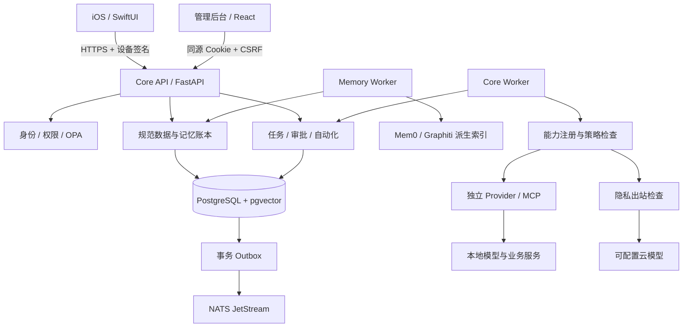
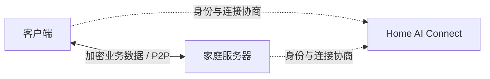

# Home AI OS

运行在家庭服务器上的私人 AI 系统。通过原生 iOS 客户端和网页管理后台，管理个人资料、长期记忆、AI 任务、自动化及家庭设备。数据由家庭端保存，本地使用不需要平台注册或付费。

**项目处于开发阶段，尚未完成全部生产与真机验收。远程访问采用纯 P2P，已通过 iPhone 蜂窝网络的资料传输验收，不提供中继兜底。**

## 功能

- **AI 对话与任务**：本地模型、多步骤工具调用、审批、取消、预算限制和异常核对。
- **数据与记忆**：文件及 iOS 数据导入、加密存储、版本管理、共享撤权、记忆确认和语义检索。
- **可插拔能力**：模型、文档、语音、搜索、家居、邮件和受控 MCP 工具。
- **自动化**：定时任务、数据事件触发、条件判断及持久化执行。
- **管理后台**：成员与设备、模型配置、凭据、Provider、数据、任务、自动化、审计和备份列表。
- **iOS 客户端**：AI、Activity、Automations、Data、Settings 五个主页面；提供语音、附件及系统数据授权入口。

## 项目架构

服务端采用 Python 模块化单体，各业务模块通过服务接口协作。API、任务处理、记忆索引和家居观察者独立运行；模型与 Provider 使用独立进程或环境。



| 层级 | 职责 |
|---|---|
| Core | 身份、权限、规范数据、密钥、任务状态、审计及插件生命周期 |
| PostgreSQL | 规范账本、授权、任务、版本、删除状态与事件 Outbox |
| Memory Provider | 可重建的记忆索引；不拥有数据的唯一副本 |
| Capability / Provider | 统一能力契约及真实实现；不得持有 Core 数据库凭据 |
| Skill / MCP | 声明式流程编排、显式工具映射；所有调用经过权限检查 |
| iOS / 管理后台 | 用户交互、系统授权、数据同步与任务审批 |
| Home AI Connect | 独立闭源平台；负责账号、套餐、连接授权和信令，不转发业务数据 |

### 远程连接

客户端与家庭服务器直接传输业务数据，平台不转发对话、文件或音视频，不允许直连失败后回退到中继。



家庭端与 iOS 使用 WebRTC 数据通道。已配对的 P-256 身份签名绑定连接描述与 DTLS 指纹，只接受直连候选，拒绝 TURN。每个业务请求仍经过 Core 的设备签名、会话、权限及防重放检查；平台账号不能代替家庭账号登录。

STUN 只帮助发现网络地址。使用第三方 STUN 时，对方能看到连接来源地址，不接收家庭业务正文。域名本身不能穿透 NAT；网络不支持直连时明确失败，不自动中继。官方服务按期限和实例数量开通，不按业务带宽或流量收费。

协调平台地址默认 `https://homeai-connect.pintheworld.cn`，也可填写兼容协议的第三方 HTTPS 根地址。管理端检查 `/api/direct/capabilities` 的协议版本、纯直连策略和 STUN 配置；检查不发送家庭凭据，不跟随重定向。能力声明兼容不等于已经完成绑定或实测直连。普通家庭 HTTPS 地址、Tailscale/ZeroTier 地址不作为协调平台接入。

远程访问目前由 iOS 内置传输层完成，网页管理后台通过家庭 HTTPS 入口访问。选择直连后，新的请求会按需重建连接；已经失败的业务操作不会自动重发，也不会偷偷切换到中继。

## 工作流程

### 初始化与扫码配对

1. 家庭服务器完成数据库、主密钥与管理员初始化，在 `/admin/` 登录管理后台。
2. “成员与设备”选择并保存手机可达的家庭 HTTPS 地址，创建成员，再为该成员生成限时二维码。
3. iOS 的连接入口只有“扫码配对”。未启用远程时，二维码携带家庭地址与稳定身份，手机在可互通的局域网中自动配对。
4. 已启用远程时，二维码携带协调平台与五分钟一次性授权，可在外网首次配对，无需预先连接家庭 Wi-Fi。
5. 配对授权密文通过平台短暂交换；平台不持有二维码中的家庭配对秘密。设备与凭据在家庭数据库同一事务创建，重复请求复用结果；手机验证家庭公钥签名后建立 WebRTC 数据通道。
6. 对话、资料、文件和任务请求在直连通道内传输，仍执行设备签名和权限检查。无法直连时明确失败，不回退中继。二维码是短期访问凭据，不应公开分享。

### 申请与开通远程服务

1. 家庭后台“远程连接”默认连接 `https://homeai-connect.pintheworld.cn`，也支持实现同一协议的第三方协调平台。
2. 点击“获取开放套餐与客服”，从平台读取真实套餐以及已配置的微信、邮箱或 QQ；没有开放套餐或客服信息时不生成申请。
3. 选择套餐生成一天有效的申请码，交给客服。申请码绑定家庭稳定公钥及套餐，不含家庭私钥、资料或模型密钥。
4. 客服登录 Connect 的“客服开通”，粘贴申请码、填写客户真实邮箱，核对套餐和家庭身份。只有实际收款后才点击确认开通。
5. 平台在一个事务中保存订单、权益与实例；重复提交同一申请不重复计费或延长权益。家庭端每十秒签名查询一次状态，开通后自动领取并加密保存连接配置，不再来回复制绑定码。
6. 回到“成员与设备”生成新二维码，iOS 即可通过扫码获得远程连接授权。已有设备连接保持兼容；要切换为新远程授权可重新扫码配对。
7. 设备撤销、授权过期或远程权益停用后拒绝访问；家庭本地功能独立运行。微信与 QQ 未填写时不展示虚构号码。

### 三端接口与信任边界

| 接口 | 使用方与用途 |
|---|---|
| Core `/api/v1/members`、`/members/{id}/pairing` | 管理员创建成员、生成带地址和稳定身份的二维码 |
| Core `/api/v1/remote/catalog`、`/applications`、`/application` | 家庭端获取套餐、生成申请、查看状态 |
| 平台 `/api/public/catalog`、`/public/applications/status` | 公开套餐及客服；家庭签名领取绑定结果 |
| 平台 `/api/admin/support`、`/admin/applications/preview`、`/approve` | TOTP 管理员配置客服、核对申请和确认收款 |
| 平台 `/api/direct/enrollments` | 家庭签名申请限时配对通道；手机凭二维码短期授权交换 AES-GCM 配对密文 |
| 平台 `/api/direct/grants`、`/offers`、`/answers`、`/permit` | 已配对设备授权、签名信令交换和权益检查 |

家庭后台无需选择 STUN 配置来源：申请远程服务开通后自动保存并使用平台下发地址；也可展开可选设置，自行填写最多两个第三方地址。两种方式二选一，留空保存恢复平台配置；禁止 TURN。更新地址后重新生成二维码，让手机获得相同的地址发现配置。STUN 不承担配对授权，也不能独立替代协调平台。

HK 平台是运营后台，包含客服开通、客户实例、套餐与订单、用户、邮件、内置 STUN 服务状态和审计；不提供家庭用户视角的“我的连接”，也不要求在网页手填 STUN 地址；部署自动登记默认服务，状态页区分本机响应、独立外网验证与实际下发地址。套餐草稿可修改，已发布或被订单引用的套餐通过新版本修改；发布新版停用旧版，历史订单保持原条款。

第三方协调平台需支持纯直连协议 v1、客服申请协议 v1 和首次配对协议 v1。普通 HTTPS 服务或 VPN 地址不能替代协调平台。平台账户与家庭账户独立，平台登录不能直接登录家庭后台。

### 数据与记忆

1. 用户授权 iOS 数据来源或导入文件，客户端携带设备签名、来源版本及幂等信息上传。
2. Core 校验权限，将规范记录和 Outbox 事件在同一事务中提交。
3. 后台处理文档、生成向量并更新派生索引；候选记忆经确认后成为有效事实。
4. 检索先查授权范围，命中后回到规范账本核对权限与版本。
5. 撤权或删除立即阻止读取，再传播至索引、缓存和文件；删除记录用于恢复时防止数据复活。

### AI 与任务

1. 客户端创建任务，Core 保存任务及步骤状态。
2. Agent 在预算和工具次数限制内规划执行；能力调用经过策略检查。
3. 需要审批的操作暂停，用户确认具体参数后重新校验权限再执行。
4. 外部副作用结果不明时进入待核对状态，不盲目重试。
5. 客户端获取任务事件与结果；来源被删除或撤权后，不再显示对应受保护结果。

### 自动化与运维

定时或数据事件创建持久任务，复用同一套权限、审批与执行机制。Outbox 和消费者去重降低重复处理风险。备份加密保存，恢复到隔离环境并重放删除记录后再验收。主密钥需单独安全保管。

## 本机启动

需要 Python 3.12+、Docker 和 Node.js；iOS 开发另需 Xcode 与 XcodeGen。以下为开发环境流程，不是已验收的生产一键部署。

```sh
python3 -m venv .venv
.venv/bin/pip install -r requirements.lock
.venv/bin/pip install --no-deps -e .
.venv/bin/python scripts/dev_env.py
docker compose --env-file .env.local -f deploy/compose.dev.yml up -d
.venv/bin/python scripts/migrate.py --runtime
.venv/bin/homeai init-key
.venv/bin/python scripts/tls.py
npm --prefix admin-web ci
npm --prefix admin-web run build
```

`init-key` 仅在首次安装执行；不要覆盖现有主密钥。保管生成的 `.env.local` 和 `state/`，不要提交到 Git。

启动 API：

```sh
.venv/bin/uvicorn homeai.api:create_app --factory \
  --host 0.0.0.0 --port 58443 \
  --ssl-keyfile state/tls/server.key --ssl-certfile state/tls/server.crt
```

在分别的终端启动后台进程：

```sh
.venv/bin/python -m homeai.worker
.venv/bin/python -m homeai.memory_worker
# 配置家居事件订阅后再启动：
.venv/bin/python -m homeai.home_observer
```

首次创建管理员，记录返回的用户 ID；再领取后台初始化凭据：

```sh
.venv/bin/homeai bootstrap --name 家庭管理员
.venv/bin/homeai web-setup --user <用户ID>
```

访问 `https://<家庭服务器地址>:58443/admin/`，按提示完成设置。`scripts/tls.py` 默认仅生成适用于 `localhost` 和 `127.0.0.1` 的开发证书；本机访问可用 `https://localhost:58443/admin/`。局域网和 iPhone 使用前，需另行配置与实际服务器地址匹配的证书。不要关闭证书验证。

生成 iOS 配对文件：

```sh
.venv/bin/homeai pair --user <用户ID> \
  --url https://<家庭服务器地址>:58443 \
  --output state/iphone-pairing.json
```

配对文件含短期凭据，应通过可信方式交给自己的设备。打开 `ios/HomeAI.xcodeproj`，配置签名后运行；最低支持 iOS 18。

模型权重不随仓库分发。`scripts/run_*.py`、`register_*.py` 提供各 Provider 的启动与注册工具；根据选用能力安装对应依赖和权重，具体版本及验证记录见 [验收记录](docs/验收记录.md)。

## 目录

```text
server/homeai/   Core API、权限、数据、任务与后台进程
server/tests/   自动化与真实服务集成测试
admin-web/      React 管理后台
ios/            SwiftUI 客户端
providers/      独立能力实现及运行适配
contracts/      OpenAPI 与 JSON Schema
scripts/        初始化、运行、注册、验证、备份与恢复工具
deploy/         容器、策略及部署配置
docs/           开发规范与详细验收记录
```

## 当前限制

- 纯直连不保证所有 NAT 或防火墙环境可达；长期弱网、更多运营商与更大文件仍需持续验证。
- 私人内容上云仍被拒绝；完整隐私检测与脱敏链路未完成。
- 生产 Provider 沙箱、完整升级卸载、vLLM 硬件验证尚未完成。
- APNs、iPhone 真机后台行为、真实家庭设备和外部邮箱仍需验收。
- 最终家庭部署、定时备份及异机恢复目标尚未完成验证。

## 验证与贡献

```sh
.venv/bin/pytest -q
.venv/bin/python scripts/check_boundaries.py
.venv/bin/python scripts/export_contracts.py
npm --prefix admin-web run build
```

外部服务未配置的集成测试会跳过；测试通过不能替代真机和生产验收。直连依赖已纳入标准安装，组件验证使用：

```sh
.venv/bin/python scripts/verify_direct_transport.py
# 独立 PostgreSQL 测试库准备完成后：
HOMEAI_DIRECT_INTEGRATION=1 .venv/bin/pytest -q server/tests/test_direct_http_live.py
```

开发约定见 [贡献指南](CONTRIBUTING.md) 和 [架构规范](docs/架构与开发规范.md)。不要提交凭据、个人数据、模型权重或闭源平台代码。

## 许可证

使用 [Home AI OS Attribution 1.0](LICENSE)，允许使用、修改、商用和闭源再分发。对外发布的衍生产品或托管服务需保留“基于 Home AI OS”及 [项目地址](https://github.com/MR-MaoJiu/home-ai-os)。这是自定义许可，不是标准 MIT 或 OSI 认证许可。第三方依赖遵循各自许可证，见 [第三方说明](THIRD_PARTY_NOTICES.md)。
