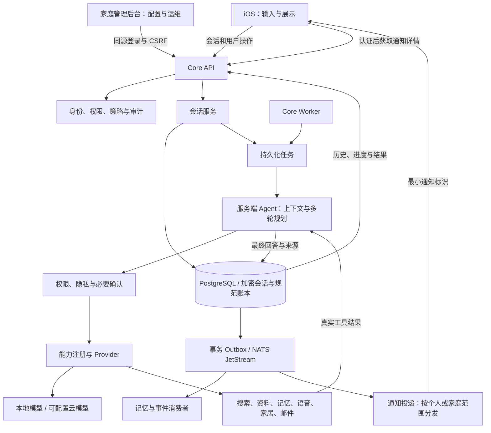
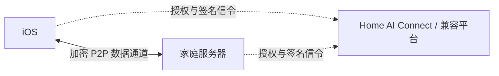

# Home AI OS

Home AI OS 是运行在家庭服务器上的私人 AI 系统，提供原生 iOS 客户端与网页管理后台。会话、资料、记忆、任务和自动化由家庭服务器持有；本地使用不需要平台注册或付费。

项目采用**服务端执行、客户端输入与展示**的架构：iOS 提交消息、上传用户选择的数据，展示回答、记忆、自动化状态和通知；服务端负责多轮上下文、模型选择、工具调用、记忆处理、定时执行和结果保存。联网搜索由 AI 在对话中按需执行。客户端不编排工具、不调度自动化，也不通过系统提醒事项代替服务端任务。

当前为持续开发版本；真实接入和验收范围见 [验收记录](docs/验收记录.md)，不将未具备环境的功能标记为完整生产交付。

## 产品组成

| 组成 | 职责 |
|---|---|
| iOS | 对话与历史、个人记忆、个人与家庭自动化、个人与家庭数据、通知和扫码配对 |
| 家庭管理后台 | 部署检查、模型与凭据、Provider、成员与设备、远程连接、备份与运维审计 |
| Core API | 身份认证、会话接口、数据权限、同步、任务提交、审批与审计 |
| Core Worker / Agent | 持久化执行、多轮规划、工具调用、重试、预算、取消、自动化触发及通知投递 |
| Memory Worker | 从规范记忆账本生成向量和可重建的派生索引 |
| Provider | 模型、搜索、文档、语音、家居、邮件与受控 MCP 的能力实现 |
| Home AI Connect | 独立闭源协调平台，提供远程开通、设备授权和连接协商，不转发家庭业务正文 |

iOS 最低支持 iOS 18，保留**对话、记忆、自动化、数据、设置**五个主页面。管理后台只用于服务器配置与运维，不展示成员的数据、记忆、任务审批或自动化内容。需要确认的操作在发起人的客户端展示，确认后的实际执行仍在服务端。

## 系统架构


```mermaid
flowchart TB
    IOS[iOS：输入与展示] -->|会话和用户操作| API[Core API]
    WEB[家庭管理后台：配置与运维] -->|同源登录与 CSRF| API
    API --> AUTH[身份、权限、策略与审计]
    API --> CHAT[会话服务]
    CHAT --> DB[(PostgreSQL / 加密会话与规范账本)]
    CHAT --> TASK[持久化任务]
    WORKER[Core Worker] --> TASK
    TASK --> AGENT[服务端 Agent：上下文与多轮规划]
    AGENT --> POLICY[权限、隐私与必要确认]
    POLICY --> CAP[能力注册与 Provider]
    CAP --> MODEL[本地模型 / 可配置云模型]
    CAP --> TOOLS[搜索、资料、记忆、语音、家居、邮件]
    TOOLS -->|真实工具结果| AGENT
    AGENT -->|最终回答与来源| DB
    DB -->|历史、进度与结果| API
    DB --> OUTBOX[事务 Outbox / NATS JetStream]
    OUTBOX --> MEMORY[记忆与事件消费者]
    OUTBOX --> NOTIFY[通知投递：按个人或家庭范围分发]
    NOTIFY -->|最小通知标识| IOS
    IOS -->|认证后获取通知详情| API
```

服务端是 Python 模块化单体，API、任务 Worker 和记忆 Worker 独立运行。PostgreSQL 保存规范数据，pgvector、Mem0 与 Graphiti 提供检索或派生索引，不能取代规范账本成为唯一数据副本。Provider 不持有 Core 数据库凭据。

## 对话与业务流程

### 1. 配对和打开应用

家庭管理员在“成员与设备”创建成员并生成五分钟有效的二维码。iOS 扫码后自动取得地址与稳定服务器身份：未启用远程时使用家庭 HTTPS 地址，已启用远程时可在外网首次配对。

打开应用后，客户端从服务端读取该成员的会话列表和历史，恢复上次选择的会话。聊天记录不依赖页面内存；关闭页面或重启应用不会删除服务端历史。不同成员的会话相互隔离。

### 2. 发送消息和多轮上下文

1. iOS 将消息和发送标识提交到会话接口，不提交模型角色、工具名称或执行计划。
2. Core 校验身份与会话所有权，把消息和任务在同一事务中保存。同一发送标识重复提交不会重复创建任务。
3. Agent 从服务端读取近期历史，重新校验旧回答引用资料的权限，再组织本轮上下文。
4. 服务端调用模型，由模型提出结构化工具建议；核心重新检查契约、权限、隐私和预算后执行。
5. 工具结果回到 Agent，必要时继续调用工具，最终将回答与真实来源保存到服务端。
6. iOS 读取进度和结果；断线期间服务端任务继续，重连后读取原任务，不重放有副作用的操作。

完整历史保存在服务器，但模型上下文有长度和轮次预算，并非无限上下文。已撤回授权或已删除来源的旧答案会被隐藏，不继续送入模型。旧版本没有会话标识的单轮任务，迁移为独立历史对话，不虚构它们之间的多轮关系。

### 3. 自动搜索与操作确认

公开联网搜索在对话中按需自动执行，通过自托管 SearXNG 获取结果，AI 整合后提供真实来源链接。搜索不再单独要求审批；查询仍经过隐私检查，不能借自动搜索将秘密或未获授权的私人来源发送出去。

邮件发送、受控设备操作等需要确认的行为，会在对话中显示具体参数。用户确认或拒绝后，由服务端继续处理。确认绑定执行身份、参数摘要和有效期，客户端不能把任意操作伪装成已批准。禁止的高风险能力不会因用户确认而自动开放。

输入采集和文件选择由 iOS 系统能力完成；后续处理交给服务端。快捷提醒通过语义输入接口交给服务器创建任务和会话记录，不在客户端编排工具或写入系统提醒事项。

### 4. 数据与记忆分别管理

数据是用户上传或采集的原始资料，例如图片、文件、健康记录与位置；记忆是对话中需要长期保留的偏好、事实和约定。两者均存储在家庭服务器，拥有不同的业务类型、来源和处理流程；上传数据不会自动把它变成记忆。

| 内容 | 归属与展示 | 处理方式 |
|---|---|---|
| 私人数据 | 仅数据所有者的设备可见 | 客户端提交选择，服务端保存并校验权限 |
| 家庭数据 | 本家庭的有效成员及其设备可见，其他家庭不可见 | 所有者明确选择家庭共享，服务端按家庭范围授权 |
| 个人记忆 | “记忆”页面仅展示当前成员的聊天记忆及候选 | 服务端处理聊天来源、候选确认、冲突和检索 |

图片、文件等在“数据”中逐条选择“仅自己”或“家庭共享”。健康与位置按类型选择这两种范围，服务端将相同规则应用到已有及后续上传、更新的记录；改回“仅自己”后，其他家庭成员立即失去访问权。持续共享不扩大系统采集权限，也不代表手机持续后台定位。共享数据不会自动共享个人记忆。

记忆来源保留可追溯的聊天关联，候选事实不能直接覆盖已确认事实。pgvector、Mem0 和 Graphiti 只提供可重建的检索索引；停用 Provider 不删除规范记忆。管理员维护服务器不会自动获得成员私人数据或聊天记忆的展示权限。

### 5. 服务端任务、自动化与通知

任务是服务端一次执行的持久记录，例如回答消息、解析文件或执行提醒。客户端负责提交需求、展示执行状态和结果；手机退出应用或暂时断网不停止服务器任务。

自动化是“什么时候、做什么、对谁可见”的持久规则，由服务器根据定时或数据事件触发。每次触发生成任务，继续经过同一套权限、预算、幂等和必要确认流程；移动端不设置本地定时器执行自动化。

- **个人自动化**：只向规则所有者的设备展示状态、结果和通知。
- **家庭自动化**：向本家庭成员的设备展示规则与可共享的结果、通知，不向其他家庭展示。家庭范围不代表能够读取其他成员的私人资料。
- **必要确认**：发给有权确认的用户，在客户端完成；移除管理端审批页面不代表跳过服务端权限或确认要求。
- **停用与取消**：停用规则阻止后续触发；取消已生成的任务是另一项明确操作。

服务端保存通知记录并按范围投递，客户端收到提示后通过认证接口获取可见详情。通知不携带聊天、健康或位置正文；网络中断后重新连接可补取未读通知。系统推送依赖 APNs 凭据、应用签名和用户通知授权，不能把接口实现或模拟测试当成真机投递通过；未配置时保留站内通知，不伪报已推送。

Provider 显示服务可达，只说明健康检查通过。实际执行还取决于启用状态、能力契约、执行身份、模型或凭据配置，以及隐私策略。

## 远程连接


```mermaid
flowchart LR
    PHONE[iOS] -. 授权与签名信令 .-> CONNECT[Home AI Connect / 兼容平台]
    HOME[家庭服务器] -. 授权与签名信令 .-> CONNECT
    PHONE <-->|加密 P2P 数据通道| HOME
```

家庭端主动连接协调平台，不要求路由器映射家庭服务端口。客户端与家庭端通过 WebRTC 数据通道直接传输业务数据，稳定公钥签名绑定协商描述和 DTLS 身份；每个请求仍经过设备认证与数据权限检查。无法直连时明确失败，不回退 frp、TURN 或业务 HTTP 中继。

家庭后台默认使用 `https://homeai-connect.pintheworld.cn`，也可使用兼容协调协议的平台。读取套餐与客服信息后生成申请码，客服确认开通，家庭端自动领取并保存连接配置，无需来回复制绑定码。

开通后自动采用平台下发的 STUN，无需选择配置来源。家庭端可以选填自定义地址；平台可以追加备用节点。STUN 只用于发现网络地址，不承载家庭业务正文。内置服务正常与公网可达是不同状态，以实际探测结果为准。

有效直连不会因空闲或满五分钟而无条件关闭；单次请求仍有超时，设备撤销和授权失效继续生效。iOS 被系统挂起或网络变化时可能需要重新打洞，不承诺后台永久在线。

## 安全与数据边界

- 用户、设备、服务与 Provider 分开认证；应用权限与 PostgreSQL RLS 双重隔离。
- 浏览器使用 Secure、HttpOnly、SameSite Cookie 与 CSRF 校验；iOS 使用设备签名和 Keychain。
- 会话、资料、凭据与记忆内容在家庭端加密保存；密钥不进入模型上下文或普通日志。
- 外部网页、模型输出和工具结果均不可信，不能改变权限或批准操作。
- 云模型调用经过隐私网关，不能在本地模型失败后自动把私人内容转发到云端。
- 写入与 Outbox 同事务，消费者去重；外部副作用结果不明时保留待核对状态。
- 删除、撤权及恢复备份后的删除记录重放继续作用于旧答案和检索结果。

## 开发与部署

需要 Python 3.12+、Docker、Node.js；iOS 另需 Xcode 与签名配置。以下为开发环境启动方式。

```sh
python3 -m venv .venv
.venv/bin/pip install -r requirements.lock
.venv/bin/pip install --no-deps -e .
.venv/bin/python scripts/dev_env.py
docker compose --env-file .env.local -f deploy/compose.dev.yml up -d
.venv/bin/python scripts/migrate.py --runtime
.venv/bin/homeai init-key
.venv/bin/python scripts/tls.py
npm --prefix admin-web ci
npm --prefix admin-web run build
```

`init-key` 只在首次安装执行，保留已有主密钥与 `.env.local`。从旧版本升级时先备份，再运行数据库迁移及历史导入：

```sh
.venv/bin/python scripts/migrate.py --runtime
.venv/bin/python scripts/migrate_chat_history.py
```

分别启动 API 和后台服务：

```sh
.venv/bin/uvicorn homeai.api:create_app --factory \
  --host 0.0.0.0 --port 58443 \
  --ssl-keyfile state/tls/server.key --ssl-certfile state/tls/server.crt
.venv/bin/python -m homeai.worker
.venv/bin/python -m homeai.memory_worker
# 使用家居事件订阅时另行运行
.venv/bin/python -m homeai.home_observer
```

首次初始化管理员：

```sh
.venv/bin/homeai bootstrap --name 家庭管理员
.venv/bin/homeai web-setup --user <用户ID>
```

访问 `https://<家庭服务器地址>:58443/admin/`，配置家庭地址、模型和成员后生成二维码。开发证书默认仅适用于本机；部署时配置实际入口与证书，不关闭证书验证。打开 `ios/HomeAI.xcodeproj` 设置签名后运行。

模型权重不随仓库分发。Provider 启动与注册脚本位于 `scripts/`，固定版本配置位于 `providers/manifests/`。加密备份、主密钥和恢复演练需按实际部署环境配置。

### 客户端通知部署

站内通知持久保存在家庭服务器，登录设备按权限读取和标记已读。需要手机在应用退出或后台时收到系统通知，还需为自己的 iOS 应用配置 Apple Push Notifications：

直接连接 APNs 的部署方式适用于使用自己 Apple Developer 团队签名的 iOS 应用；自编译用户填写自己的 Team、Key 和 Bundle ID。官方发行应用的 APNs 私钥不能下发给自托管家庭服务器，官方推送代理尚未实现，不能用本部署配置替代官方应用的推送服务。

1. 在 Apple Developer 为应用标识开启 Push Notifications，并准备 APNs 签名密钥；iOS 签名描述文件和推送环境必须匹配。
2. 将 `.p8` 文件只保存在家庭服务器，并限制为运行服务的账户可读（例如权限 `0600`）。在本机 `.env.local` 配置以下变量，不提交密钥或实际值：

   | 变量 | 内容 |
   |---|---|
   | `HOMEAI_APNS_KEY_FILE` | 本机 `.p8` 文件路径 |
   | `HOMEAI_APNS_KEY_ID` | APNs Key ID |
   | `HOMEAI_APNS_TEAM_ID` | Apple Developer Team ID |
   | `HOMEAI_APNS_TOPIC` | 当前 iOS 应用的 Bundle ID |

3. 在项目根目录启动通知投递进程：

   ```sh
   PYTHONPATH=server .venv/bin/python scripts/run_notification_worker.py
   ```

4. iOS 完成配对并允许通知后，将当前设备的推送令牌登记到家庭服务器。通过已认证的 `/api/v1/notifications/status` 检查配置与 Worker 状态，再以真实设备分别验收前台、后台及网络切换。

APNs 只接收固定提示与通知标识，不接收家庭业务正文。个人通知投递到本人注册设备，家庭自动化通知投递到本家庭有效成员设备；客户端认证后再获取可见详情。未配置 Apple 凭据、未启用 Worker 或未获得用户系统授权时，不能承诺系统推送到达；站内记录仍可在重连后读取。


## 工程目录

| 目录 | 内容 |
|---|---|
| `server/homeai/` | 会话、身份、账本、Agent、任务、工具与运维模块 |
| `server/alembic/` | 数据库迁移与 RLS 策略 |
| `ios/HomeAI/` | SwiftUI 交互、会话展示、设备权限和传输层 |
| `admin-web/` | React 服务器配置与运维后台 |
| `providers/` | 独立 Provider 适配及固定版本清单 |
| `contracts/` | OpenAPI 与公共 JSON Schema |
| `deploy/`、`scripts/` | 部署、启动、迁移、备份与验证工具 |
| `server/tests/`、`ios/HomeAITests/` | 权限、协议、工作流与客户端测试 |

Home AI Connect 在独立闭源项目维护，不放入此仓库。

## 许可证

采用 `LicenseRef-Home-AI-OS-Attribution-1.0`，允许使用、修改、商用、闭源再分发和自行托管。对外发布的衍生产品或托管服务须保留“基于 Home AI OS”及指向本项目的可点击链接。详见 [LICENSE](LICENSE) 和 [第三方许可](THIRD_PARTY_NOTICES.md)；不宣称是标准 MIT 或已通过 OSI 认证。


## 新电脑启用内置服务

Provider 数据库为空表示尚未登记服务，不需要复制其他电脑的数据库或凭据。打开“模型与凭据”即可看到内置目录：

- **联网搜索**：SearXNG，固定容器镜像。需要安装并启动 Docker。
- **本地模型**：Qwen3 0.6B Q8（下载约 0.64 GB）或 Qwen3 4B Q4（约 2.50 GB）。实际运行还需要额外内存；0.6B 适合轻量验证，复杂工具规划优先选 4B。先按 [llama.cpp 官方指南](https://github.com/ggml-org/llama.cpp/blob/master/docs/build.md) 安装 `llama-server` 并加入 PATH。模型来自 [Qwen 官方 GGUF 仓库](https://huggingface.co/Qwen/Qwen3-4B-GGUF)，下载固定提交的文件并校验 SHA256。

除了 API、任务 Worker，在项目根目录启动内置部署器：

```bash
PYTHONPATH=server .venv/bin/python scripts/run_builtin_services.py
```

然后在“模型与凭据”选择服务与模型大小，点击“启用／应用选择”。部署器负责下载和启动；界面显示等待部署、启动中、可用或具体失败原因。只有实际健康检查通过才登记为可用。部署器未运行时会明确提示，申请不会伪装成已经启动。重启机器后需要将此进程与其他服务一起启动；首次下载需要访问模型仓库和容器仓库。停用会禁止 Core 调用；SearXNG 容器可继续存在供本机使用，若不再需要可在服务器执行 `docker compose -f deploy/compose.searxng.yml stop`。

内置部署器是可信本机运维进程，只接受固定目录选项，不接受网页提交的 Shell 或任意下载 URL。API 无需获得 Docker Socket。当前生产隔离尚未验收，生产模式仍拒绝通过开发部署器启用。

## MCP 与 Skill

“模型与凭据”提供 MCP 地址和可选访问令牌，连接后读取真实工具目录。管理员核对参数契约，明确映射到 Core 能力，再保存并启用 Provider。目录指纹变化会停止调用，必须重新核对；不能把任意工具名称伪装成已有能力。现阶段支持 Streamable HTTP；stdio 服务使用 `scripts/run_mcp_stdio.py` 的固定配置桥接器，其对外协议为 Core HTTP Provider，不是 Streamable HTTP；不能把桥接地址直接填入 MCP 表单。当前网页 MCP 表单用于 Streamable HTTP 接入。工具仍由服务端 Agent 调度，并保留审批、审计和出站策略。

Skill 支持导入带 `name`、`description` YAML 头部的 `SKILL.md`。保存后默认停用；启用后作为本家庭 Agent 的处理指引，不赋予额外工具权限。当前入口执行指令型 Skill，不运行附带脚本或任意安装命令。确定性、多步骤及定时任务由服务端自动化工作流执行，客户端只展示属于个人或家庭的规则与结果。Skill 可停用、删除，删除不会移除家庭资料或记忆。

## 部署凭据与动态码登录

以下三类凭据用途不同，不能互换：

| 凭据 | 来源 | 用途 |
|---|---|---|
| 数据加密主密钥 | `init-key` 生成于服务器 | 解密家庭资料；不得粘贴到网页登录或 iOS 验证器 |
| 初始化凭据 | 本机 `web-setup` / `web-recover` 输出 | 五分钟内、一次性初始化或恢复网页账号 |
| TOTP 动态码密钥 | 管理网页初始化成功后一次性展示 | 导入 iOS 验证器，离线生成每 30 秒更新的六位动态码 |

首次安装依次执行已有环境与数据库初始化步骤，再在项目根目录：

```bash
PYTHONPATH=server .venv/bin/python -m homeai.cli init-key
PYTHONPATH=server .venv/bin/python -m homeai.cli bootstrap --name 家庭管理员
# 将上一步输出的 user_id 填入以下命令，勿填写 pairing_token。
PYTHONPATH=server .venv/bin/python -m homeai.cli web-setup --user <user_id>
```

已有安装不要重复执行 `init-key` 或 `bootstrap`。`web-setup` 输出中的 `setup_ticket` 是此命令生成的网页初始化凭据，有效期 300 秒：打开家庭 HTTPS `/admin/`，选择“首次部署”，填写此凭据、用户名和备用密码。页面随后展示 TOTP 密钥，将其导入 iOS“设置 → 管理端动态码”，或标准验证器，并填入生成的动态码完成绑定。完成绑定前不能访问管理功能。凭据过期时重新运行 `web-setup`，不要删除数据库。

日常管理登录输入**用户名＋当前动态码**即可；已有客户端若同时提交密码，服务端仍校验该密码。登录有效期为 24 小时，有效期内的配置操作无需重复输入动态码；退出登录或撤销网页设备后立即失效。同一动态码不能重复使用；手动重新验证时需等待下一周期。连续错误会限流。iOS 在本机 Keychain 保存 TOTP 密钥，显示验证码前验证设备身份，离开前台隐藏；生成动态码不要求与家庭服务器连接。

丢失验证器时，只能由持有服务器本机访问权的人执行：

```bash
PYTHONPATH=server .venv/bin/python -m homeai.cli web-recover --user <user_id>
```

用新的一次性凭据完成初始化流程，重新绑定 TOTP；旧动态码密钥和旧网页会话随恢复失效。不要将初始化凭据、TOTP 密钥、主密钥、模型 API Key 或 `.env.local` 提交到 Git。
